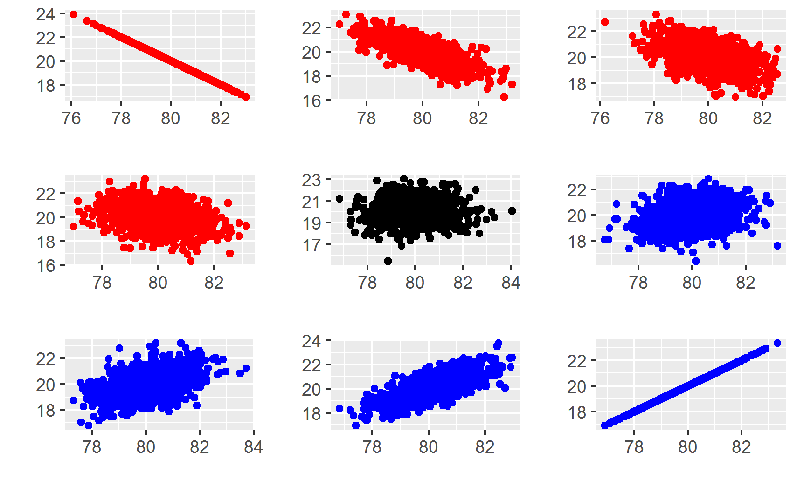
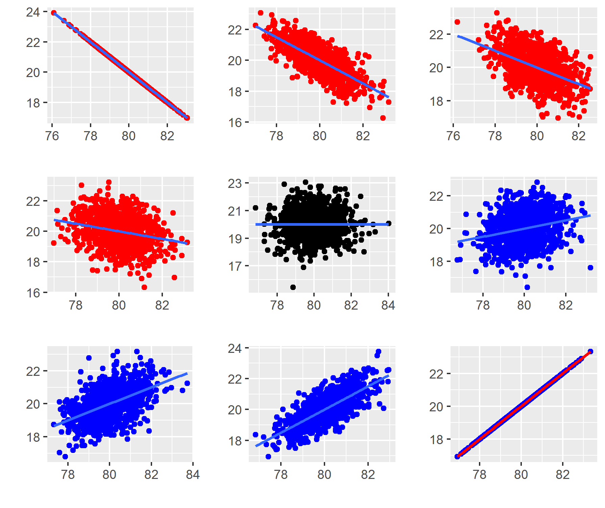
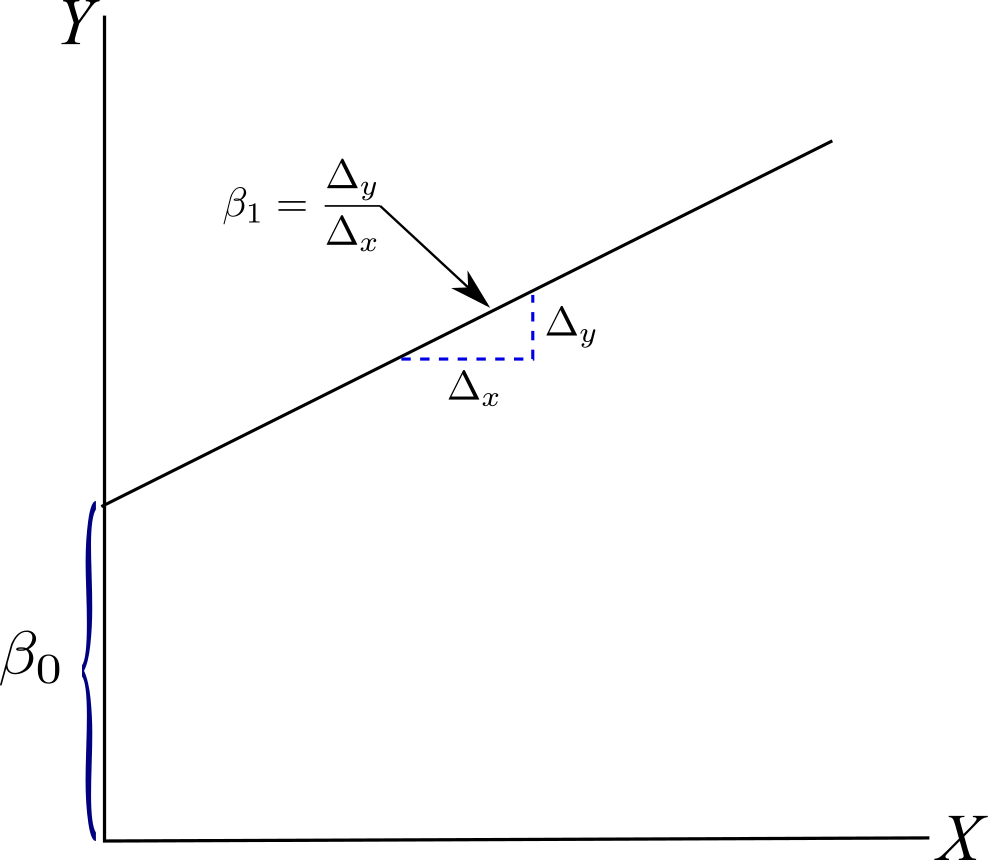
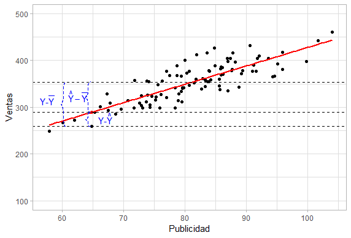

```{r include = FALSE}
if(!knitr:::is_html_output())
{
  knitr::opts_chunk$set(fig.pos = '!h')
}
```

# Correlación y Regresión {#methods}

Supongamos que se quisiera analizar la relación entre las ventas y la utilidad de una empresa, para tratar de explicar de qué forma las ventas afectan la utilidad de las empresas. La existencia de la relación entre variables puede ser analizada usando un gráfico, una medida numérica o una ecuación. 
El gráfico utilizado para analizar la relación entre dos variables se llama *gráfico de dispersión* o *diagrama de dispersión*, en la figura \@ref(fig:corr) se muestran algunos diagramas de dispersión. 

Un diagrama de dispersión muestra la relación entre dos variables cuantitativas medidas para las mismas observaciones. Los valores de una variable aparecen en el eje horizontal, y los valores de la otra variable aparecen en el eje verticcal. Cada observación aparece como el punto en el gráfico fijado por los valores de ambas variables para esa observación .


En un diagrama de dispersión podemos encontrar tres aspectos de la asociación entre dos variables. 

1. La dirección de la relación. La relación entre dos variables puede no existir o ser negativa o positiva. Retomemos la figura \@ref(fig:corr) para entender la dirección de la relación.  Cuando los valores de $x$ e $y$ aumentan al mismo tiempo se dice que es positiva las gráficas con los puntos de color azul muestran una relación positiva. Cuando los valores de $x$ aumentan y los de $y$ disminuyen, o viceversa se dice que la relación es negativa, las gráficas con los puntos de color rojo presentan una relación negativa. Cuando no existen patrones claros como en la gráfica donde los puntos se presentan de color negro, se dice que no existe relación. 

```{r corr, out.width = "50%",fig.cap="Gráficos de dispersión",fig.align = 'center', echo=FALSE}



``` 

2. La forma de la relación que puede ser lineal o no lineal. En la figura \@ref(fig:corr2) se observa que la relación es lineal, mientras que en la figura \@ref(fig:corr3) se observa una relación no lineal. 

```{r corr2, out.width = "50%",fig.cap="Relación Lineal",fig.align = 'center', echo=FALSE}


```


```{r corr3, out.width = "50%",fig.cap="Relación No Lineal",fig.align = 'center', echo=FALSE}

x1 <- 1:100
y1 <- 1 + x1^0.15 + rnorm(100, 0, 0.01)
data <- cbind(x1,y1)
data <- as.data.frame(data)
ggplot(data, aes(x = x1, y = y1)) + geom_point() +
  stat_smooth(method ="loess", formula = y ~ x, size = 1,se = FALSE) +
  theme_light()
```

3. La fuerza de la relación lineal. Imaginemos que trazamos una recta por el centro de la nube de puntos, la fuerza de la relación se puede medir por la proximidad de los datos a esa linea, a mayor cercanía a la recta mayor fuerza de la relación. En la figura \@ref(fig:corr2) se observa que en las dos primeras y en las dos últimas gráficas las nubes de puntos se acercan hacia la recta, lo que nos indica que en esos casos la fuerza de la relación lineal es alta. 

En los dos gráficos centrales dn la figura \@ref(fig:corr4)  la nube de puntos está más dispersa que en los otros gráficos la dispersión de la nube de puntos es menor. En términos de la fuerza de la relación lineal podemos decir que en los dos gráficos centrales esta es muy débil. Pero ¿cuán fuerte o débil es la relación en cada gráfica? La  gráfica por si sola no nos indica que tan fuerte o débil es la relación, se hace necesario entonces medir de alguna forma la fuerza de la relación lineal. La fuerza de la relación lineal se mide con la correlación. 


```{r corr4, out.width = "50%",fig.cap="Fuerza de la relación lineal",fig.align = 'center', echo=FALSE}

knitr::include_graphics("corr3.png")
```

## Coeficiente de Correlación {#correl}

El *coeficiente de correlación de Pearson* es una medida que puede tomar valores entre $-1$ y $1$. Es igual a $1$ cuando dos variables cuantitativas tienen una relación lineal perfecta positiva y cuando las variables tienen una relación lineal negativa la correlación es igual a $-1$ como se observa en la figura \@ref(fig:corr5).  

```{r corr5, out.width = "50%",fig.cap="Relaciones lineales perfectas",fig.align = 'center', echo=FALSE}

knitr::include_graphics("corr4.png")
```

Para entender el coeficiente de correlación de Pearson, debemos empezar por definir la *covarianza*. La varianza la definimos en la sección \@ref(dispersion) como el promedio de la desviación cuadrática de todas las observaciones de una variable. Cuando trabajamos con dos variables debemos usar la **covarianza** que es la medida distancia entre cada par ordenado del centroide en un diagrama de dispersión. El centroide de un conjunto de puntos $\left(x,y\right)$ es el punto $\left(\bar{x},\bar{y}\right)$. 

En la figura \@ref(fig:vtaspub) se presenta el diagrama de dispersión del gasto en Publicidad contra el ingreso por ventas de 100 empresas, estos datos han sido simulados. En la figura \@ref(fig:centroide) se muestra la ubicación del centroide de los datos. Es fácil observar que el punto del centroide es el centro de un sistema de coordenadas con cuatro cuadrantes, como se muestra en la figura \@ref(fig:centroide). La desviación de cualquier punto desde el centroide se calcula con la expresión $\left(x-\bar{x}\right)\left(y-\bar{y}\right)$. 

Todos los puntos en el cuadrante I tienen publicidad y ventas mayores al promedio y cuando se reemplazan en la expresión $\left(x-\bar{x}\right)\left(y-\bar{y}\right)$ siempre se obtiene un resultado positivo. Los puntos en el cuadrante II tienen publicidad menor al promedio y ventas mayores al promedio al reemplazarlos en la expresión $\left(x-\bar{x}\right)\left(y-\bar{y}\right)$ se obtiene un resultado negativo puesto que negativo multiplicado por positivo es negativo, para los cuadrantes III y IV los resultados de reemplazar en $\left(x-\bar{x}\right)\left(y-\bar{y}\right)$ son positivo y negativo respectivamente (¿por que?). 

Para comparar las ventas con la publicidad se debe comparar la suma de los positivos obtenidos en los cuadrantes I y III con los negativos que resultan de los cuadrantes II y IV, Si la suma de los positivos es mayor a la de los negativos estamos ante una asociación positiva, pero si la suma de los negativos es mayor que la de los positivos la asociación es negativa y si la suma de los positivos es casi igual a la suma de los positivos, la sumatoria será cercana a $0$ por lo que  no existe asociación entre las variables.

```{r vtaspub, out.width = "50%",fig.cap="Diagrama de Dispersión del gasto en Publicidad contra el ingreso en Ventas",fig.align = 'center', echo=FALSE}

set.seed(1.8)
Publicidad <- rnorm(100, mean=80, sd=10)
Ventas <- 30 + rnorm(100,mean=4,sd=0.30)*Publicidad + rnorm(100,mean = 0,sd=1)
datos <- cbind(Publicidad,Ventas)
datos <- as.data.frame(datos)
media.p <- mean(Publicidad)
media.v <- mean(Ventas)


ggplot(datos, aes(x=Publicidad,y=Ventas))+
  geom_point( ) + xlim(min(Publicidad),max(Publicidad)) + ylim(0,600) + 
  theme_light()


```

```{r centroide, out.width = "50%",fig.cap="Ubicación del centroide de los datos",fig.align = 'center', echo=FALSE}

set.seed(1.8)
Publicidad <- rnorm(100, mean=80, sd=10)
Ventas <- 30 + rnorm(100,mean=4,sd=0.3)*Publicidad + rnorm(100,mean = 0,sd=1)
datos <- cbind(Publicidad,Ventas)
datos <- as.data.frame(datos)
media.p <- mean(Publicidad)
media.v <- mean(Ventas)


ggplot(datos, aes(x=Publicidad,y=Ventas))+
  geom_point( ) + 
  geom_segment(aes(x=media.p, y=0, xend = media.p, yend = 600), colour="blue",size =1.20, linetype ="dashed" ) +
  geom_segment(aes(x=min(Publicidad), y=media.v, xend = max(Publicidad), yend = media.v), colour="blue",size =1.20, linetype ="dashed" ) +
  geom_point(aes(x=media.p, y=media.v), colour="red",size=4) + xlim(min(Publicidad),max(Publicidad)) + ylim(0,600) +
  annotate("text", x = 95, y = 550, label = "Cuadrante I") +
  annotate("text", x = 65, y = 550, label = "Cuadrante II") +
  annotate("text", x = 65, y = 150, label = "Cuadrante III") +
  annotate("text", x = 95, y = 150, label = "Cuadrante IV") +
  theme_light()
```


Esto implica que la suma de las distancias entre los puntos y el centroide proporciona una medida de la relación entre las variables y si se divide este valor para el número de observaciones obtenemos la desviación promedio de los datos respecto al centroide, conocido como covarianza. Formalmente la covarianza se calcula con:

\begin{equation} 
  cov(x,y) = S_{xy} = \dfrac{1}{n} \sum_{i=1}^{n}\left(x_i-\bar{x}\right)\left(y_i-\bar{y}\right)
  (\#eq:covar)
\end{equation}

La ecuación \@ref(eq:covar) puede ser reescrita como 

\begin{equation} 
  S_{xy} = \dfrac{1}{n}\sum_{i=1}^{n}{x_iy_i}-\bar{x}\bar{y}
  (\#eq:covar2)
\end{equation}

Si la covarianza es positiva, la relación entre las variables es positiva. Si la covarianza es negativa, la relación entre las variables puede ser negativa. Y si es $0$ o cercana a $0$ entonces no hay relación lineal entre las variables. Basta con conocer el signo de la covarianza para saber el sentido de la relación. Un problema de la covarianza es que su valor depende de las unidades de medida que están siendo usadas. Una forma de corregir esto es dividiendo para las desviaciones de $x$ y $y$. El resultado de dividir la covarianza para las desviaciones recibe el nombre de **coeficiente de correlación de Pearson** 
\begin{equation} 
  r=\dfrac{s_{xy}}{s_xs_y}=\dfrac{\dfrac{1}{n} \sum_{i=1}^{n}\left(x_i-\bar{x}\right)\left(y_i-\bar{y}\right)}{\sqrt{\left(\dfrac{1}{n} \sum_{i=1}^{n}\left(x_i-\bar{x}\right)^2\right)\left(\dfrac{1}{n} \sum_{i=1}^{n}\left(y_i-\bar{y}\right)^2\right)}}
  (\#eq:covar3)
\end{equation}


En R se utiliza la función `cor()`, Ejemplificaremos esto con los datos de la figura \@ref(fig:vtaspub)


```{r cor, echo=TRUE}
set.seed(1.8)
Publicidad <- rnorm(100, mean=80, sd=10)
Ventas <- 30 + rnorm(100,mean=4,sd=0.3)*Publicidad + rnorm(100,mean = 0,sd=1)

cor(Publicidad, Ventas)

```

El valor obtenido  de la correlación es `r round(cor(Publicidad, Ventas),4)` pero ¿cómo saber qué tan bueno o malo es este valor de correlación? Es ampliamente aceptada la interpretación de acuerdo al intervalo en el que cae el valor de la correlación:

* $-1$: La relación lineal negativa es perfecta
* $-1<r \leq -0.70$ La relación lineal negativa es fuerte
* $-0.70<r \leq -0.50$ La relación lineal negativa es moderada
* $-0.50<r \leq -0.30$ La relación lineal negativa es débil
* $-0.30<r < 0$ La relación lineal es casi inexistente
* $0$ No existe relación lineal
* $0<r < 0.30$ La relación lineal es casi inexistente
* $0.30 \leq r < 0.50$ La relación lineal positiva es débil
* $0.50 \leq r < 0.70$ La relación lineal positiva es moderada
* $0.70 \leq r < 1$ La relación lineal positiva es fuerte
* $1$ La relación lineal positiva es perfecta

## Regresión lineal simple {#lineal}

Al inicio de este capítulo usamos diagramas de dispersión o gráficos de dispersión para analizar la relación entre dos variables. Luego en la seccion \@ref(correl) se analizó la relación entre la publicidad y las ventas de 100 empresas utilizando el coeficiente de correlación. La correlación no contesta preguntas como ¿influye la publicidad sobre las ventas? Si la publicidad aumenta ¿cuánto aumentarán las ventas? En esta sección utilizaremos el análisis de regresión para analizar la relación entre la publicidad y las ventas. 

El análisis de regresión es una forma más avanzada que la correlación para analizar la relación entre variables. Las principales diferencias entre la correlación y la regresión son:

* La regresión puede investigar las relaciones entre dos o más variables.
* Se estima una relación de causalidad entre la o las variables explicativas y la variable dependiente.
* Se mide la influencia de cada variable explicativa sobre la variable dependiente.
* Se puede medir la significancia de cada variable explicativa.

Se espera que la publicidad explique las ventas. La publicidad es la variable explicativa o independiente  y se ubica sobre el eje de las $X$, y el nivel de ventas es una variable explicada o dependiente y se ubica sobre el eje de las $Y$. El análisis de regresión describe esta relación causal ajustando una línea recta a los datos como se observa en la figura \@ref(fig:regre1). Esta recta de regresión es creciente, lo que se relaciona con el valor del coeficiente de correlación previamente calculado cuyo signo es positivo, por lo que altos niveles de publicidad se asocian con altos niveles de ventas y viceversa. 

```{r regre1, out.width = "50%",fig.cap="Recta de regresión",fig.align = 'center', echo=FALSE}
set.seed(1.8)
Publicidad <- rnorm(100, mean=80, sd=10)
Ventas <- 30 + rnorm(100,mean=4,sd=0.3)*Publicidad + rnorm(100,mean = 0,sd=1)
datos <- cbind(Publicidad,Ventas)
datos <- as.data.frame(datos)

ggplot(datos, aes(x=Publicidad,y=Ventas))+
  geom_point( ) + stat_smooth(method="lm", se=FALSE) + ylim(0,600)
```

```{r include=FALSE}

m1 <- lm(Ventas~Publicidad)
coeficientes <-  coef(m1)
names(coeficientes) <- NULL
b0 <- coeficientes[1]
b1 <- coeficientes[2]
estimado = b0 + b1*64.76433
```

En los datos cuando la publicidad es $64.76$ las ventas son $250.35$, pero para la recta de regresión cuando la publicidad es igual a $64.76$ ventas son iguales a `r round(estimado,2)`. Este valor es cercano pero no igual al valor real, la diferencia refleja la ausencia de una correlación perfecta entre las dos variables. La diferencia entre el valor real $Y$ y el valor predicho $\hat{Y}$ recibe el nombre de **error** o **residual**, en la figura \@ref(fig:error1) se observa el error. 

```{r error1, out.width = "60%",fig.cap="Error en la estimación",fig.align = 'center', echo=FALSE}

knitr::include_graphics("error.png")
```

El error puede provenir de diversas fuentes y deberse a varios factores por ejemplo en el contexto que estamos analizando, la diferencia entre las ventas predichas y las ventas reales se puede deber a errores de medición, a condiciones externas a la empresa como la situación política o a condiciones internas como problemas en la producción, etc. Todos los factores están dentro del término de error y esto significa que las observaciones caen alrededor de la recta de regresión y no en ella. Si hay muchos de estos factores, sin uno en particular que predomine y además existe independencia entre los factores se puede asumir que los errores se distribuyen normalmente alrededor de la recta de regresión.

\begin{equation}
\hat{Y}_i = \beta_0 + \beta_1 X_i
    (\#eq:regre2)
\end{equation}

donde:

* $\hat{Y}_i$ es el valor predicho de $Y$ para la observación $i$
* $X_i$ es el valor de la variable explicativa para la observación $i$
* $\beta_0$ y $\beta_1$ son los coeficientes fijos que serán estimados; $\beta_0$ representa el intercepto de la recta de regresión con el eje de las $Y$ y $\beta_1$ mide la pendiente. En la figura \@ref(fig:rectareg) se aprecia el intercepto y la pendiente de la recta de regresión lineal. 

```{r rectareg, out.width = "50%",fig.cap="Intercepto y pendiente en la recta de regresión",fig.align = 'center', echo=FALSE}


```

Lo primordial del análisis de regresión consiste en determinar los valores de $\beta_0$ y $\beta_1$. Para esto se parte de que la diferencia entre el valor real y el valor predicho es igual al error o dicho de otra forma el valor real es igual al valor predicho más el error:


\begin{equation}
Y_i=\hat{Y}_i+e_i 
    (\#eq:regre3)
\end{equation}

Reemplazando la ecuación \@ref(eq:regre3) en \@ref(eq:regre2) se obtiene:

\begin{equation}
Y_i=\beta_0 + \beta_1 X_i+e_i 
    (\#eq:regre4)
\end{equation}

Con la ecuación \@ref(eq:regre4) se puede entender que las ventas observadas están conformadas de dos componentes:

1. La parte que se explica por la publicidad $\beta_0 + \beta_1 X_i$
2. El error $e_i$

La recta de mejor ajuste se determina encontrando los valores $\beta_0$ y $\beta_1$ que **minimizan** la suma de los **errores cuadráticos** en términos matemáticos $\sum_{i=1}^{n}{e_i^2}$, este método se lo conoce como **mínimos cuadrados ordinarios**. Intuitivamente la primera idea sería minimizar la suma de los errores $\sum_{i=1}^{n}{e_i}$, el lector puede verificar que $\sum_{i=1}^{n}{e_i}=0$.

De la ecuación \@ref(eq:regre4) se obtiene que

\begin{equation}
e_i = Y_i-\beta_0 - \beta_1 X_i
    (\#eq:regre5)
\end{equation}

Entonces la suma de los errores cuadráticos equivale a:

\begin{equation}
\sum_{i=1}^{n}{e_i^2} = \sum_{i=1}^{n}{\left(Y_i-\beta_0 - \beta_1 X_i\right)^2}
    (\#eq:regre6)
\end{equation}

La expresión de la ecuación \@ref(eq:regre6) se minimiza utilizando derivadas, el resultado obtenido de esa minimización se muestra en las ecuaciones \@ref(eq:pendiente) y \@ref(eq:inter)

\begin{equation}
\beta_1 = \dfrac{n\sum_{i=1}^{n}{X_iY_i}-\sum_{i=1}^{n}{X_i}\sum_{i=1}^{n}{Y_i}}{n\sum_{i=1}^{n}{X_i^2}-\left(\sum_{i=1}^{n}{X_i}\right)^2}
    (\#eq:pendiente)
\end{equation}

\begin{equation}
\beta_0 = \bar{Y}-\beta_1\bar{X}
    (\#eq:inter)
\end{equation}

### Regresión lineal en R

Para realizar regresión lineal en R se puede usar la función `lm( )`, el uso de la función es `lm(formula, datos)`. En este caso se quiere obtener los coeficientes de la ecuación de regresión 

\begin{equation}
  \text{Ventas} = \beta_0 + \beta_1 \text{Publicidad} + \epsilon
    (\#eq:modelo0)
\end{equation}

```{r linreg, echo=TRUE}
set.seed(1.8)
Publicidad <- rnorm(100, mean=80, sd=10)
Ventas <- 30 + rnorm(100,mean=4,sd=0.3)*Publicidad + rnorm(100,mean = 0,sd=1)

m1 = lm(Ventas ~ Publicidad)
summary(m1)
```


### Interpretación de los coeficientes de regresión {#coefregre}

En el apartado `Coefficients:` del resultado la primera columna corresponde a los valores estimados de los coeficientes. La ecuación de regresión obtenida al reemplazar los coeficientes obtenidos en la ecuación \@ref(eq:modelo0) seria:

\begin{equation}
\text{Ventas} = 34.69 + 3.93\text{Publicidad} + \epsilon 
    (\#eq:modelo)
\end{equation}

El primer coeficiente a interpretar es el de la pendiente en este caso $\beta_1$ es igual a `r round(b1,2)` esto se lo observa en la salida de R en el apartado `Coefficients:` el valor estimado para la publicidad, de manera general el valor de $\beta_1$ se interpreta como el cambio en la variable dependiente ($Y$) por cada aumento de $1$ unidad en la variable independiente ($X$). En este caso por cada aumento de $1$ dólar en la inversión en publicidad, el nivel de ventas sube en promedio `r round(b1,2)`.

Por otro lado $\beta_0$ es igual a `r round(b0,2)`, $\beta_0$ se interpreta como el valor que toma la variable dependiente cuando la variable independiente es igual a $0$. En este caso cuando la inversión en publicidad es igual a $0$ las ventas son en promedio iguales a `r round(b0,2)`. 

### Bondad de Ajuste del modelo de regresión

Una vez calculada la recta de regresión quizás nos preguntemos si esta da un buen ajuste a los datos, nos interesa si las observaciones se alejan o se acercan de la recta. Si el ajuste es pobre, quizás el efecto de la variable independiente en la dependiente no es lo suficientemente fuerte. El lector debe fijarse en que, aún cuando no haya efecto de $X$ sobre $Y$ se puede calcular la recta de regresión. Medir la bondad de ajuste de una regresión nos permite discriminar entre un buen y un mal modelo de regresión.

La bondad de ajuste se calcula comparando dos rectas, la recta de regresión y la recta promedio de $Y$ que es una recta horizontal dibujada en el promedio de $Y$, como se observa en la figura \@ref(fig:determinacion) la linea punteada de negro representa el valor promedio de $Y$, se ilustra además una observación $\left(X_i,Y_i\right)$. La diferencia entre $Y$ y $\bar{Y}$ está dividida en dos partes la primera parte es la parte que explica la recta de regresión $\hat{Y}-\bar{Y}$. y la segunda parte es el término de error $Y-\hat{Y}$

```{r determinacion, out.width = "50%",fig.cap="Bondad de Ajuste de un Modelo de Regresión Lineal",fig.align = 'center', echo=FALSE}


```

Un buen modelo de regresión debería explicar una gran porción de las diferencias entre $Y$ y $\bar{Y}$, por lo tanto la longitud $\hat{Y}-\bar{Y}$ debería ser más grande respecto a $Y-\bar{Y}$. Entonces una medida de ajuste puede ser $\frac{\hat{Y}-\bar{Y}}{Y_i-\bar{Y}}$, esto lo deberíamos usar para todas las observaciones por lo que deberiamos sumar estas expresiones, sin embargo en el caso de $\sum_{i=1}^{n}{Y_i-\bar{Y}}$ esto es igual a $0$, para saltar este problema usamos el cuadrado de las expresiones para que se hagan positivas. De esta forma definimos:

1. $\sum_{i=1}^{n}{\left(Y_i-\bar{Y}\right)^2}$, conocido como la suma total de cuadrados (STC).
2. $\sum_{i=1}^{n}{\left(Y_i-\hat{Y}\right)^2}$, suma cuadrática del error (SCE)


La bondad de ajuste $R^2$ se define como:

\begin{equation}
R^2 = \dfrac{STC-SCE}{STC} = 1 - \dfrac{SCE}{STC}
    (\#eq:rscuared)
\end{equation}


El $R^2$ se lo interpreta como la proporción de la variabilidad de $Y$ explicada por $X$. En el modelo obtenido en la sección \@ref(coefregre) se obtuvo un $R^2$ de `r round(summary(m1)$r.squared,4)` este valor se observa en las últimas líneas del resumen del modelo donde dice `Multiple R-squared`, se interpreta que el `r 100*round(summary(m1)$r.squared,4)`% de la variabilidad de las ventas son explicadas por la inversión en publicidad.

### Pruebas de Hipótesis para los coeficientes de la regresión

El resumen de R muestra los valores *p* para las hipótesis nulas $\beta_0=0$ y $\beta_1=0$, el criterio que se usa para aceptar o rechazar la hipótesis nula es el criterio que se explica en la sección \@ref(pvalor).

En este caso se puede ver en el resumen que para el intercepto $\beta_0$ el valor *p* es $0.109$ y para la pendiente $\beta_1$ el valor *p* es $<2 \times 10^{-16}$ junto a los valores *p* hay unos códigos de significancia
lo mejor es simplemnte usar el criterio ya mencionado, en este caso el valor *p* del intercepto nos indica que no se puede rechazar $H_0: \beta_0=0$ a un nivel de significancia de $0.05$, mientras que para el caso de la pendiente el valor *p* nos indica que rechazamos $H_0:  \beta_1=0$ a un nivel de significancia de $0.05$. 

Además en la última linea de la salida del resumen del modelo de regresión se obtiene un estadístico $F$ de $224.2$ este estadístico es un buen indicador de si existe una relación entre la variable independiente y dependiente. A mayor distancia del estadístico de $1$ el modelo es mejor. Qué tan grande debe ser el valor depende tanto del número de datos y de variables predictoras. En este caso el estadístico está lejos de $1$, además el valor $p$ general al final del modelo es para el estadístico $F$ en este caso el valor $p$ de $<2 \times10^{-16}$ nos indica que el modelo global es significativo.


## Regresión Múltiple  {#mult}

La regresión lineal simple sólo permite tener una variable explicativa, pero en la vida real una variable de respuesta puede ser afectada por más de una variable explicativa. Por ejemplo la demanda puede verse afectada por el precio, pero también por el ingreso. La demanda puede ser expresada en función del precio y de los ingresos $Demanda=f\left(Precio,Ingreso\right)$. La ecuación de regresión puede ser reescrita como:

\begin{equation}
\hat{Y}_i = \beta_0 + \beta_1 X_{1,i} + \beta_2 X_{2,i}  + \ldots + \beta_k X_{k,i}
    (\#eq:regremul1)
\end{equation}

El subíndice $k,i$ se entiende como el valor de la variable $k$ para la i-ésima observación. Como en la regresión simple $Y_i$ puede ser escrito como:

\begin{equation}
Y_i = \beta_0 + \beta_1 X_{1,i} + \beta_2 X_{2,i}  + \ldots + \beta_k X_{k,i} + \epsilon_i
    (\#eq:regremul2)
\end{equation}

Combinando las ecuaciones \@ref(eq:regremul1) y \@ref(eq:regremul2). Se obtiene:

\begin{equation}
Y_i = \hat{Y}_i + \epsilon_i
    (\#eq:regremul3)
\end{equation}

Los principios usados en regresión múltiple son esencialmente los mismos que la regresión simple. Se determinan los coeficientes $\beta_0,\beta_1,\beta_2,\ldots,\beta_k$ minimizando la suma de los errores cuadráticos. También se obtiene un $R^2$ y se pueden realizar  pruebas de hipótesis para los coeficientes. 

Al igual que en la regresión lineal simple, la fracción de la variación en la variable dependiente explicada por las variables independientes se lo puede calcular como en la ecuación \@ref(eq:rscuared): 

\begin{equation}
R^2 = 1 - \dfrac{SCE}{STC}
    (\#eq:rscuared2)
\end{equation}

Si se añaden nuevas variables independientes a la regresión el valor del $R^2$ aumentará. Para entender esto, podemos pensar en un experimento en el cual añadimos variables independientes hasta  que el total de variables independientes más la constante es igual al número de observaciones. Esto nos conducirá a un $R^2$ igual a $1$. Entonces para poder explicar más de la variación de la variable dependiente simplemente adicionamos variables independientes sin importar si estas variables añadidas son realmente relevantes para la variable dependiente. Para obtener una medida más significativa de cuanta variación de la variable dependiente está siendo explicada, se ajusta el $R^2$ para compensar la pérdida de grados de libertad asociados a la inclusión de variables independientes adicionales. Este $R^2$ ajustado se calcula con la expresión de la ecuación \@ref(eq:rscuared3)

\begin{equation}
R^2 = 1 -\dfrac{n-1}{n-k-1} \dfrac{SCE}{STC}
    (\#eq:rscuared3)
\end{equation}

La regresión múltiple se hace también con la función `lm(formula,datos)`, la diferencia es que en la fórmula se incluye más de una variable independiente.

Para ejemplificar la regresión múltiple en R construiremos un modelo de regresión múltiple con la base  `Ranking2018Comercio.csv`, se intentará explicar primero la utilidad de las empresas en función del número de empleados y las ventas. La ecuación de regresión sería:

\begin{equation}
  \text{Utilidad} = \beta_0 + \beta_1 \text{Empleados} + \beta_2 \text{Ventas} + \epsilon
    (\#eq:modelo2)
\end{equation}

Primero cargamos los datos. Una particularidad que tienen los datos es que algunas de las observaciones son inconsistentes en el sentido que reportan ventas iguales a 0, se filtrarán los datos de tal forma que solo se analizarán las empresas que han reportado ventas mayores a 0. Se seleccionará además la variable `TAMAÑO` para verificar más adelante si el tamaño de la empresa influye sobre las utilidades:

```{r mulreg0, include=TRUE, eval=FALSE, results='hide'}
datos = read.csv("Ranking2018Comercio.csv",header=TRUE,sep=";", dec=",")

datos = datos %>%
  filter(VENTAS>0) %>%
  select(UTILIDAD,EMPLEADOS,VENTAS,TAMA)
attach(datos)
```

```{r mulreg1, include=FALSE, results='hide'}
datos = read.csv("Ranking2018Comercio.csv",header=TRUE,sep=";", dec=",")

datos = datos[which(datos$VENTAS > 0), ]

datos = datos %>%
  select(UTILIDAD,EMPLEADOS,VENTAS,TAMA)
attach(datos)
```

Una vez cargados los datos graficamos los diagramas de dispersión por pares de variables para esto usaremos la función `pairs()` las variables para las que se quiere realizar son las tres primeras por lo que las seleccionamos indicando que del conjunto datos solo queremos las columnas de la 1 a la 3. En la figura \@ref(fig:pairs) se observa que cuando se relaciona la utilidad con los empleados si hay una tendencia creciente bien definida, mas cuando se relacionan las ventas ya sea con utilidad o con empleados la tendencia no está bien definida. 

```{r pairs, out.width="60%", fig.cap="Diagramas de Dispersión del Conjunto datos", fig.align='center',fig.pos="!h"}

pairs(datos[,1:3])

```


Construimos el modelo de regresión. Nótese que en la fórmula del lado de las variables independientes incluimos las dos variables ya mencionadas: 

```{r mulreg2, echo=TRUE}
m2 = lm(UTILIDAD ~ EMPLEADOS + VENTAS)
summary(m2)
```

Se puede apreciar que con los coeficientes obtenidos la ecuación \@ref(eq:modelo2) sería:

\begin{equation}
  \text{Utilidad} = -32\;090 + 4\;900 \text{Empleados} + 0.0003343 \text{Ventas} + \epsilon
    (\#eq:modelo3)
\end{equation}

El intercepto y el coeficiente estimado para el número de empleados son significativos, no así el estimado para las ventas. La interpretación de cada coeficiente estimado es:

- Intercepto: una empresa sin empleados y con ventas iguales a 0 tiene utilidades de $-32\;090$ (Pérdidas)
- Empleados: por cada empleado adicional que tiene la empresa las utilidades aumentan en promedio $4\;900$ dólares
- Ventas: por cada dólar adicional de ventas las utilidades aumentan en promedio $0.0003343$

El $R^2$ ajustado del modelo es $0.7605$, se interpreta que el $76.05$% de la variación de la utilidad es explicada por el número de empleados y las ventas. De acuerdo al estadístico $F$ y al valor $p$ de ese estadístico el modelo global es significativo. 

A continuación construiremos otro modelo en el que se tome en cuenta el tamaño de la empresa. 

\begin{equation}
  \text{Utilidad} = \beta_0 + \beta_1 \text{Empleados} + \beta_2 \text{Ventas} + \beta_3 \text{Tamaño} + \epsilon
    (\#eq:modelo4)
\end{equation}

```{r mulreg3, echo=TRUE}
m3 = lm(UTILIDAD ~ EMPLEADOS + VENTAS + TAMA)
summary(m3)
```

En este caso todos los coeficientes son significativos. Para interpretar los coeficientes es necesario fijarse que en los coeficientes para el tamaño no se encuentra el tamaño grande puesto que este tamaño es tomado como base y su efecto está incluido en el intercepto. La interpretación de cada coeficiente es:

- Intercepto: cuando la empresa no tiene empleados, ni ventas pero es de tamaño grande las perdidas son en promedio de $255\;500$
- Empleados: por cada aumento de un empleado la utilidad promedio de las empresas aumenta en  $4\;961$
- Ventas: por cada dólar adicional en ventas las utilidades aumentan en promedio $0.007824$ dólares, dicho de otra forma por cada $1000$ dólares de ventas las empresas tienen en promedio una utilidad de $\$\;7.82$.
- Tamaño Mediana: cuando la empresa es mediana la utilidad aumenta en promedio $181\;200$ respecto a las empresas grandes
- Tamaño Microempresa: cuando la compañía es microempresa la utilidad aumenta en promedio $232\;200$ respecto a las empresas grandes
- Tamaño pequeña: cuando la empresa es pequeña la utilidad aumenta en promedio $222\;100$ respecto a las empresas grandes.

El $R^2$ ajustado del modelo es $0.7751$, el $77.51$% de la variación de la utilidad es explicada por las variables independiente. De acuerdo al estadístico $F$ y al valor $p$ de ese estadístico el modelo global es significativo. 

Elaboraremos un modelo parecido al anterior pero sin intercepto, para crear un modelo de regresión sin intercepto al comienzo de las variables independientes escribimos `-1`. 

\begin{equation}
  \text{Utilidad} =  \beta_1 \text{Empleados} + \beta_2 \text{Ventas} + \beta_3 \text{Tamaño} + \epsilon
    (\#eq:modelo5)
\end{equation}

```{r mulreg4, echo=TRUE}
m4 = lm(UTILIDAD ~ -1 + EMPLEADOS + VENTAS + TAMA)
summary(m4)
```

Cuando se quita el intercepto el efecto de este se traslada a un coeficiente que se le asigna a la categoría que en el modelo con intercepto se tomó como base. Los coeficientes son significativos. La interpretación de los coeficientes es:

- Empleados: por cada aumento de un empleado la utilidad promedio de las empresas aumenta en  $4\;961$
- Ventas: por cada dólar adicional en ventas las utilidades aumentan en promedio $0.007824$ dólares, por cada $1000$ dólares de ventas las empresas tienen en promedio una utilidad de $\$\;7.82$.
- Tamaño grande: las empresas de tamaño grande disminuyen en promedio su utilidad en $255\;500$
- Tamaño Mediana: cuando la empresa es mediana la utilidad disminuye  en promedio $74\;300$.
- Tamaño Microempresa: cuando la compañía es microempresa la utilidad disminuye en promedio $23\;220$.
- Tamaño pequeña: cuando la empresa es pequeña la utilidad aumenta en promedio $22\;210$.

El $R^2$ ajustado del modelo es $0.7772$, el $77.72$% de la variación de la utilidad es explicada por las variables independiente. De acuerdo al estadístico $F$ y al valor $p$ de ese estadístico el modelo global es significativo.

## Regresión logística

Los métodos de regresión estudiados en las secciones \@ref(lineal) y \@ref(mult) se usan para modelar la relación entre una variable cuantitativa y una o más variables explicativas. En esta sección se explican métodos usados cuando la variable de respuesta es una variable cualiitativa o categórica con dos posibles valores o binaria. Ejemplos de variables de este tipo son si un estudiante aprueba o no una materia, si una persona recibe o no un crédito bancario [@kleinbaum2009]. 

Llamaremos a los dos posibles resultados de la variable categórica "éxito" o "fracaso" y los representamos con 1 o 0 respectivamente. La media es la proporción de 1s dentro de nuestros datos, podríamos definir a $p$ como la probabilidad de éxito $p=P(\text{éxito})$. Nuestros datos tienen por lo menos una variable explicativa $x$ y la probabilidad $p$ dependerá de esta variable explicativa. Por ejemplo, supongamos que estamos estudiando si una empresa es auditada por una Big Four. En este caso $p$ es la probabilidad de ser auditado por una Big Four y algunas de las posibles variables explicativas son el tamaño de la empresa, el ingreso por ventas, el valor de las utilidades. Como en la regresión lineal múltiple, las variables explicativas pueden ser cuantitativas o cualitativas. La regresión logística es un método para describir ese tipo de relaciones. En la figura \@ref(fig:logistic) se aprecia una variable de respuesta cualitativa binaria. 

```{r logistic, out.width = "60%",fig.cap="Variable de respuesta cualitativa binaria",fig.align = 'center', echo=FALSE}

datos =read.csv("cap2_big4_size.csv",header=TRUE,dec=",",sep=";")

ggplot(datos,aes(x=UTILIDAD, y=BIG4)) + geom_point()


```


En regresión logística se trabaja con la probabilidad de éxito sobre la probabilidad de fracaso, esto se lo conoce como *odds* esta palabra no tiene una traducción al español que sea ampliamente aceptada aunque su traducción más precisa puede ser *posibilidades*. Si $p$ es la probabilidad de éxito, $1-p$ es la probabilidad de fracaso. 

\begin{equation} 
  odds = \dfrac{p}{1-p}
  (\#eq:odds)
\end{equation}


¿cómo se interpreta un odds? supongamos que en un grupo de 100 empresas 80 han presentado su declaración de impuestos a tiempo y 20 no lo han hecho. La probabilidad $p$ de presentar la declaración a tiempo es: 

$$p=\dfrac{80}{100}=0.80$$
Mientras que la probabilidad de no declarar a tiempo es $1-p=1-0.80=0.20$. De esta forma el odds de presentar la declaración a tiempo es:

$$ odds = \dfrac{p}{1-p} = \dfrac{0.80}{0.20}=4$$
Las posibilidades de que una empresa declare a tiempo sus impuestos es 4 a 1. 

### Modelo de regresión logística

En la regresión lineal simple se modela la media de la variable dependiente $y$ como una función lineal de la variable independiente $\mu_y=\beta_0+\beta_1x$. Cuando $y$ solo toma valores de $0$ o $1$, el promedio es la probabilidad $p$ de éxito. En la regresión logística se expresa la media $p$ en términos de una variable explicativa $x$. Podríamos tratar de expresar $p$ y $x$ como en la regresión lineal simple, en términos matemáticos, $p=\beta_0+\beta_1x$ como se aprecia en la figura \@ref(fig:logistic1) un ajuste de este tipo no sería lo más conveniente puesto que en algunas ocasiones valores muy grandes o muy pequeños de $x$ darán como resultados valores de $\beta_0+\beta_1x$ que saldrán del rango de valores de $p$, recuerde que $0\leq p \leq 1$ o más precisamente $p$ solo puede ser $0$ o $1$.


```{r logistic1, out.width = "60%",fig.cap="Ajuste lineal a una variable de respuesta cualitativa binaria",fig.align = 'center', echo=FALSE}

datos =read.csv("cap2_big4_size.csv",header=TRUE,dec=",",sep=";")

ggplot(datos,aes(x=UTILIDAD, y=BIG4)) + geom_point() + 
  geom_smooth(method = "lm",se=FALSE)
```

Para resolver este inconveniente, en la regresión logística se trabaja con el logaritmo natural del odds o **logit**, en este texto usamos $\log$ para logaritmo natural en lugar de $\ln$. Modelamos el $\log\left(\text{odds}\right)$ como una función lineal de la variable independiente o explicativa.

\begin{equation}
\text{logit}\left(p\right) = \log \left(\text{odds}\right) =  \log \left( \dfrac{p}{1-p}\right) = \beta_0 + \beta_1 x_1 + \beta_2 x_2 + \beta_3 x_3 + \ldots + \beta_n x_n
    (\#eq:logit)
\end{equation}

Debido a que $0 \leq p \leq  1$ el odds está en el intervalo $\left( 0, + \infty \right)$, lo que implica que  $\text{logit}\left(p\right)$ se encuentra en $\left( -\infty , + \infty \right)$ y la expresión $\beta_0 + \beta_1 x_1 + \beta_2 x_2 + \beta_3 x_3 + \ldots + \beta_n x_n$  también cae en ese intervalo. Si tomamos la base $e$ en los miembros de la ecuación \@ref(eq:logit).

\begin{equation}
  e^{\text{logit}\left(p\right)} = e^{\log \left(\text{odds}\right)} =  e^{\log \left( \dfrac{p}{1-p}\right)} = e^{\beta_0 + \beta_1 x_1 + \beta_2 x_2 + \beta_3 x_3 + \ldots + \beta_n x_n }
    (\#eq:logit2)
\end{equation}

\begin{equation}
   \text{odds} =  \dfrac{p}{1-p} = e^{\beta_0}e^{\beta_1 x_1}e^{\beta_2 x_2}e^{ \beta_3 x_3}\ldots e^{\beta_n x_n}
    (\#eq:logit3)
\end{equation}

La inversa de la función $\text{logit}$ es la función logística. Si $\text{logit}\left(\pi\right)=z$, entonces $\pi = \dfrac{e^z}{1+e^z} = \dfrac{1}{1+e^{-z}}$.

La estimación de los parámetros de la regresión logística ($\beta\text{'s}$) se hace por máxima verosimilitud  [@albert1984]. otros autores como @lecessie92 han propuesto métodos diferentes a la máxima verosimilitud que intentan mejorar los estimadores, investigaciones como la de @breslow97 proponen mejoras a los estimadores a partir de la máxima verosimilitud. Un desarrollo completo de la obtención de los parámetros del modelo de regresión logística puede ser revisado en @hosmer2013. Otros buenos recursos para revisar regresiòn logìstica son @hibe2017 y @hibe2015

### Regresión logística en R

Para realizar regresión logística en R, nos despegaremos de datos financieros para ampliar al lector la perspectiva de las aplicaciones con este fin utilizamos el archivo `notas.csv`, este archivo tiene las notas finales de todas las materias de todas las carreras de todos los estudiantes de una universidad. 

```{r datreglog, echo=TRUE}

notas = read.csv("notas.csv",header=TRUE,sep=";")

str(notas)
```

Podemos observar que el conjunto de datos tiene 38195 observaciones de 5 variables. 

- `GENERO`: contiene el género del estudiante.
- `NIVEL`: nivel en el que se encuentra el estudiante.
- `FINAL`: la nota final del estudiante.
- `VECES`: el número de veces que el estudiante ha visto la materia.
- `CARRERA`: la carrera del estudiante, son 18 carreras que existen en esta universidad.

Para poder trabajar la regresión logística se deben hacer algunas transformaciones a los datos:

1. La variable `NIVEL` debe ser transformada en factor, 
2. Se debe crear una variable categórica binaria llamada `APRUEBA`, en esta variable se va a asignar $1$ cuando el estudiante aprueba y $0$ si el estudiante reprueba, para aprobar se necesita una nota mayor o igual a $70$.

```{r datreglog1, echo=TRUE}

notas$NIVEL = as.factor(notas$NIVEL)

notas = notas %>%
  mutate(APRUEBA = ifelse(FINAL>=70,1,0))

str(notas)
```

Para realizar regresión logística en R se utiliza la función `glm()` del paquete `stats` este paquete se carga por defecto cuando abrimos R. El uso de esta función es `glm(formula , family = binomial, data)`. El primer modelo a ser analizado trata de explicar la aprobación en función del nivel del estudiante.

```{r datreglog2, echo=TRUE}

m5 = glm(formula = APRUEBA ~ NIVEL, family = binomial, data = notas)

summary(m5)
```

Los resultados de este modelo de regresión logística en el que se trata de explicar la probabilidad de aprobar de acuerdo al nivel en el que se encuentra el estudiante, indican que todos los coeficientes son estadisticamente significativos. El intercepto contiene el efecto para el primer nivel que se ha codificado con `NIVEL1`. El valor de $1.04156$ del intercepto corresponde al  $\log \left( \text{odds} \right)$ de los estudiantes de primer nivel para aprobar, puesto que el primer nivel es el grupo de referencia. La probabilidad de que un estudiante de primer nivel apruebe sería $\dfrac{e^{1.04156}}{1+e^{1.04156}} =$ `r exp(1.04156)/(1+exp(1.04156))`.

Por otro lado el coeficiente estimado para el `NIVEL2`es $0.66829$ y corresponde al logaritmo de la división entre los odds (**odds ratio**) entre los estudiantes del segundo nivel y los del primer nivel: 

\[\log \left( \dfrac{\text{odds}_{NIVEL2}}{\text{odds}_{NIVEL1}}\right)=0.66829 \rightarrow \dfrac{\text{odds}_{NIVEL2}}{\text{odds}_{NIVEL1}}=e^{0.66829}=1.9509\rightarrow \text{odds}_{NIVEL2} = 1.9509\text{odds}_{NIVEL1}\]

En términos de probabilidad, la probabilidad que un estudiante de segundo nivel apruebe sería:

\[\dfrac{e^{1.04156+0.66829}}{1+e^{1.04156+0.66829}}=0.84734\]

El lector puede hacer el ejercicio de calcular las probabilidades de que un estudiante de cualquier otro nivel apruebe. 

En el siguiente modelo consideramos el género y el nivel del estudiante.

```{r datreglog3, echo=TRUE}

m6 = glm(formula = APRUEBA ~ GENERO + NIVEL , family = binomial, data = notas)

summary(m6)
```

Se aprecia que todos los coeficientes son estadistícamente significativos. El intercepto calculado contiene como grupo de referencia a las personas del primer nivel y de género femenino. El $\log \left( \text{odds} \right)$ es $1.31441$. La probabilidad de que una mujer de primer nivel apruebe es $\dfrac{e^{1.31441}}{1+e^{1.31441}}= 0.7883$. Mientras que la probabilidad de que un hombre de primer nivel apruebe es $\dfrac{e^{1.31441-0.45823}}{1+e^{1.31441-0.45823}}= 0.7019$. De manera general si la persona es hombre, sin importar el nivel, la probabilidad de aprobar disminuye  porque el logaritmo del odds ratio entre hombres y mujeres es $-0.45823$:

\[\log \left( \dfrac{\text{odds}_{M}}{\text{odds}_{F}}\right)=-0.45823 \rightarrow \dfrac{\text{odds}_{M}}{\text{odds}_{F}}=e^{-0.45823}=0.6324\rightarrow \text{odds}_{M} = 0.6324\text{odds}_{F}\]

En el último modelo de regresión logística a ser analizado, no incluiremos el intercepto y además se incluirá la carrera como variable explicativa. Recordemos que para no incluir el intercepto en la fórmula incluimos $-1$ en el lado derecho.

```{r datreglog4, echo=TRUE}

m7 = glm(formula = APRUEBA ~ -1 + GENERO + NIVEL + CARRERA , family = binomial, data = notas)

summary(m7)
```

En este caso observamos que el coeficiente correspondiente al género masculino no es significativo, los coeficientes correspondientes al nivel sí son significativos. Con respecto  a las carreras los coeficientes de las carreras B y L no son significativos, mientras que los coeficientes de las carreras C y K son significativos a un nivel del $10\%$ de significancia. Nótese que para determinar la probabilidad de que apruebe un estudiante de la carrera A, se debe hacer que $CARRERAB=CARRERAC=\ldots=CARRERAR=0$ y si se quisiera determinar la probabilidad de que un estudinate del primer nivel apruebe se debe hacer $NIVEL2=NIVEL3=\ldots=NIVEL10=0$ 


\newpage

## Ejercicios

1. A partir del archivo `todas2018.csv` construya el ranking de las 1000 mejores empresas de acuerdo a las utilidades. 
    
    a. Realice un diagrama de dispersión del número de empleados contra la utilidad. 
    b. Determine la correlación entre el número de empleados y la utilidad
    c. Establezca un modelo de regresión lineal simple donde la variable dependiente sea la utilidad y la independiente sea el número de empleados. Interprete sus resultados.
    d. Incluya en su modelo de regresión las ventas. Interprete sus resultados
    e. Adicione en su modelo de regresión del literal anterior el sector productivo al que pertence la empresa. Interprete sus resultados.

2. Con el archivo  `audit_bolsa_SECTOR_TAMA.csv` elabore un modelo de regresión logìstica que tenga como variable dependiente la variable `BIG4` tomando en cuenta que debe modificar esta variable para poder realizar la regresión, las variables dependientes deben ser las que se indican en cada literal, interprete los resultados de cada apartado:
    
    a. El patrimonio
    b. El patrimonio y el precio de la acción
    c. EL patrimonio, el precio de la acción y el sector
    d. El patrimonio, el precio de la acción, el sector y el tamaño de la empresa.

