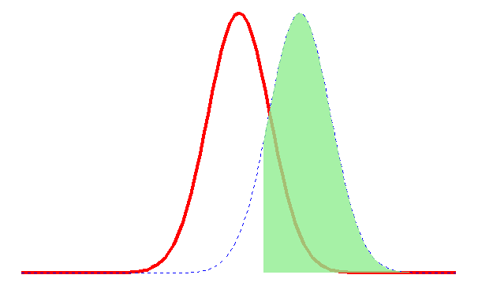

--- 
title: "Estadística para Contadores y Auditores con R"
author: 
 - "Oswaldo Navarrete Carreño"
 - "María Alexandra Chavez P."
 
date: "."
site: bookdown::bookdown_site
documentclass: krantz
bibliography: [book.bib, packages.bib]
biblio-style: apalike
link-citations: yes
description: "Libro de Estadística para Contadores y Auditores con R"
github-repo: "oswnavarre/AEDFR"
cover-image: "images/cover.png"
---

```{r global_options, include=FALSE}
knitr::opts_chunk$set(fig.pos = 'h',fig.align = 'center')
library(kableExtra)
library(tidyverse)
library(gridExtra)
library(latex2exp)
library(tinytex)
library(formatR)
library(VGAM)
library(methods)
library(fGarch)
library(DescTools)
```

# ¿A quién va dirigido este libro?

Este libro no es una introducción a la estadística. En la presente obra se intenta hacer un repaso de algunos temas de estadística que debe conocer quien desee hacer investigación en Contabilidad, en Auditoría o quizás en alguna ciencia social. Es probable que se omitan algunas cosas pero la retroalimentación de los lectores de esta obra será importante para su crecimiento.

En este texto se presentan, discuten y aplican los conceptos. La presentación de los conceptos es realizada pensando en un diálogo entre el autor y el lector, sin descuidar la formalidad de las expresiones matemáticas. Para la discusión y aplicación de los conceptos, se va mostrando al usuario como implementar el análisis estadístico en R. 

Este libro fue desarrollado con el paquete  `bookdown` que permite generar libros desde la consola de Rstudio una buena guía para empezar es @R-bookdown, la ventaja de usar este paquete es que se genera todo el contenido del libro [@xie2015], como índices, tablas, índices de tablas, índices de figuras mientras se desarrolla el análisis estadístico [@R-knitr]. Este paquete usa una variación de un lenguaje de marcado llamado Markdown [@R-rmarkdown] 

Para aprovechar al máximo este libro se recomienda tener a mano una computadora con R y Rstudio instalados, a fin de poder ir ejecutando los códigos que se muestran. Los scripts y los conjuntos de datos que se presentan pueden ser descargados de <http://oswaldonavarrete.info/datos-libro/>

Aunque la obra tiene un enfoque práctico, el lector no debe olvidar que aprender a usar R no implica saber estadística y que los programas estadísticos no brindan soluciones si el usuario no conoce los conceptos que deben ser aplicados. 


## ¿Qué es R?

El análisis de datos requiere una inversión de tiempo considerable en obtener, fusionar, limpiar, transformar, ordenar, visualizar, analizar, modelar, evaluar y desarrollar modelos de los datos. Todas estas actividades generalmente implican interactuar con nuestros datos a un nivel sotisficado y elevado, esto implica usar un lenguaje mediante el cual expresamos nuestro trabajo. En este libro se presenta la escritura formal en un lenguaje de programación que sirve para el análisis de datos. Y es a través de este lenguaje que realizaremos el procesamiento de nuestros datos.

Los lenguajes de programación, como cualquier lenguaje, tienen sus reglas propias que muchas veces son más rígidas que las reglas de los lenguajes que usamos para comunicarnos diariamente. Estas reglas se dividen en sintaxis que se refiere a las reglas para producir oraciones y en semántica que se refiere al significado de cada palabra.

Existen muchos lenguajes de programación por ejemplo Python, Matlab, Wolfram, sin embargo en este libro se trabaja con un lenguaje de programación sencillo que ha crecido y evolucionado mucho los últimos años y que proviene de la misma comunidad estadística. 

R es un lenguaje y entorno para computación estadística y gráficos. En los últimos años el uso del programa estadístico R ha ido en aumento. Puede ser descargado de <https://cran.r-project.org/> [@R-base]. 

En este texto suponemos que el lector no tiene conocimiento, familiaridad o experiencia con la sintaxis o la semántica de R. Estas se irán presentando a lo largo del libro, pensando exclusivamente en la programación sobre los datos. El entendimiento de la sintaxis y la semántica se dará por medio de los diferentes ejemplos que se presentan en el texto.  
 
## ¿Qué es Rstudio? 

RStudio es un entorno de desarrollo integrado (IDE por sus siglas en inglés) que ayuda a explotar todas las capacidades de R. Rstudio se descarga de la página <https://www.rstudio.com/>. Puede ser instalado en casi todos los sistemas operativos de escritorio. También puede ser instalado en un servidor que funciones con el sistema operativo GNU/Linux. En la sección \@ref(primerR) se explica el uso de Rstudio.


## Paquetes {#packages}

La potencia de R nace de los usuarios y de la inmensa comunidad de usuarios que por si mismos extienden el programa, debido a su naturaleza de código abierto. Cualquier persona puede contribuir a R, mediante paquetes.

Un **paquete** es una colección de comandos para una tarea particular. Un  **comando** es una instrucción en lenguaje de computadora, que sirve para indicarle a la computadora lo que debe hacer. Los paquetes generalmente necesitan de funciones o comandos de otros paquetes. 

Los paquetes están disponibles principalmente en "la red completa de archivos R"  (*the comprehensive R Archive Network* CRAN por sus siglas en inglés), en la actualidad existen cerca de $15\;000$ paquetes disponibles. Otros sitios donde se puede encontrar paquetes son el proyecto Bioconductor <http://www.bioconductor.org>, r-forge <https://r-forge.r-project.org/>, Github <https://github.com/languages/R> y la página de código de Google <https://code.google.com>

En este libro se usan los paquetes `dplyr`, `ggplot2`, `tidyr`, `BSDA`, `agricolae` y `Desctools`. Los tres primeros pertenecen al `tidyverse`, el `tidyverse` es una colección de paquetes diseñados para la ciencia de datos. Todos los paquetes comparten una filosofía de diseño, gramática y estructura subyacente de datos. 

<!--chapter:end:index.Rmd-->

```{r include = FALSE}
if(!knitr:::is_html_output())
{
  knitr::opts_chunk$set(fig.pos = 'h!')
}
```


# Estadística. Conceptos Básicos. {#intro}

En nuestra vida diaria es común escuchar el término **estadística** en situaciones como las tasas de desempleo, el índice de pobreza, el saldo promedio de nuestra cuenta de ahorros, el número de goles realizados en la LigaPro durante el fin de semana, etc. Aunque los ejemplos descritos no corresponden a una forma incorrecta de ver las estadísticas, en este texto se pensará
a la estadística como un conjunto de métodos que se utilizan para **recoger, clasificar, resumir, organizar, presentar, analizar e interpretar información numérica** [@cleff2013].

@lyman2010 manifiestan que "la estadística es la ciencia de diseñar estudios o experimentos, recoger datos y modelar o analizar los datos con el propósito de tomar decisiones o realizar descubrimientos científicos cuando la información disponible es tanto limitada como variable. En otras palabras la estadística es la ciencia de *aprender de los datos*". 

En las empresas la estadística es usada para tomar decisiones como los productos y las cantidades que deben ser producidas, la frecuencia con la que una maquinaria debe recibir mantenimiento, el tamaño del inventario, la forma de distribuir los productos, y casi todos los aspectos relativos a sus operaciones [@barrow2006]. En el estudio de las finanzas, la contabilidad, la economía y otras ciencias sociales la motivación para usar estadística radica en entender como funcionan los sistemas económicos, financieros o contables [@berenson2012].  

 
## Estadística descriptiva e inferencial {#estypes}

La estadística puede ser usada de dos formas. La primera, cuando se describen y se presentan los datos. Y la segunda es cuando los datos son utilizados para hacer inferencias sobre características del ambiente o del entorno de donde se seleccionaron los datos o sobre el mecanismo subyacente que generó los datos. La primera forma recibe el nombre de __estadística descriptiva__ y la segunda se conoce como __estadística inferencial__ [@rossman2018]. 

En la estadística descriptiva se utilizan métodos numéricos y gráficos para encontrar patrones y características de los datos a fin de resumir la información y presentarla de una forma significativa. Mientras que en la estadística inferencial se utilizan los datos para tomar decisiones, hacer estimaciones, pronósticos o predicciones y generalizaciones sobre el entorno del que fueron obtenidos los datos o el proceso que los generó [@cleff2013].

Sea en estadística descriptiva o en estadística inferencial, el primer paso siempre va a ser obtener información de alguna característica, medida o valor que nos interese de un grupo de elementos. Esa característica, medida o valor de interés para el investigador recibe el nombre de **variable** [@keller2011]. 

## Tipos de Variables

Muchos autores presentan algunas clasificaciones para las variables, en el texto trabajamos con una clasificación que se ajusta a las necesidades de la investigación en las áreas de nuestro interés. Según esta clasificación hay dos grandes grupos de variables: cuantitativas y cualitativas. Las primeras son las que toman valores __numéricos__. Mientras que las cualitativas toman valores que describen una __cualidad__ o __categoría__ [@ross2008].

Las variables cuantitativas se clasifican a la vez en **continuas** que se presentan cuando las observaciones pueden tomar cualquier valor dentro de un subconjunto de los números reales, ejemplos de variables cuantitativas continuas son: edad, altura, temperatura y  peso. Las  **discretas** son aquellas cuya característica principal es que las observaciones pueden tomar un valor basado en un recuento de un conjunto de valores enteros distintos. Ejemplos de variables cuantitativas discretas son: número de hijos, número de comprobantes de venta emitidos en un mes, número de clientes haciendo fila durante una hora en un banco, etc  [@devore2012].

### Niveles de medición

Las variables tienen cualquiera de los siguientes niveles de medición: 

1. Ordinal
2. Nominal
3. Intervalo
4. Razón

En el nivel  ordinal las observaciones toman valores que se ordenan o clasifican de forma lógica, por ejemplo las tallas de ropa (pequeña, media, grande, extra grande), la frecuencia con la que se hace una actividad (nunca, casi nunca, a veces, casi siempre, siempre). Por otro lado, en el nivel nominal las observaciones toman valores que no se pueden organizar de forna lógica, por ejemplo el sexo, el color de ojos, la marca de ropa favorita. Si se usan números en variables con nivel de medición nominal, estos números son usados solo para clasificar [@barrow2006; @cleff2013].

En el nivel de intervalo existe diferencia significativa entre valores pero el cero no representa la ausencia de la característica un ejemplo es la temperatura medida en grados Farenheit, el nivel de intervalo no solo clasifica y ordena las mediciones además indica que las distancias entre cada intervalo en la escala son equivalentes. Finalmente en el nivel de razón el 0 es significativo y la razón entre dos números es significativa, un ejemplo es la temperatura medida en grados Kelvin.

## Otros conceptos importantes

Existen algunos conceptos que son importantes y que se deben conocer al momento de realizar análisis estadístico de datos. 

*  **Población**: una población es el conjunto de todos los sujetos u objetos de interés en una investigación o análisis. Por ejemplo si se desea analizar la intención de voto en una ciudad para las próximas elecciones seccionales, la población serían todas las personas en edad de votar empadronadas en la ciudad. 
* **Muestra**: es la parte de la población que es analizada, dicho de otra forma una muestra es un subconjunto de la población. Sigamos con el ejemplo de la intención de voto, aunque el investigador quisiera no puede acceder a toda la población ya sea por cuestiones de tiempo o dinero y por esta razón debe tomar una parte de la población. La muestra debe representar lo mejor posible a la población. La parte de la estadística que comprende los métodos estadísticos para obtener muestras representativas de una población se llama *muestreo*
* **Parámetro**: un parámetro es una cantidad numérica que caracteriza a una población.
* **Estadístico**: un estadístico es una cantidad numérica que caracteriza a una muestra. 

```{r popsample, out.width = "50%",fig.cap="Población, Muestra, Parámetro y Estadístico",fig.align = 'center', echo=FALSE,fig.pos='h!'}

knitr::include_graphics("popsample.png")
```

## Tipos de estudio en investigación

Aunque en este texto se trabaja con conjuntos de datos descargados de entidades de control o generados por los autores a partir de otros conjuntos de datos, es importante que el lector conozca las formas de recolección de datos. Los investigadores pueden tomar información de encuestas, datos de empresas, páginas de internet oficiales. En cualquiera de los casos descritos, el investigador simplemente observa los datos como aparecen y no interviene en el fenómeno investigado. Este tipo de estudios recibe el nombre de **estudios observacionales** y pueden ser descriptivos o analíticos [@delafuente08]. En las áreas de finanzas, contabilidad o administración la mayoría de los estudios son observacionales.

En algunas ocasiones el investigador necesita intervenir de manera intencionada y programada para manipular una o más variables con el fin de analizar los efectos de estas manipulaciones en otras variables, en estos casos los estudios reciben el nombre de **experimentales** [@miggen07]. Este tipo de estudios es muy frecuente en medicina, psicología o educación.

## Primeros pasos en R {#primerR}

Una vez instalado R y RStudio, abrimos Rstudio para comenzar a trabajar. La ventana de RStudio tiene la apariencia que se muestra en la figura \@ref(fig:rstudio1).

La interfaz de RStudio incluye una **consola de R** en el lado izquierdo. El panel de ventanas en el lado superior derecho muestra el **ambiente (Environment)** que muestra los datos y los conjuntos de datos que se van definiendo a medida que se trabaja con R. En la  pestaña que se encuentra junto a **Environment** se muestra la **historia (History)** de todos los comandos que hemos ejecutado en R. A partir de la versión 1.1 en el panel superior derecho se encuentra una ventana para **Conexiones**, esta pestaña permite conectarse fácilmente a una variedad de fuentes de datos y explorar los objetos y datos dentro de la conexión. Se extiende y está diseñado para trabajar con una variedad de otras herramientas para trabajar con bases de datos en R.

En el panel inferior izquierdo se encuentra una pestaña **Archivos (Files)** para accceder a los archivos presentes en el directorio de trabajo. Otra pestaña da acceso a los **gráficos (Plots)**, otra a los **paquetes (packaqes)** instalados, una más a la **ayuda (Help)** y finalmente una pestaña **visor (Viewer)**   para acceder a los documentos que se hubieran generado desde el programa. Los paneles detallados se muestran en la figura \@ref(fig:rstudiotabs).


```{r rstudio1, out.width = "50%",fig.cap="Ventana de RStudio",fig.align = 'center', echo=FALSE,fig.pos='h!'}

knitr::include_graphics("rstudio1.png")
```

```{r rstudiotabs, out.width = "50%",fig.cap="Ventana de RStudio con sus paneles",fig.align = 'center', echo=FALSE,fig.pos='h!'}


```

Una vez que hemos reconocido nuestro ambiente de trabajo en Rstudio, lo primero que debemos hacer es abrir un nuevo "script", un script de R es simplemente un archivo de texto que contiene (casi) todos los comandos que se escribirían en la línea de comandos de R, para esto en la barra de menú seguimos la secuencia __File, New File, R Script__ o desde el teclado con la combinación _Ctrl + Shift + N_, en este archivo iremos escribiendo todos los comandos que usamos para el análisis. En la figura \@ref(fig:rstudio2) se aprecia un script abierto.

```{r rstudio2, out.width = "50%",fig.cap="Ventana de RStudio con Script",fig.align = 'center', echo=FALSE,fig.pos='h!'}

knitr::include_graphics("rstudio2.png")

```

Para empezar a aprender, en el script escribimos `3+2` y ejecutamos esto con la combinación de teclas __Ctrl + Enter__ el resultado obviamente es `r 3+2`. Ingresamos un conjunto de valores y los almacenaremos en una variable, para almacenar algo en una variable se puede usar  `<-` o  `=`. 

En el código que se muestra a continuación en la variable `x` almacenaremos un conjunto de 8 observaciones, es importante observar que la lista de datos es ingresada con el comando `c(elem1,elem2,elem3,...)` si los elementos de la lista fueran cadenas de texto o caracteres cada elemento se encierra entre comillas `" "`: 

```{r results='hide'}
x <- c(3,7,9,5,6,2,1,10) 
```

Recuerde que este código se ejecuta con la combinación de teclas __Ctrl + Enter__. Para poder realizar análisis estadístico, es necesario cargar nuestros datos en el programa. R acepta algunos formatos de archivos, como por ejemplo archivos de Excel, archivos de valores separados por coma, archivos de texto e inclusive archivos de otros programas como SPSS. Lo más usual es trabajar con un archivo de valores separados por coma es, estos archivos se caracterizan por tener extensión `.csv`, estos archivos `csv` se generan cuando el investigador recolecta la información, la almacena en un archivo de Excel o alguna otra hoja de cálculo y la guarda como un archivo de valores separados por coma. 

Para trabajar análisis estadístico de datos de forma eficiente con R existen dos formas la primera es fijar un directorio de trabajo y la segunda es crear un proyecto. Un directorio de trabajo es el espacio donde deben estar guardados nuestros archivos en el formato que sea de nuestra preferencia. Una forma de fijar el directorio de trabajo es desde la barra de menú escoger las opciones __Session, Set Working Directory, Choose Directory__ o desde el teclado con la combinación __Ctrl+Shift+H__, o con la función `setwd("rutadeldirectorio")`.

Aunque fijar el directorio de trabajo es una práctica recomendada, la práctica más eficiente es crear un proyecto. Trabajar con un proyecto permite al investigador especificar un directorio y sus archivos y subcarpetas como parte de un proyecto. Además de proporcionar un medio para almacenar la información de la sesión de trabajo, los proyectos facilitan la búsqueda en todos los archivos que lo conforman y permiten que estos archivos se pongan fácilmente bajo versiones de control.

Para crear un proyecto primero debemos presionar __File, New Project__ como se ve en la figura \@ref(fig:project1)

```{r project1, out.width = "45%",fig.cap="Nuevo Proyecto. Paso 1",fig.align = 'center', echo=FALSE,fig.pos='!h'}

knitr::include_graphics("project1.png")

```

Si no hemos creado la carpeta donde reposarán nuestros archivos, escogemos la primera opción __New Directory__. Pero si los archivos a ser analizados ya están en una carpeta escogemos la segunda opción __Existing Directory__, en este caso ya tenemos los archivos en una carpeta llamada _AEDFR_ por lo que escogemos la segunda opción. Las opciones se aprecian en la figura \@ref(fig:project2)

```{r project2, out.width = "45%",fig.cap="Nuevo Proyecto. Paso 2",fig.align = 'center', echo=FALSE,fig.pos='!h'}


```

Luego escogemos la ubicación de la carpeta donde reposan nuestros archivos dando clic en el botón __Browse__. Finalmente escogemos __Create Project__ como se aprecia en la figura \@ref(fig:project3).

```{r project3, out.width = "45%",fig.cap="Nuevo Proyecto. Paso 3",fig.align = 'center', echo=FALSE,fig.pos='!h'}

knitr::include_graphics("project3.png")

```

Finalmente se crea nuestro proyecto, la ventana de Rstudio ahora en la parte superior derecha muestra el nombre de nuestro proyecto. Tal como se aprecia en la figura \@ref(fig:project4). 

```{r project4, out.width = "40%",fig.cap="Nuevo Proyecto. Paso Final",fig.align = 'center', echo=FALSE,fig.pos='!h'}

knitr::include_graphics("project4.png")

```

Dentro de este proyecto creamos los scripts que necesitemos para nuestro análisis de datos. 

En este primer ejercicio trabajaremos con el archivo *cap2_big4_size.csv*. Los datos serán guardados en una variable llamada `big4size`, usaremos la función  `read.csv()` para leer los datos. La función `read.csv()` recibe las instrucciones `read.csv("archivo", header=T, sep=";",dec=",")`.  La opción `"archivo"` indica el nombre del archivo, `header=T` o `header=F` permite indicar si las columnas tienen o no un encabezado que las identifique, `sep=";"` sirve para indicar cual es el separador presente en nuestro archivo en algunas ocasiones ocurre que un archivo de valores separado por coma en realidad tiene sus valores separados por un punto y cona esto generalmente ocurre cuando el sistema operativo utiliza, como en este caso, la coma como separador decimal y finalmente la opción `dec=","` sirve para indicar que el separador decimal es la coma. 

En R se puede acceder a la ayuda sobre las funciones, esto se hace escribiendo `?funcion` por ejemplo si queremos la ayuda de la función `read.csv` simplemente escribimos `?read.csv` en el panel ubicado en la parte inferior derecha se desplegará la ayuda de la función. Con la particularidad de que la ayuda se despliega en inglés lo que no debería ser problema para un buen investigador.

El archivo que analizaremos contiene los activos, la utilidad, las ventas y el patrimonio de una muestra de empresas tomada de los registros de la Superintendencia de Compañías. Además en el conjunto de datos se indica si la empresa ha sido auditada por una de las 4 firmas auditoras consideradas las más grandes o también llamadas _*Big Four*_. En la \@ref(tab:tabla1) se muestran las 6 primeras observaciones de nuestro conjunto de datos.


```{r tabla1, echo=FALSE}
big4size <- read.csv("cap2_big4_size.csv",header=TRUE,sep=";",dec=",")
knitr::kable(
  head(big4size, 6), caption = 'Primeras 10 observaciones', longtable = TRUE,
  booktabs = TRUE,format = "pandoc") 
```

\newpage
Sin más preámbulos, empecemos a trabajar. Recapitulando, nuestro flujo de trabajo es:

1. Configurar el directorio de trabajo o crear un proyecto. Este paso ya fue realizado.
2. Crear un script donde escribiremos todo el código de nuestro análisis de datos.
2. Cargar el archivo indicado.
3.  Finalmente usamos la función `str()`, que nos permite obtener la descripción de la estructura de los datos. 

```{r}
big4size <- read.csv("cap2_big4_size.csv",header=TRUE,sep=";",dec=",")
str(big4size)
```

En la primera línea de los resultados se observa la salida  `'data.frame': 2256 obs. of  6 variables:` esto nos indica que nuestro *marco de datos (data frame)* tiene 2256 observaciones y 6 variables. Con respecto a las variables tenemos 6 variables que a continuación se describen, y se explican los resultados obtenidos con la función.

* `EXPMUESTRA`: esta variable es de tipo entera `(INT)` (por el inglés *integer*) y almacena el expediente de la empresa. Aunque la variable tiene valores numéricos, no es una variable cuantitativa sino cualitativa "Expediente de la Empresa"
* `BIG4`: esta variable es de tipo entera, y ha sido codificada con 1 si la empresa fue auditada por una Big Four y 0 si no. Podemos cambiar esta codificación por "Sí" y "No" en lugar de "1" y "0", más adelante aprenderemos como hacerlo. Al igual que la variable anterior aunque tiene valores numéricos, no es una variable cuantitativa sino cualitativa, dejamos al lector la reflexión en este particular. 
* `ACTIVOS`: contiene el valor de los activos totales de la empresa. Es de tipo `NUM`, en este caso es una variable cuantitativa continua porque permite el uso de decimales. 
* `UTILIDAD`: contiene el valor de la utildad de la empresa.
* `VTAS`: contiene el valor de las ventas de la empresa.
* `PAT`: contiene el valor del patrimonio de la empresa.

Los paquetes de R son colecciones de funciones y conjuntos de datos desarrollados por la comunidad de usuarios, los paquetes aumentan el poder de R mejorando las funcionalidades existentes en la base de R, o añadiendo nuevas funcionalidades. En este texto trabajaremos con algunos de los paquetes desarrollados por el equipo de RStudio como `ggplot2`, `dplyr` y otros, una descripción detallada de estos paquetes puede ser encontrada en  <https://www.rstudio.com/products/rpackages/>. Trabajaremos también con paquetes desarrollados por otros colaboradores de la comunidad de usuarios de R. 

Comenzaremos por instalar el paquete `dplyr`, este paquete tiene funciones que permiten realizar fácilmente manipulaciones de datos. Para instalar un paquete se utiliza la función `install.packages("paquete")`. Una vez instalado el paquete, se carga el paquete utilizando la función `library(paquete)`.

```{r, eval=FALSE}
install.packages("dplyr")
```

La primera manipulación que realizamos es la creación de nuevas variables con el paquete `dplyr`. En nuestros datos cargados en el conjunto de datos `big4size` creamos dos variables nuevas __ROS__ y __ROE__. En las ecuaciones \@ref(eq:ros) y \@ref(eq:roe) se dan las expresiones para calcular el __Retorno sobre ventas__ ( __ROS__ Return on Sales) y el __Retorno sobre el Patrimonio__ ( __ROE__ Return on Equity)


\begin{equation} 
  ROS = \dfrac{Utilidad}{Ventas}
  (\#eq:ros)
\end{equation}

\begin{equation} 
  ROE = \dfrac{Utilidad}{Patrimonio}
  (\#eq:roe)
\end{equation}

Una característica importante de `dplyr` es el uso del operador `%>%`. Cada transformación u operación en los datos se separa por el operador `%>%`. La primera función de `dplyr` que usaremos es `mutate()`, básicamente esta función permite crear nuevas variables.

```{r}
library(dplyr)
big4size <- big4size %>%
  mutate(
    ROS = UTILIDAD/VTAS,
    ROE = UTILIDAD/PAT
  )
str(big4size)
```

En las últimas líneas de la salida de R, se observa que en el conjunto de datos existen dos nuevas variables. En la próxima sección seguiremos trabajando con el mismo conjunto de datos.


## Medidas de Tendencia Central {#tendcentr}

Una medida de tendencia central, es una medida de resumen que intenta describir un conjunto completo de datos con un único valor que representa la mitad o centro de la distribución. 

Las tres medidas de tendencia central principales son la media, la mediana y la moda [@devore2012_2].

### Media

La media se la calcula como la suma de todos los valores de una variable dividido para el número de valores. En la ecuación \@ref(eq:mean) se muestra la fórmula para calcular la media [@macfarland2014].

\begin{equation} 
  \bar{x} = \dfrac{\sum_{i=1}^{n}x_i}{n}
  (\#eq:mean)
\end{equation}

La expresión $\sum_{i=1}^{n} x_i$ se interpreta como la suma desde el primer hasta el último elemento del conjunto de datos, dicho de otra forma:

\begin{equation} 
  \sum_{i=1}^{n} x_i = x_1 + x_2 + \ldots + x_n 
  (\#eq:sum)
\end{equation}

La media tiene algunas propiedades que a continuación se detallan [@uboe2017]:

* Si a cada valor $x_i$ de una distribución con media $\bar{x}$ se le suma un valor constante $k \in \mathbb{R}$, la nueva media es $\bar{x}+k$.
* Si a cada valor $x_i$ de una distribución con media $\bar{x}$ se lo multiplica por un valor constante $k \in \mathbb{R}$, la nueva media es $k\bar{x}$.
* Si a cada valor $x_i$ de una distribución con media $\bar{x}$ se lo divide por un valor constante $k \neq 0 \in \mathbb{R}$, la nueva media es $\dfrac{\bar{x}}{k}$.
* Solo existe una media para un conjunto de datos.
* Las medias de subconjuntos de un conjunto de datos pueden ser combinadas para determinar la media del conjunto de datos completo.
* Solo se usa para datos cuantitativos.

Las ventajas de usar la media son:

* Es fácil de entender y calcular
* No se ve afectada mayormente por fluctuaciones productos del muestreo
* Toma en cuenta todos los valores de la variable

Las desventajas de usar la media son:

* Es muy sensible a la presencia de pocos valores muy pequeños o muy grandes, dicho de otra forma la media es sensible a valores aberrantes o extremos.
* No se puede calcular por inspección.


### Mediana

La mediana es el valor central en una distribución cuando se ordenan los valores de forma ascendente o descendente. El valor de la mediana depende entonces del número de valores presentes en la variable [@barrow2006]. Definamos como $\left\{ X \right \}$ al conjunto ordenado de datos, y sea $\left  \{ X \right \}_i$ el valor i-ésimo del conjunto $\left \{ X \right \}$ entonces la mediana $Me$ se define como

\begin{equation}
Me = \begin{cases} 
      \left \{ X \right\}_{\frac{n+1}{2}} & ; n \quad \textrm{impar}  \\
      \dfrac{\left \{ X  \right \}_{\frac{n}{2}} + \left \{ X  \right \}_{\frac{n}{2}+1} }{2} & ; n \quad \textrm{par}
   \end{cases}
   (\#eq:median)
\end{equation}

Lo escrito en la ecuación \@ref(eq:median) se puede expresar de la siguiente forma: si el número de datos es impar, la mediana es igual al valor central de la distribución y si el número de datos es par, la mediana es igual al promedio de los valores centrales de la distribución.

Las ventajas de usar la mediana son:

* Es fácil de calcular y comprender
* Solo existe una mediana para un conjunto de datos. 
* No se ve afectada por valores extremos
* Se puede determinar para escalas ordinales, nominales, de razón e intervalo

Las desventajas de usar la mediana son:

* No toma en cuenta el valor exacto de cada dato y por tanto no usa toda la información disponible.
* Si se agrupan los valores de dos grupos, la mediana de cada grupo no puede ser expresada en términos del grupo agrupado. Dicho de otra forma si se calculan las medianas de subconjuntos de un conjunto de datos, estas medianas no pueden ser combinadas para calcular la mediana de todo el conjunto. [@zurita2010] 


### Moda

La moda es definida como el valor que ocurre con mayor frecuencia en los datos. Algunos conjuntos de datos no tienen moda porque cada valor ocurre solo una vez. Hay conjuntos de datos que tienen más de una moda, si tienen 2 modas reciben el nombre de bimodal y se acostumbra que si tiene más de 3 modas se la llama multimodal [@siegel2016].

Las ventajas de usar la moda son:

* Puede ser usada para datos con escala nominal
* Es sencilla de calcular

La desventaja de la moda es:

* No es usada en análisis estadístico debido a que no está definida algebraicamente y la fluctuación en la frecuencia de las observaciones es mayor cuando el tamaño de la muestra es pequeña.

### ¿Cuándo usar la media o la mediana?

La media es considerada generalmente la mejor medida de tendencia central y la más usada. Pero hay situaciones donde las otras medidas de tendencia central son preferidas. 

La mediana es preferida a la media cuando:

* Hay valores extremos en la distribución
* Hay valores indeterminados
* Los datos son medidos en una escala ordinal

Aunque en esta sección se habla exclusivamente de la media o la mediana, el lector debe conocer que la moda es la medida preferida cuando los datos son medidos en una escala nominal. 

### Cálculo de las medidas de tendencia central en R

Para calcular la media y la mediana se utilizan las funciones  `mean()` y `median()` respectivamente, estas dos funciones vienen cargadas con los paquetes base de R [@verzani2014]. Para calcular la moda usaremos la función `Mode()` del paquete `DescTools`, recuerde que para instalar un paquete se utiliza la función `install.packages()`.

En el siguiente ejemplo se obtiene la media de los activos de las empresas. Puesto que solamente necesitamos una variable del conjunto de datos usamos el operador `$`, el funcionamiento de este operador es `data.frame$variable`, primero indicamos el conjunto de datos del que llamamos la variable y después del operador `$` indicamos la variable con la que trabajamos.

```{r, results='markup'}
mean(big4size$ACTIVOS)
median(big4size$ACTIVOS)
library(DescTools)
Mode(big4size$ACTIVOS)
```

En el resultado de la moda se obtienen 2 valores. Esto implica que existen dos valores que se repiten más veces o tienen mayor frecuencia. Cuando se realiza investigación es común desear hacer una tabla con las estadísticas descriptivas de los datos. El paquete `dplyr` permite realizar tablas que resuman las variables de forma sencilla con la función `summarise()`.

```{r, results='markup'}
big4size %>%
  summarise(PROM.ACTIVOS = mean(ACTIVOS),
            PROM.UTILIDAD = mean(UTILIDAD),
            PROM.VTAS = mean(VTAS),
            MEDIAN.ACTIVOS = median(ACTIVOS),
            MEDIAN.UTILIDAD = median(UTILIDAD),
            MEDIAN.VTAS = median(VTAS)
            )
```

#### ¿Cuándo usar `mutate()` y cuándo usar `summarise()`? 
 
Note que cuando usamos la función `summarise()` creamos nuevas variables en el conjunto de datos, al igual que cuando se usa la función `mutate()` la principal diferencia entre `summarise()`y `mutate()` es que la primera resume los datos o dicho de otra forma devuelve un nuevo conjunto de datos con menos filas, mientras que `mutate()` devuelve el conjunto de datos con el mismo número de observaciones o con el mismo número de filas [@msdr2017].

## Medidas de posición (Cuantiles)

Las medidas de posición no central permiten conocer otros puntos característicos de la distribución que no son los valores centrales. Entre las medidas de posición no central más importantes están los cuantiles. El término cuantil fue usado por primera vez por Kendall en 1940 [@zurita2010].

El cuantil de orden $p$ de una distribución con $0<p<1$ es el valor $x_{i}$ de la variable $X$ que marca un corte de modo que una proporción $p$ o un porcentaje $100p$% de valores de la población es menor o igual que $x_{i}$ Por ejemplo el cuantil de orden $0.35$ dejaría un 35% de valores por debajo de él. 

### Tipos de Cuantiles

- *Cuartiles*: son 3 valores ($Q_{1}, Q_{2}, Q_{3}$) que dividen a la distribución en 4 partes iguales.

```{r cuart, out.width = "50%",fig.cap="Cuartiles",fig.align = 'center', echo=FALSE,fig.pos='!h'}


```

- *Quintiles*: son 4 valores ($K_{1}, K_{2}, K_{3}, K_{4}$) que dividen a la distribución en 5 partes iguales.

```{r quint, out.width = "50%",fig.cap="Quintiles",fig.align = 'center', echo=FALSE,fig.pos='!h'}

knitr::include_graphics("quintiles.png")
```

- *Deciles*: son 9 valores ($D_1, D_2, D_3, D_4, D_5, D_6, D_7, D_8, D_9$) que dividen a la distribución en 10 partes iguales.

```{r decil, out.width = "50%",fig.cap="Deciles",fig.align = 'center', echo=FALSE,fig.pos='!h'}

knitr::include_graphics("deciles.png")
```

- *Percentiles*, son 99 valores ($P_1, P_2, \ldots P_{99}$) que dividen a la distribución en 100 partes iguales.


### Cálculo de cuantiles

Es fácil darse cuenta que existen equivalencias importantes entre los cuantiles, algunos ejemplos de estas equivalencias:

- $D_5=Q_2=P_{50}$
- $D_4=K_2=P_{40}$
- $D_3=P_{30}$

Se deduce entonces que no es necesario tener una expresión para cada tipo de cuantiles, basta con conocer una expresión para calcular percentiles. Para esto debemos conocer dos cosas:

1. La posición del percentil en nuestro conjunto de datos.
2. El valor del percentil tomando en cuenta su posición.

Para calcular la posición del percentil $i$ que acumula el 100$p$% en un conjunto de datos no agrupado $X$, de tamaño $n$ y ordenado en forma ascendente primero determinamos la posición del percentil con la expresión:

\begin{equation} 
  \text{Posición} = p(n-1)+1
  (\#eq:posperc)
\end{equation} 

Para determinar el valor $X_{i.a}$ utilizamos la expresión:

\begin{equation} 
  X_{i.a}=X_{i}+0.a(X_{i+1}-X_{i})
  (\#eq:valperc)
\end{equation} 

Para calcular percentiles en R, se utiliza la función `quantile()`. Esta función recibe dos argumentos, la variable de la que se calcula el percentil y el porcentaje del percentil que se desea calcular [@verzani2014]. Se pueden calcular varios percentiles al mismo tiempo. 

Calculamos el primer cuartil $Q_{1}$ de la variable `ACTIVOS` del conjunto de datos ya trabajado anteriormente. Llamamos a esta variable utilizando la notación `$` recordemos que esta notación se usa poniendo `data.frame$variable` en este caso nuestra variable está en el conjunto `big4size` y se llama `ACTIVOS` por lo que para llamar la variable desde la función escribimos `big4size$ACTIVOS`. Luego debemos recordar que $Q_1=P_{25}$ por lo que en la función `quantile` debemos anotar $0.25$

```{r echo=TRUE}
quantile(big4size$ACTIVOS, 0.25)
```

Calculamos los tres cuartiles en este caso podemos escribir dentro de una lista los tres valores, para ingresar listas en R lo hacemos con `c(elemento1, elemento2, ... )` como ya lo habíamos indicado antes [@williams2017].

```{r, echo=TRUE}
quantile(big4size$ACTIVOS, c(0.25,0.50,0.75))
```

De los resultados obtenidos se interpreta que el 25% de los activos de las empresas es menor que $3\;184\;669$. Supongamos que se quieren determinar los deciles, una forma de hacer la lista es con la función `seq` con las instrucciones `seq(inicial, final, by = aumento)` de esta manera evitamos escribir los nueve valores.

```{r, echo=TRUE}
quantile(big4size$ACTIVOS, seq(0.1,0.9, by = 0.1))
```


## Medidas de dispersión {#dispersion}

Si comparamos los conjuntos de datos $X=\left\{ 2,4,6,8 \right\}$ y $Y=\left\{1,3,7,9\right\}$ se obtiene que las medias son iguales $\bar{X}= \bar{Y}=5$. En la figura \@ref(fig:rnl1) se han graficado con color rojo los puntos del conjunto $X$ y de color celeste los puntos del conjunto $Y$. Se observa que los valores del conjunto $Y$ están más dispersos que los valores del conjunto $X$, es fácil observar que los valores del conjunto $X$ están más cercanos a la media. En esta sección se discute las formas existentes para cuantificar la dispersión.

```{r rnl1, out.width = "50%",fig.cap="Conjuntos graficados",fig.align = 'center', echo=FALSE}
CONJUNTO = c(rep("X",4),rep("Y",4))
valores = c(2,4,6,8,1,3,7,9)
datos = valores
datos = as.data.frame(datos)
datos =cbind(CONJUNTO, datos)


ggplot(datos, aes(x=valores,y=CONJUNTO)) + 
  geom_point(aes(col=CONJUNTO,size=2)) +
  scale_x_continuous(breaks=1:9) +
  geom_vline(xintercept=5, linetype="dashed") +
  theme(legend.position = "none",panel.background = element_rect(fill="white"))+
  ylab("") + xlab("") 
```

### Rango
El rango es la medida de dispersión más fácil de calcular. Se obtiene restando el máximo menos el mínimo [@groebner2018]. La expresión para calcularlo es:

\begin{equation} 
  Rango = max - min
  (\#eq:rg)
\end{equation}

### Varianza

La dispersión  en un conjunto $x$ se puede entender como una medida de la distancia que tiene cada dato $x_i$ a la media de los datos. En el caso del conjunto $X$ descrito al inicio de esta sección se puede verificar que para cada dato la distancia del dato a la media ($x_i-\bar{x}$) es:

* $2-5=-3$
* $4-5=-1$
* $6-5=1$
* $8-5=3$

Al sumar estos valores el resultado es  $0$. De hecho el lector puede verificar que para cualquier conjunto de datos $X$ se cumple que $\sum_{i=1}^n{\left(x_i-\bar{x}\right)}=0$ por esta razón para calcular la dispersión se trabaja con la distancia cuadrática $\left(x_i-\bar{x}\right)^2$.

La varianza es el promedio de la diferencia cuadrática de la media. Si se conocen todos los datos de una población se puede calcular la varianza poblacional, denotada con $\sigma^2$, con la expresión:

\begin{equation} 
  \sigma^2 = \dfrac{\sum_{i=1}^{N}\left(x_i- \mu \right)^2}{N}
  (\#eq:varp)
\end{equation}

Por otro lado si se conocen los datos de una muestra se puede calcular la varianza muestral, denotada con $s^2$, con la expresión:

\begin{equation} 
  s^2 = \dfrac{\sum_{i=1}^{n}\left(x_i - \bar{x} \right)^2}{n-1}
  (\#eq:varm)
\end{equation}


### Desviación

La desviación es la raíz cuadrada de la varianza, en las fórmulas \@ref(eq:desp) y \@ref(eq:desm) se muestran las expresiones para calcular la desviación poblacional y muestral respectivamente. 

\begin{equation} 
  \sigma = \sqrt{\sigma^2} = \sqrt{\dfrac{\sum_{i=1}^{N}\left(x_i- \mu \right)^2}{N}}
  (\#eq:desp)
\end{equation}

\begin{equation} 
  s = \sqrt{s^2} = \sqrt{\dfrac{\sum_{i=1}^{n}\left(x_i- \bar{x} \right)^2}{n-1}}
  (\#eq:desm)
\end{equation}

### Medidas de dispersión en R 

Es necesario saber que R por defecto no tiene una función para calcular el rango, pero para calcular el rango usaremos `max() - min()`, y que además por defecto R tiene una función para calcular la varianza muestral (`var()`) y otra para calcular la desviación muestral (`sd()`), si se desea obtener la varianza y la desviación poblacional existen por lo menos 3 soluciones:

* Se puede multiplicar la varianza muestral por $\dfrac{n-1}{n}$ para obtener la varianza poblacional y la desviación muestral por $\sqrt{\dfrac{n-1}{n}}$ para obtener la desviación poblacional.
* Se puede multiplicar la varianza muestral por $\dfrac{n-1}{n}$ para obtener la varianza poblacional y a ese resultado extraer la raíz cuadrada para obtener la desviación poblacional.
* Crear funciones propias que calculen la varianza y la desviación muestral. 

Trabajamos con la segunda solución que es simplemente una mejora de la primera solución, la tercera solución es avanzada y será abordada más adelante.

A manera de ejemplo calcularemos las medidas de dispersión de los activos en millones de dólares de la base `cap2_big4_size.csv`. Se calculan la varianza y la desviación poblacional aunque, a menos de que tengamos todos los datos (población), siempre en el análisis estadístico de datos se calcula la varianza y la desviación muestral.

```{r, results='markup'}
big4size %>%
  summarise(RANGO.ACTIVOS = max(ACTIVOS/1000000)-min(ACTIVOS/1000000),
            VARM.ACTIVOS = var(ACTIVOS/1000000),
            DESVM.ACTIVOS = sd(ACTIVOS/1000000),
            n=n()
            ) %>%
  mutate(VARP.ACTIVOS = VARM.ACTIVOS*((n-1)/n),
         DESVP.ACTIVOS = sqrt(VARP.ACTIVOS)) %>%
  select(RANGO.ACTIVOS, VARM.ACTIVOS, DESVM.ACTIVOS, VARP.ACTIVOS, DESVP.ACTIVOS)
```

## Tablas de frecuencia

Una tabla de frecuencia es una forma de describir los datos de forma resumida, las tablas de frecuencia pueden construirse para variables cualitativas y para variables cuantitativas.

### Variables Cualitativas

Para las variables cualitativas una tabla de frecuencia basicámente tiene tres columnas: "Categoría", "Frecuencia", "Porcentaje". Para aprender a realizar tablas de frecuencia para variables cualitativas, trabajaremos con el conjunto de datos `audit_bolsa`, Este conjunto de datos tiene información sobre las empresas que cotizan en la Bolsa de Valores de Guayaquil, se elaborará una tabla de frecuencias de las firmas auditoras que han trabajado para estas empresas. La variable en la que se almacena esta información es la variable `FIRMA`. La tabla de frecuencia se elabora usando el paquete  `dplyr`. Recordemos que la función `mutate( )` sirve para crear nuevas columnas, en este caso se crea la columna porcentaje. 


```{r , echo=TRUE,eval=FALSE}
audit_bolsa <- read.csv("audit_bolsa.csv",header=TRUE,sep=";",dec=",")

tabla_firma <- audit_bolsa %>%
  group_by(FIRMA) %>%
  summarise(Frecuencia=n()) %>%
  mutate(Porcentaje = round(100*Frecuencia/sum(Frecuencia),2)
         ) %>%
  arrange(desc(Porcentaje))
 print(tabla_firma)
```

```{r , echo=FALSE,eval=TRUE, results='markup'}
audit_bolsa <- read.csv("audit_bolsa.csv",header=TRUE,sep=";",dec=",")

tabla_firma <- audit_bolsa %>%
  group_by(FIRMA) %>%
  summarise(Frecuencia=n()) %>%
  mutate(Porcentaje = round(100*Frecuencia/sum(Frecuencia),2)
         ) %>%
  arrange(desc(Porcentaje))
 print(tabla_firma)
```

```{r tabla2, echo=FALSE}
knitr::kable(
  tabla_firma, caption = 'Tabla de Frecuencia de Firmas Auditoras',
  booktabs = TRUE,format = "pandoc") 
```

En la tabla \@ref(tab:tabla2) se aprecia el resultado obtenido y formateado para ser publicado. El resultado de R, puede ser exportado a un archivo Excel con la finalidad de luego tomar esa tabla y llevarla a un documento donde se presentará toda la información analizada. Para exportar la información a un archivo excel se puede trabajar con el paquete `xlsx`. Para exportar los resultados a Excel se puede proceder de la siguiente forma.

1. Cargar el paquete `xlsx`.
2. Convertir el resultado a un `data frame` utilizando la función `as.data.frame()`
3. Exportar el resultado con la función `write.xlsx()` cuya estructura básica es `write.xlsx(datos, "archivo.xlsx")`, si se desea consultar más detalles de la función se puede escribir `?write.xlsx`. 

El resultado de esta operación será un archivo de excel guardado en nuestro directorio de trabajo.

```{r, echo=TRUE, eval=TRUE}
library(xlsx)
tabla_firma = as.data.frame(tabla_firma)
write.xlsx(tabla_firma, "tablas.xlsx", sheetName = "firmas", row.names = FALSE)

```

La opción `sheetname = "firmas"` crea dentro del libro `tablas.xlsx` una hoja de cálculo llamada `firmas`. La opción `row.names = FALSE` hace que en el archivo final no se graben los números de cada fila. 
 
Nota: es importante tener fijado el directorio de trabajo, como se explicó en la sección \@ref(primerR). 

### Variables Cuantitativas

Una tabla de frecuencias para variables cuantitativas tiene 6 columnas:

1. Clase: una clase es un intervalo del tipo $\left[ menor, mayor \right)$
2. Marca de Clase: es un valor igual al promedio de los dos extremos de la clase.
3. Frecuencia: la frecuencia es igual al número de valores de la variable que están dentro del intervalo.
4. Frecuencia relativa: la frecuencia relativa se la calcula como la frecuencia dividida para el total de valores de la variable.
5. Frecuencia acumulada: se la calcula sumando las frecuencias desde la primera clase hasta la clase en consideración.
6. Frecuencia Relativa acumulada: se la calcula como la frecuencia acumulada pero para las frecuencias relativas. 


Una de las ventajas de usar R es que se pueden crear funciones para cada necesidad que el investigador tenga, en este caso el código que se muestra sirve para hacer tablas de frecuencia de cualquier variable cuantitativa. A manera de ejemplo se hará la tabla de frecuencia de la variable `VTAS` en millones de dólares, del conjunto de datos trabajado en la sección \@ref(primerR). 

```{r,echo = TRUE}
library(agricolae)
library(dplyr)

h2<-with(big4size,graph.freq(VTAS/1000000,plot=FALSE));

h2 = table.freq(h2)

h3 <- h2 %>%
  mutate(Clase = paste("[",Lower,",",Upper,")"),	
        "Marca de Clase"  =  Main,
        Frec. = Frequency,
        "Frec. Rel." = Percentage,
        "Frec. Acu." = CF,
        "Rel. Acu." = CPF )  %>%
  select(-c(1:7))
```

```{r tabla3, echo=FALSE}
knitr::kable(
  h3, caption = 'Tabla de Frecuencia de las Ventas',
  booktabs = TRUE,format = "pandoc") 
```

De la tabla \@ref(tab:tabla3) se obsserva que el $93\%$ de las empresas realiza ventas entre 0 y $165.76$ millones. El $99\%$  de las empresas que equivale a $2234$ tiene ventas menores a $663.04$ millones de dólares, esto se lo puede ver en la columna de frecuencias acumuladas relativas. Además, solo una empresa tiene ventas entre $1823.36$ y $1989.12$ millones. Finalmente exportamos la tabla de frecuencia en el archivo `tablas.xlsx`. La opción `append = TRUE` sirve para añadir una nueva hoja de cálculo al libro.

```{r, echo=TRUE, eval=TRUE}
library(xlsx)
h3 = as.data.frame(h3)
write.xlsx(h3, "tablas.xlsx", sheetName = "frec_ventas", row.names = FALSE,append=TRUE)
```

## Tablas de Contingencia

Una tabla de contingencia es una forma útil para examinar relaciones entre dos variables categóricas. Los valores en las celdas de una tabla de contingencia pueden ser de frecuencia absoluta o frecuencia relativa.

Para ejemplificar la construcción de una tabla de contingencia trabajamos con el archivo `Ranking2018Guayas.csv` que tiene información sobre 23457 empresas de la provincia del Guayas. Se analizará la relación entre la ciudad y el tamaño de las empresas. 

Para construir tablas de contingencia se utiliza la función `spread( )` del paquete `tidyr`. El uso básico de esta función es `spread(datos, clave,valor)` donde `clave` corresponde a las columnas que se usarán y `valor` al número que se incluirá en la tabla. En este caso escribimos `spread(TAMAÑO, n),` no indicamos los datos porque se hace uso del operador %>% antes de la función `spread()`.

```{r, echo=TRUE, eval=TRUE, warning=FALSE}
library(tidyr)
rank2018 = read.csv("Ranking2018Guayas.csv",header=TRUE, sep=";",dec=",")

ciudad.tama = rank2018 %>% 
  group_by(CIUDAD, TAMAÑO)%>%
  summarise(n=n())%>%
  spread(TAMAÑO, n) %>%
  replace(., is.na(.), 0)
  
```

En la tabla \@ref(tab:tabla4) se observa que de las 23457 empresas 11824 son microempresas y de la ciudad de Guayaquil. Esta información, como se mencionó antes, puede también ser mostrada en porcentajes. En la tabla \@ref(tab:tabla5) se observa la tabla de contingencia con los porcentajes. 

```{r, echo=TRUE, eval=TRUE}
ciudad.tama.porc = rank2018 %>% 
  group_by(CIUDAD, TAMAÑO)%>%
  summarise(Porc = round(100*n()/nrow(rank2018),2)) %>%
  spread(TAMAÑO, Porc) %>%
  replace(., is.na(.), 0)
```


\newpage

```{r tabla4, echo=FALSE}
knitr::kable(
  ciudad.tama, caption = 'Tabla de Contingencia de las empresas clasificadas por tamaño y ciudad',
  booktabs = TRUE,format = "pandoc")
```


\newpage

```{r tabla5, echo=FALSE}
knitr::kable(
  ciudad.tama.porc, caption = 'Tabla de Contingencia de las empresas clasificadas por tamaño y ciudad',
  booktabs = TRUE,format = "pandoc") 
```

Las tablas \@ref(tab:tabla4) y \@ref(tab:tabla5) podrían resultar "grandes" para ilustrar el concepto de tablas de contingencia, en las tablas \@ref(tab:contpeq) y \@ref(tab:contpeqporc) se muestran las empresas clasificadas por tamaño y tipo en frecuencias absolutas y en porcentajes respectivamente. 

```{r, echo=TRUE, eval=TRUE}

tipo.tama = rank2018 %>% 
  group_by(TIPO, TAMAÑO)%>%
  summarise(n=n())%>%
  spread(TAMAÑO, n) %>%
  replace(., is.na(.), 0)
  
```

```{r, echo=TRUE, eval=TRUE}
tipo.tama.porc = rank2018 %>% 
  group_by(TIPO, TAMAÑO)%>%
  summarise(Porc = round(100*n()/nrow(rank2018),2)) %>%
  spread(TAMAÑO, Porc) %>%
  replace(., is.na(.), 0)
```

```{r contpeq, echo=FALSE}
knitr::kable(
  tipo.tama, caption = 'Tabla de Contingencia de las empresas clasificadas por tipo y tamaño',
  booktabs = TRUE,format = "pandoc")
```

```{r contpeqporc, echo=FALSE}
knitr::kable(
  tipo.tama.porc, caption = 'Tabla de Contingencia de las empresas clasificadas por tipo y tamaño',
  booktabs = TRUE,format = "pandoc") 
```

```{r include=FALSE}
library(xlsx)
ciudad.tama = as.data.frame(ciudad.tama)
ciudad.tama.porc = as.data.frame(ciudad.tama.porc)
write.xlsx(ciudad.tama, "tablas.xlsx", sheetName = "contingencia_abs", row.names = FALSE,append=TRUE)
write.xlsx(ciudad.tama.porc, "tablas.xlsx", sheetName = "contingencia_rel", row.names = FALSE,append=TRUE)

```

\newpage

### Las funciones `spread` y `gather` 

En la sección anterior hicimos uso de la función `spread( )`. Esta función tiene una función complementaria llamada `gather`. Para comprender mejor el uso de estas funciones, analizamos un conjunto de datos llamado `IPC.csv`. En este conjunto de datos se encuentra el valor del *Índice de Precios al Consumidor* desde enero de 1995 hasta diciembre de 2018 [@msdr2017]. 

```{r}
IPC = read.csv("IPC.csv",header = TRUE, dec=",", sep = ";")
head(IPC)
```

Se puede observar que este conjunto tiene 24 observaciones una por cada año y 13 variables la primera variable es `AÑO` y las otras 12 variables corresponden a los meses del año. Supongamos que queremos transformar este conjunto **ancho** a un conjunto **largo** con solo tres variables `AÑO`, `MES` e `IPC`. en este caso usamos la función `gather`. 


```{r}
IPC2 = IPC %>%
  gather(key = "MES", value = "IPC", 2:13)

head(IPC2)
```

Podemos observar que los nombres de las columnas que estaban de la columna 2 a la 13 ahora están como categorías de la variable mes y que los valores que antes estaban en estas columna ahora se almacenan en una variable llamada `ÌPC`. 

Si deseamos regresar al conjunto inicial utilizamos la función `spread()`

```{r}
IPC3 = IPC2 %>%
  spread(key = "MES", value = "IPC")

head(IPC3)
```

Podemos observar que el conjunto `IPC3` es igual al conjunto de datos inicial, con la diferencia que las columnas de los meses se han ordenado alfabeticamente. En secciones posteriores aprenderemos a trabajar con variables relacionadas a tiempo. En resumen la función `gather( )` transforma datos anchos a datos largos y `spread( )` transforma datos largos a datos anchos.  

```{r gatspr, out.width = "50%",fig.cap="Datos largos y datos anchos",fig.align = 'center', echo=FALSE,fig.pos='!h'}


```

\newpage

## Gráficos y Visualización

Para realizar gráficas R tiene algunos paquetes disponibles, mas en este texto trabajaremos con el paquete  `ggplot2`. Este paquete produce gráficos como muchos otros paquetes pero no se parece al resto de paquetes debido a que tiene una grámatica subyacente muy profunda [@wickham2016], esta gramática está basada en la Gramática de los Gráficos descrita en  @wilkinson2005. Esto lo hace un paquete que no solo esta diseñado para problemas preestablecidos sino que se pueden crear nuevos gráficos adaptados a las necesidades del usuario. 

### Histogramas

Los histogramas se utilizan para variables continuas. Un histograma es un gráfico de la distribución de frecuencia de una variable, en el eje vertical se representa la frecuencia (absoluta o relativa) y en el eje horizontal los rangos de los valores.

En la figura \@ref(fig:figura1) se muestra el histograma de la variable ventas en millones de dólares del archivo *cap2_big4_size.csv* ya descrito en la sección \@ref(primerR), este primer histograma ha sido configurado para presentar 12 barras, que las barras sean de color azul con un contorno rojo. Antes de abordar los detalles mencionados discutiremos brevemente el funcionamiento de la gramática de `ggplot2`, una gráfica realizada en `ggplot2` empieza por `ggplot(data, aes())` dentro de `aes()` se indica las variables que van a intervenir en la gráfica, Luego se añade la `geom` con la que se va a trabajar en este caso se escogió `geom_histogram()`  puesto que se desea  realizar un histograma [@hitchhiker2017]. Como se indicó anteriormente se configuró el histograma con 12 barras (`bins=12`), la opción `color="red"` permite que el contorno de las barrras sea rojo y la opción `fill="blue"`hace que las barras sean de color azul. 

```{r figura1, results='markup', echo=TRUE, out.width = "60%", message=FALSE, warning=FALSE, fig.cap="Histograma de las Ventas", fig.pos='h!'}


ggplot(big4size, aes(x= VTAS/1000000)) + 
  geom_histogram(bins=12, color= "red", fill="blue" ) + 
  theme_light()
```

Para configurar las etiquetas de los ejes podemos añadir las opciones `xlab( )` y `ylab( )`. En la figura \@ref(fig:figura2) se aprecia el histograma con las etiquetas de los ejes añadidos. 

```{r figura2, results='markup', echo=TRUE, out.width = "70%", message=FALSE, warning=FALSE, fig.cap="Histograma de las Ventas con Etiquetas en los Ejes", fig.pos='h!'}


ggplot(big4size, aes(x= VTAS/1000000)) + 
  geom_histogram(bins=12, color= "red",  fill="blue" ) + 
  xlab("Ventas en Millones de Dólares") + ylab("Frecuencia") +
  theme_light()
```

Usando el archivo `Ranking2018Guayas.csv`, hacemos el histograma de las ventas en millones de acuerdo al tamaño de la empresa. En la figura \@ref(fig:figura3) se observa el histograma, para obtener un gráfico agradable a la vista se cambia la orientación de las marcas de $0^\circ$ a $90^\circ$ en el eje $x$ con la instrucción `theme(axis.text.x = element_text(angle = 90, hjust = 1))`.  


```{r figura3, echo=TRUE,out.width = "60%",fig.cap="Histograma de las Ventas de Acuerdo al Tamaño de la empresa", fig.pos='h!'}

ggplot(rank2018, aes(x=VENTAS/1000000, fill=TAMAÑO)) + 
  geom_histogram(alpha=0.3, color="black",bins = 20) +
  theme(axis.text.x = element_text(angle = 90, hjust = 1), 
        panel.background = element_rect(fill="white")) +
  xlab("Ventas en Millones") + ylab("Frecuencia") 
```

Se puede observar en la \@ref(fig:figura3) que algunas empresas grandes tienen mayores ventas que el resto de empresas. Una mejor forma de comparar la distribución de una variable de acuerdo a otra variable es usar los diagramas de caja que serán discutidos en profundidad en la sección \@ref(boxes). 

Si se desea ver los histogramas de acuerdo al tamaño de empresa se puede separar los histogramas con la opción `facet_grid(. ~ VARIABLE)`, dentro de esta opción se escribe el nombre de la variable por la que se quiere separar el gráfico, en este caso se escribe `facet_grid(. ~ TAMAÑO)`. Un ejemplo se visualiza en la figura \@ref(fig:histfacet).

```{r histfacet, echo=TRUE,out.width = "60%",fig.cap="Histograma de las Ventas de Acuerdo al Tamaño de la empresa", fig.pos='h!'}

ggplot(rank2018, aes(x=VENTAS/1000000)) + 
  geom_histogram(alpha=0.3, color="black",bins = 10) +
  theme(axis.text.x = element_text(angle = 90, hjust = 1), 
        panel.background = element_rect(fill="white")) +
  xlab("Ventas en Miles") + ylab("Frecuencia") +
  facet_grid(. ~ TAMAÑO)
```


#### Simetría y sesgo 

Un histograma es *simétrico* en forma si hacia la derecha y la izquierda tiene la misma forma como se aprecia en la parte superior de la figura \@ref(fig:sime1) [@lind2019]. Cuando el lado derecho del histograma, que contiene la mitad más grande de las observaciones en los datos, se extiende una distancia mayor que el lado izquierdo se dice que el histograma esta **sesgado a la derecha** [@envoy2018] como se aprecia en la parte superior de  la figura \@ref(fig:sesgoright). Finalmente el histograma es **sesgado a la izquierda** cuando el lado izquierdo se extiende una distancia mucho mayor que el lado derecho, un ejemplo se aprecia en la parte superior de la figura \@ref(fig:sesgoleft).

En la sección \@ref(tendcentr) se discutieron las medidas de tendencia central, ¿cómo se relacionan las medidas de tendencia central y el sesgo? Si la distribución es simétrica se cumple que $\bar{x}=Me=Mo$, esto se puede visualizar en la parte inferior de la figura \@ref(fig:sime1). Cuando es sesgada a la derecha se cumple que $Mo < Me < \bar{x}$ en la parte inferior de la figura \@ref(fig:sesgoright) se visualiza la moda de color azul, la mediana de color rojo y la media de color verde. Mientras que si es sesgada a la izquierda se puede verificar que $\bar{x} < Me < Mo$ como se aprecia en la parte inferior de la figura \@ref(fig:sesgoleft). 


```{r sime1, echo=FALSE, fig.cap="Histograma Simétrico", fig.pos='h!', out.width="50%"}


set.seed(20)
dt <- rnorm(10000, mean = 0, sd=1)
dt <- as.data.frame(dt)
names(dt) <- c("Tiempo")
mean.t = mean(dt$Tiempo)
median.t = median(dt$Tiempo)

p1 = ggplot(dt, aes(x=Tiempo)) + 
  geom_histogram(bins=20,colour="black", fill="white") +
  ylab("")  + xlab("")  + theme_void()
p2 = ggplot(dt, aes(x=Tiempo)) + 
  geom_density() +
  geom_vline(xintercept=mean.t) +
  geom_vline(xintercept=median.t,col="red") +
  ylab("")  + xlab("")  + theme_void()

grid.arrange(p1,p2)
```


```{r sesgoright, echo=FALSE, fig.cap="Histograma Sesgado a la Derecha", fig.pos='h!', out.width="50%"}

set.seed(20)
df <- data.frame(
  normal_distrib = round(rnorm(n = 10000, mean = 0, sd = 1),2),
  exp_distrib = rexp(n = 10000, rate = .1),
  gamma_distrib = round(rgamma(n = 10000, shape = 2, scale = 2),2),
  beta_distrib = round(rbeta(n = 10000, shape1 = 8, shape2 = 2),2)

)
mean.gamma = mean(df$gamma_distrib)
median.gamma = median(df$gamma_distrib)
mode.gamma = Mode(df$gamma_distrib)

p3 <- ggplot(data =df, aes(x=gamma_distrib)) +
  geom_histogram(bins=20,fill="white",col="black") + 
  xlab("") + ylab("") +theme_void()
p4 = ggplot(data =df, aes(x=gamma_distrib)) +
  geom_density() + geom_vline(xintercept=mean.gamma, colour="green") +
  geom_vline(xintercept=median.gamma,colour="red") +
  geom_vline(xintercept=mode.gamma[1],colour="blue") + theme_void()

grid.arrange(p3,p4)
```

```{r sesgoleft, echo=FALSE, fig.cap="Histograma Sesgado a la Izquierda", fig.pos='h!', out.width="60%"}

set.seed(20)
df <- data.frame(
  normal_distrib = round(rnorm(n = 10000, mean = 0, sd = 1),2),
  exp_distrib = rexp(n = 10000, rate = .1),
  gamma_distrib = round(rgamma(n = 10000, shape = 2, scale = 2),2),
  beta_distrib = round(rbeta(n = 10000, shape1 = 8, shape2 = 2),2)

)
mean.beta = mean(df$beta_distrib)
median.beta = median(df$beta_distrib)
mode.beta = Mode(df$beta_distrib)

p5 = ggplot(data =df, aes(x=beta_distrib)) +
  geom_histogram(bins=20,fill="white",col="black") + 
  xlab("") + ylab("") +theme_void()

p6 = ggplot(data =df, aes(x=beta_distrib)) +
  geom_density() + geom_vline(xintercept=mean.beta,colour="green") +
  geom_vline(xintercept=median.beta,colour="red") +
  geom_vline(xintercept=mode.beta[1],colour="blue") + 
  xlab("") + ylab("") +theme_void()

grid.arrange(p5,p6)
```


\newpage

### Diagrama de barras

Los histogramas se usan para variables cuantitativas, mientras que los gráficos o diagramas de barras se utilizan para variables cualitativas. Al igual que los histogramas los diagramas de barras se elaboran para las frecuencias absolutas o las relativas [@kwm2016]. 

Para ejemplificar la elaboración de diagrama de barras, trabajamos con el conjunto de datos`Ranking2018Comercio.csv` que contiene una muestra de 507 empresas de Ecuador dedicadas al comercio.

```{r echo=TRUE, results = 'markup' }
rank2018com = read.csv("Ranking2018Comercio.csv",header = T,sep=";",dec=",")
str(rank2018com)
```

El conjunto de datos tiene 507 observaciones con 12 variables. Las variables presentes en este conjunto de datos son:

1. `EXPEDIENTE` variable cualitativa que almacena el número de expediente asignado por la Superintendencia de Compañías.
2. `TIPO` es una variable cualitativa con un nivel de medición nominal que almacena el tipo de compañía. En esta variable existen 3 niveles.
3. `ACTIVIDAD` variable cualitativa con nivel de medición nominal que almacena la actividad económica de la empresa, estas actividades se rigen por un catalógo dado por la superintendencia.
4. `REGIÓN` variable cualittativa con nivel de medición nominal que almacena la región del país a la que pertenece la empresa.
5. `PROVINCIA` variable cualitativa con nivel de medición nominal que almacena la provincia a la que pertenece la empresa.
6. `TAMA` variable cualitativa con nivel de medición ordinal que almacena el tamaño de la empresa.
7. `SECTOR` variable cualitativa con nivel de medición ordinal que indica el sector al que pertenece la empresa.
8. `EMPLEADOS`variable cuantitativa discreta que almacena el número de empleados de la empresa.
9. `ACTIVO` variable cuantitativa continua que almacena el valor de los activos en libros de la empresa.
10. `PATRIMONIO` variable cuantitativa continua que almacena el valor del patrimonio en libros de la empresa.
11. `VENTAS` variable cuantitativa continua que almacena el valor de las ventas en libros de la empresa.
12. `UTILIDAD` variable cuantitativa continua que almacena el valor de la utilidad en libros de la empresa.

Como hemos dicho anteriormente los diagramas de barra se utilizan para variables cualitativas. Comenzamos elaborando una tabla de frecuencias de las empresas por región.

```{r echo=TRUE}
tabla_reg <- rank2018com %>%
  group_by(REGIÓN) %>%
  summarise(Frecuencia=n()) %>%
  mutate(Porcentaje = round(100*Frecuencia/sum(Frecuencia),2)
  ) %>%
  arrange(desc(Porcentaje))
print(tabla_reg)
```

Para hacer diagramas de barras se utiliza `geom_bar()` en este caso como deseamos hacer un diagrama de barras de las frecuencias dentro de `geom_bar()` esvribimos `stat="count"`. En la figura \@ref(fig:barras1) se observa el gráfico de barras de las empresas por región.

```{r barras1, echo=TRUE,out.width = "60%",fig.cap="Gráfico de Barras de las empresas por Región", fig.pos='h!'}
ggplot(rank2018com, aes(x=REGIÓN)) + 
  geom_bar(stat = "count",col="black",fill="white") +
  xlab("") + ylab("Frecuencia")
```

En la figura se observa que las regiones están en orden alfabético. Supongamos que se desea ordenar las regiones en el siguiente orden:

1. Costa
2. Sierra
3. Oriente
4. Galápagos

Para lograr este objetivo, antes de hacer el diagrama de barras debemos reordenar las regiones. Como se muestra a continuación:

```{r echo=TRUE}
rank2018com$REGIÓN <- factor(rank2018com$REGIÓN,
                             levels = c("COSTA", "SIERRA", "ORIENTE", "GALAPAGOS"))
```

Luego de reordenar las regiones podemos volver a realizar el gráfico de barras pero esta vez obtendremos las regiones en el orden deseado como se observa en la figura \@ref(fig:barras2):

```{r barras2, echo=TRUE,out.width = "60%",fig.cap="Gráfico de Barras de las empresas por Región (Ordenadas)", fig.pos='h!'}
ggplot(rank2018com, aes(x=REGIÓN)) + 
  geom_bar(stat = "count",col="black",fill="white") +
  xlab("") + ylab("Frecuencia")
```

Supongamos que queremos hacer un gráfico de barras de las empresas por región y por tamaño. Elaboremos primero una tabla de contingencia que contenga la información solicitada.

```{r echo=TRUE}
tama.reg = rank2018com %>% 
  group_by(TAMA, REGIÓN)%>%
  summarise(n=n())%>%
  spread(TAMA, n) %>%
  replace(., is.na(.), 0)

print(tama.reg)
```

Para elaborar el gráfico agregamos la opción `fill = TAMA` junto a `x=REGIÓN`

```{r barras3, echo=TRUE, out.width = "60%",fig.cap="Gráfico de Barras de las empresas por Región y por Tamaño", fig.pos='h!'}

ggplot(rank2018com, aes(x=REGIÓN,fill=TAMA)) + 
  geom_bar(stat = "count",position = "dodge") +
  xlab("") + ylab("Frecuencia")

```

Se puede notar que en las leyendas ubicadas a la derecha del histograma, el título es *TAMA* porque la variable tiene ese nombre si quisierámos poner el nombre completo agregamos la opción `scale_fill_discrete(name="Tamaño")`

```{r barras4, echo=TRUE, out.width = "60%",fig.cap="Gráfico de Barras de las empresas por Región y por Tamaño", fig.pos='h!'}

ggplot(rank2018com, aes(x=REGIÓN,fill=TAMA)) + 
  geom_bar(stat = "count",position = "dodge") +
  scale_fill_discrete(name="Tamaño") + 
  xlab("") + ylab("Frecuencia")

```

### Diagramas de Caja y valores atípicos {#boxes}

En la figura \@ref(fig:figura3) se pretendía mostrar la distribución de las ventas de acuerdo al tamaño de la empresa. Pero el histograma no mostraba claramente la distribución de acuerdo al tamaño de la empresa. una alternativa es usar un diagrama de caja.

Un diagrama de caja está formado por 5 valores que lo resumen, estos 5 valores se muestran en la figura \@ref(fig:caja1). La distancia entre el primer y el tercer cuartil se la conoce como rango intercuartílico (IQR, por sus siglas en inglés). El límite superior es igual al tercer cuartil más 1.5 veces el rango intercuartílico, valores mayores a esta cantidad se consideran valores atípicos. Mientras que el límite inferior es igual al primer cuartil menos 1.5 veces el rango intercuartílico y valores menores a esta cantidad se consideran valores atípicos [envoy2018]. 

\begin{equation} 
  IQR = Q_3 - Q_1
  (\#eq:iqr)
\end{equation}

\begin{equation} 
  LS = Q_3 + 1.5IQR
  (\#eq:ls)
\end{equation}

\begin{equation} 
  LI = Q_1 - 1.5IQR
  (\#eq:li)
\end{equation}

```{r caja1, out.width = "40%",fig.cap="Partes de un Diagrama de Caja",fig.align = 'center', echo=FALSE,fig.pos='h!'}

knitr::include_graphics("boxplot3.png")
```

En la figura \@ref(fig:figura4) se observan los diagramas de caja de las ventas según el tamaño de la empresa. Se puede notar que existen diferencias entre las ventas de las empresas medianas, las microempresas y las pequeñas. El $50\%$ de las empresas medianas vende más de $1250000$, mientras que todas las microempresas venden menos de $250000$. Las empresas pequeñas que venden más de $500000$ son atípicas, mientras que en las empresas medianas no se presentan valores atípicos. 

```{r figura4, echo=TRUE,out.width = "60%",fig.cap="Diagrama de Caja de las Ventas según el Tamaño de la empresa",fig.pos='h!'}

ggplot(rank2018, aes(TAMAÑO, VENTAS/1000)) + 
  geom_boxplot() + xlab("Tamaño de las empresas") +
  ylab("Ventas en Miles de Dólares") +theme_light()
```

Si se quisiera analizar con mayor detalle las microempresas se podría seleccionar solo las empresas con este tamaño y elaborar el diagrama de caja correspondiente, para lograr esto se utiliza la función `subset(df, cond)`. donde `df` corresponde al *data frame* usado y *cond* a la regla que deben cumplir los datos a ser analizados. 

```{r figura5, out.width = "60%", echo=TRUE,fig.cap="Diagrama de Caja de las Ventas de las Microempresas", fig.pos='h!'}

ggplot(subset(rank2018, TAMAÑO == "MICROEMPRESA"), aes(TAMAÑO, VENTAS/1000)) + 
  geom_boxplot() + xlab("") +
  ylab("Ventas en Miles de Dólares") +theme_light()
```


\newpage

## Ejercicios

### Teóricos

1. Supongamos que se desea analizar el efecto de una estrategia de enseñanza en la mejora del rendimiento estudiantil de una institución de educación superior. A un grupo de estudiantes se les imparte clases aplicando la estrategia de enseñanza, mientras que a otro grupo de estudiantes se les enseña de forma tradicional ¿qué tipo de estudio se utiliza en esta investigación?

2. Se desea conocer la distribución del pago del impuesto a la renta de las microempresas de la ciudad de Guayaquil en el ejercicio económico anterior, para lo cual se consultan la información disponible en la página del Servicio de Rentas Internas ¿qué tipo de estudio se utiliza en esta investigación?

3. Considere las siguientes preguntas sobre la varianza muestral:
    
    a. ¿Es posible que la varianza sea negativa? Explique su respuesta.
    b. ¿Cuál es valor más pequeño que puede tomar la varianza?
    c. ¿Bajo qué condiciones la varianza es igual al valor más pequeño que puede tomar?
    
### Prácticos

Para realizar estos ejercicios se recomienda crear un proyecto llamado `EjerciciosCap1`. Una  vez creado el proyecto dentro de la carpeta del proyecto cargar los datos que se encuentran en <http://oswaldonavarrete.info/datos-libro/>

1. El conjunto `RESERVAS0818.csv` contiene los valores de las reservas monetarias desde enero del 2008 hasta diciembre del 2018. El conjunto de datos tiene 11 observaciones y 13 variables, la primera variable es el año y las otras 12 corresponden a los meses del año. Los datos tienen un formato largo.

    a. Cambiar los datos de formato ancho a formato largo, el nuevo conjunto de  datos debe llamarse `RESERVAS0818_L` las variables del conjunto de datos deben ser  `AÑO`, `MES` y `RESERVA`.
    b. Usando convenientemente la funcón `arrange` muestre los tres años y meses con las reservas más altas.
    c. Usando convenientemente la funcón `arrange` muestre los tres años y meses con las reservas más bajas.
    d. Determine el promedio, mediana y desviación muestral de las reservas por año.

2. El conjunto `rankingconstruccion.csv` contiene los datos del año 2018 de las  empresas que se dedican al sector de la construcción. La revista Vistazo elabora cada año un ranking de las empresas por cada sector de la producción al que pertenecen las empresas y un ranking general. Investigue el uso de la función `top_n` y con la ayuda de esta función seleccione las primeras 500 empresas de acuerdo a la utilidad, almacene estos resultados en el un conjunto llamado `rank500_construccion` y de este conjunto de datos, realice los siguientes ejercicios:

    a. Elabore una tabla de frecuencia con las utilidades de las empresas.
    b. Elabore una tabla de frecuencia de las empresas de acuerdo al sector.
    c. Elabore una tabla de frecuencia con las ventas de las empresas.
    d. Elabore una tabla de contingencia que relacione el tamaño de la empresa con la región a la que pertenece la empresa.
    e. Construya un diagrama de barras de las empresas por tamaño
    f. Construya un diagrama de barras de las empresas por tamaño de acuerdo a la región.
    g. Determine las medidas de tendencia central y de dispersión de las ventas de acuerdo a la región, almacene los resultados en una tabla llamada `ventasconstruccion` y guarde sus resultados en una hoja de cálculo.
    h. Determine los tres cuartiles de las utilidades de acuerdo al tipo de compañía,
    i. Elabore el diagrama de caja de las utilidades
    j. Elabore el diagrama de caja de las utilidades de acuerdo al tipo de compañía.
    
3. El conjunto de datos `bvg3.csv` contiene los precios de las acciones mensuales de 8 empresas que cotizan en la Bolsa de Valores de Guayaquil. El conjunto de datos tiene nueve variables, la primera variable es la fecha. Las otras variables son las 8 empresas. La variable `Fecha` contiene un valor  numérico, esto se debe a que los datos fueron procesados en Excel y al momento de guardar el archivo como `csv` las fechas se convirtieron a números. Cargue los datos a R y almacenelos en un conjunto de datos llamado `bvg`.

    a. Para convertir los números a fechas se puede usar la función `as.Date` cuyo uso básico es  `as.Date(variable, origin ="1899-12-30")`. Convierta la variable fecha de número a una fecha válida. Investigue ¿por qué se utiliza como origen el 30 de diciembre de 1899?
    b. Cree una variable llamada `Año` extrayendo el año de la variable `Fecha`. Esto se puede realizar con el código `bvg$Año = as.numeric(format(bvg$Fecha, "%Y"))`.
    c. Cree una variable llamada `Mes` extrayendo el mes de la variable `Fecha`. Note que cuando extrae el mes el resultado es un número. Investigue como cambiar ese número al mes correspondiente.
    d. Determine las medidas de tendencia central y dispersión de los precios de las acciones por empresa.
    
4. En el ejercicio 2 se elaboró el ranking de las empresas del sector construcción, la revista Vistazo publica además un ranking de las mejores 500 empresas de todos los sectores de acuerdo a su utilidad. Elabore el ranking de las 500 mejores empresas utilizando los archivos `csv` `rankingagricultura`, `rankingcomercio`, `rankingconstruccion`, `rankinginmobiliaria` y `rankingmanufactura`. El flujo de trabajo recomendado para esta actividad es:

    a. Cargar cada conjunto de datos por separado, almacenando cada conjunto en una variable que usted decida.
    b. Unir los conjuntos de datos en un solo conjunto, para esto debe utilizar la función `rbind( )`. Investigue el uso de esta función y utilícela para formar un único conjunto de datos. 
    c. Con ayuda de la función `top_n( )` seleccione las primeras 500 empresas de acuerdo a la utilidad. Guarde este ranking en un conjunto llamado `ranking2018todos`. Con el conjunto `ranking2018todos` se pide:
        1. Calcular las medidas de tendencia central y dispersión por sector de las utilidades.
        2. Determinar los deciles de las utilidades para todas las empresas.
        3. Determinar los deciles de las utilidades por sector.
        4. ELaborar tablas de contingencia relacionando el sector y el tamaño de las empresas.
        5. ¿De qué ciudad son la mayoría de empresas del ranking? Elabore una tabla de frecuencia de las empresas por ciudad. 
        6. ¿a qué sector productivo pertenecen la mayoría de empresas del ranking?

<!--chapter:end:01-estdesc.Rmd-->

```{r include = FALSE}
if(!knitr:::is_html_output())
{
  knitr::opts_chunk$set(fig.pos = 'h!')
}
```

# Distribuciones de probabilidad {#distr}


En este capítulo abordaremos las distribuciones de probabilidad que se necesitarán en las siguientes secciones. Es necesario para empezar, introducir el concepto de variable aleatoria. 

## Variable aleatoria y distribución de probabilidad

Consideremos un experimento donde lanzamos tres monedas y observamos los resultados. Podemos representar todos los eventos posibles:

* Cara en la primera moneda, cara en la segunda y cara en la tercera. 
* Cara en la primera moneda, cara en la segunda y sello en la tercera.
* Cara en la primera moneda, sello en la segunda y cara en la tercera.
* Cara en la primera moneda, sello en la segunda y sello en la tercera.
* Sello en la primera moneda, cara en la segunda y cara en la tercera. 
* Sello en la primera moneda, cara en la segunda y sello en la tercera.
* Sello en la primera moneda, sello en la segunda y cara en la tercera.
* Sello en la primera moneda, sello en la segunda y sello en la tercera

Pero podríamos también hacer una lista de estos eventos en una forma diferente, en lugar de definir cada evento indicando el resultado de cada moneda, podemos contar el número de caras o sellos. Por ejemplo si trabajamos con el número de sellos, los eventos son:

* 0 sellos 
* 1 sello
* 1 sello
* 2 sellos
* 1 sellos
* 2 sellos
* 2 sellos
* 3 sellos

El número de sellos recibe el nombre de **variable aleatoria**, las variables aleatorias pueden ser representadas con letras mayúsculas. Definamos a $X$ como la variable aleatoria **número de sellos**. Además nos interesará la probabilidad $P$ de cada valor posible de $X$. En este caso los valores posibles de $X$ son $0$, $1$, $2$ y $3$ [@uboe2017].

La probabilidad se la calcula de forma fácil como el número de resultados favorables sobre el número de resultados posibles. Por ejemplo si queremos obtener en este caso $P\left(X =2 \right)$, el número de resultados favorables es $3$ porque en tres oportunidades se pueden obtener 2 sellos, mientras que el número de resultados posibles es 8, en términos matemáticos $P\left(X=2\right)= \frac{3}{8}$.

Formalmente podemos definir a una **variable aleatoria** como una regla o función que asigna un número a cada resultado de un experimento. Existen dos tipos de variables aleatorias las **discretas** y las **continuas**, las primeras se usan cuando los valores que puede tomar la variable son contables y las continuas se utilizan cuando los valores posibles de la variable son incontables. 

Un ejemplo de variable aleatoria continua puede ser el tiempo que le puede tomar a una persona llenar su declaración de impuesto a la renta. Puede ocurrir que una persona tenga la información lista y le tome mínimo 30 minutos mientras que a otra persona sin la información lista le tome 5 horas máximo. Sea $X= \text{tiempo en minutos para llenar una declaración}$ con el valor mínimo 30 y el máximo de 300. Si intentamos contar el número posible de valores que puede tomar $X$, empezamos por el valor mínimo que es $30$ y luego buscamos el valor que sigue de $30$ ¿cuál es el valor que sigue de 30 en este caso? ¿31? ¿30.5? ¿30.05? ¿30.005? no podemos determinar el siguiente valor porque entre $30$ y $30.005$ por ejemplo existe una cantidad infinita de valores. Por lo tanto no podemos contar el número de valores posibles de $X$, y $X$ es continua.

Una *distribución de probabilidad* es una tabla, fórmula o gráfico que describe los valores de una variable aleatoria y la probabilidad asociada a estos valores.

## Funciones de Densidad de Probabilidad

Retomemos la variable aleatoria $X= \text{tiempo en minutos para llenar una declaración}$. Si graficamos un histograma de frecuencias relativas, la altura de cada barra representa la proporción o porcentaje de valores en cada clase y la suma de todas las áreas es $1$. Si el tamaño de la muestra aumenta, se puede reducir la longitud de cada clase y la altura va formando una curva más suave. La curva a la que se aproxima recibe el nombre de **curva de densidad** como se ve en la \@ref(fig:densidad). 

La densidad de la probabilidad puede ser descrita por una expresión matemática $f\left(x\right)$, que recibe el nombre de **distribución de probabilidad** o **función de densidad de probabilidad**. Las funciones de densidad de probabilidad de variables continuas cumplen con algunas propiedades:


* El área bajo la distribución de probabilidad es igual a $1$
* La probabilidad de que $X$ se encuentre en determinado intervalo $\left(a,b\right)$ es igual al área bajo la curva entre los dos puntos $a$ y $b$. 
* $P\left(X=c\right)=0$ para cualquier valor $c$ para el que se encuentre definida la función de probabilidad.


```{r densidad, out.width = "70%", echo=FALSE,fig.cap="Curva de Densidad"}

dt <- rnorm(10000, mean = 80, sd=10)
dt <- as.data.frame(dt)
names(dt) <- c("Tiempo")


p1 <-ggplot(dt, aes(x=Tiempo)) + 
  geom_histogram(aes(y=..density..), bins=10,colour="black", fill="white") +
  ylab("") + geom_density(alpha=.2, fill="#FF6666")  + xlab("") + theme_light()

p2 <- ggplot(dt, aes(x=Tiempo)) + 
  geom_histogram(aes(y=..density..), bins=20,colour="black", fill="white") +
  ylab("") + geom_density(alpha=.2, fill="#FF6666") + xlab("")  + theme_light()

p3 <- ggplot(dt, aes(x=Tiempo)) + 
  geom_histogram(aes(y=..density..), bins=30,colour="black", fill="white") +
  ylab("") + geom_density(alpha=.2, fill="#FF6666") + xlab("")  + theme_light()

p4 <- ggplot(dt, aes(x=Tiempo)) + 
  geom_histogram(aes(y=..density..), bins=40,colour="black", fill="white") +
  ylab("") + geom_density(alpha=.2, fill="#FF6666") + xlab("")  + theme_light()

p5 <- ggplot(dt, aes(x=Tiempo)) + 
  geom_histogram(aes(y=..density..), bins=50,colour="black", fill="white") +
  ylab("") + geom_density(alpha=.2, fill="#FF6666") + xlab("")  + theme_light()

p6 <- ggplot(dt, aes(x=Tiempo)) + 
  geom_histogram(aes(y=..density..), bins=60,colour="black", fill="white") +
  ylab("") + geom_density(alpha=.2, fill="#FF6666") + xlab("")  + theme_light()


grid.arrange(p1,p2,p3,p4,p5,p6)

```

## Distribución de Probabilidad Normal

La distribución de probabilidad más usada para describir variables aleatorias continuas es la **distribución de probabilidad normal**. Esta distribución se la puede encontrar en variables como la altura de personas, los pesos, calificaciones, mediciones científicas, cantidad de lluvia, etc.

La distribución normal tiene la forma de una campana, como se observa en la figura \@ref(fig:normal)

```{r normal, out.width = "50%", echo=FALSE,fig.cap="Distribución Normal", fig.align='center',fig.pos = 'h!'}

ggplot(data = data.frame(x = c(-4, 4)), aes(x)) +
  stat_function(fun = dnorm, n = 10000, args = list(mean = 0, sd = 1), colour ="blue", size=1.20) +
  ylab("") +   scale_y_continuous(breaks = NULL) + scale_x_continuous(breaks = c(0),labels = parse(text = TeX('$\\mu$') )) +
  xlab("") + geom_hline(yintercept = -0.01, colour ="black") + geom_vline(xintercept = 0, linetype ="dashed", colour ="lightblue",size =1.5) +theme(axis.text = element_text(size = 15), panel.background = element_rect(fill="white")) 

```

La función de densidad de probabilidad de la distribución normal es:

\begin{equation} 
f\left(x\right)=\dfrac{1}{\sigma\sqrt{2\pi}}e^{\dfrac{-\left(x-\mu\right)^2}{2\sigma^2}}
(\#eq:normalpdf)
\end{equation}

como se puede observar en la ecuación \@ref(eq:normalpdf), la distribución normal tiene dos parámetros la media $\mu$ y la desviación $\sigma$ cuando una variable aleatoria $X$ tiene una distribución normal se escribe $X \sim \mathcal{N}\left(\mu,\sigma \right)$, y se observan las siguientes propiedades de acuerdo a estos parámetros.

* La distribución normal alcanza su máximo en la media, que se ubica en el centro de la curva por esta razón se dice que la distribución normal es simétrica respecto a la media.
* La media es un parámetro de localización, en la figura \@ref(fig:normalmus) se observan tres distribuciones normales con la misma desviación pero diferentes medias.

```{r normalmus, out.width = "50%", echo=FALSE,fig.cap="Diferentes distribuciones normales con diferentes medias", fig.align='center',fig.pos = 'h!'}

ggplot(data.frame(x = c(-6, 6)), aes(x)) + 
  mapply(function(mean, sd, col) {
    stat_function(fun = dnorm, args = list(mean = mean, sd = sd), col = col)
  }, 
  # enter means, standard deviations and colors here
  mean = c(0, -2, 2), 
  sd = c(1, 1, 1), 
  col = c('red', 'blue', 'green')
  ) + ylab("") +   scale_y_continuous(breaks = NULL) + scale_x_continuous(breaks = c(-2,0,2),labels = c(parse(text = TeX('$\\mu_1$')), parse(text = TeX('$\\mu_2$')), parse(text = TeX('$\\mu_3$'))  ) ) +
  xlab("") + geom_hline(yintercept = -0.01, colour ="black") + geom_vline(xintercept = c(-2,0,2), linetype ="dashed", colour ="lightblue",size =1.5) +theme(axis.text = element_text(size = 15), panel.background = element_rect(fill="white"))  

```

* La desviación es un parámetro que afecta a la forma de la curva, a mayor desviación la curva se acerca hacia el eje de las $X$  o se "aplana". Y a menor desviación la curva se "estrecha". Este comportamiento se aprecia en la fiugra \@ref(fig:normalsds)

```{r normalsds, out.width = "50%", echo=FALSE,fig.cap="Diferentes distribuciones normales con diferentes desviaciones", fig.align='center',fig.pos = 'h!'}

ggplot(data.frame(x = c(-6, 6)), aes(x)) + 
  mapply(function(mean, sd, col) {
    stat_function(fun = dnorm, args = list(mean = mean, sd = sd), col = col,size=1.20)
  }, 
  # enter means, standard deviations and colors here
  mean = c(0,0, 0, 0, 0), 
  sd = c(2,1.5,1, 0.5, 0.40), 
  col = c('purple','black','red', 'blue', 'green')
  ) + ylab("") +   scale_y_continuous(breaks = NULL) + scale_x_continuous(breaks = NULL) +
  xlab("") + geom_hline(yintercept = -0.01, colour ="black") + theme(panel.background = element_rect(fill="white"))
```

* El porcentaje de valores en algunos intervalos que se usan comúnmente son:
  * $68.3\%$ de los valores de una variable normal aleatoria se encuentran a más o menos una desviación de la media, como se muestra en la figura \@ref(fig:unasd)
  * $95.4\%$ de los valores de una variable normal aleatoria se encuentran a más o menos dos desviaciones de la media, como se muestra en la figura \@ref(fig:dossd)
  * $99.7\%$ de los valores de una variable normal aleatoria se encuentran a más o menos tres desviaciones de la media, como se muestra en la figura \@ref(fig:tressd)

```{r unasd, out.width = "50%", echo=FALSE,fig.cap="Porcentaje a 1 desviación de la media", fig.align='center',fig.pos = 'h!'}

ggplot(data = data.frame(x = c(-4, 4)), aes(x)) +
  stat_function(fun = dnorm, n = 10000, args = list(mean = 0, sd = 1), colour ="blue", size=1.20) +
  ylab("") +   scale_y_continuous(breaks = NULL) + 
  scale_x_continuous(breaks = c(-1,0,1),labels = c(parse(text = TeX('$\\mu - 1\\sigma$')),parse(text = TeX('$\\mu $') ),parse(text = TeX('$\\mu + 1 \\sigma$') ) )) +
  xlab("") + geom_hline(yintercept = 0, colour ="black") +
  geom_segment(aes(x = 0, y=0, xend=0, yend=dnorm(0,mean=0,sd=1)), colour ="black",linetype="dashed") +
  theme(axis.text = element_text(size = 15), 
        panel.background = element_rect(fill="white"),axis.ticks = element_blank())  +
  geom_segment(aes(x=-1, y=0, xend = -1, yend = dnorm(mean=0, sd=1, x=-1)), colour="green",size =1.20, linetype ="dashed" ) +
  geom_segment(aes(x=1, y=0, xend = 1, yend = dnorm(mean=0, sd=1, x=1)), colour="green",size =1.20, linetype ="dashed" ) +
  geom_area(stat = "function", fun = dnorm, args = list(0, 1), 
            fill = "lightgreen", xlim = c(-1, 1), alpha=0.8)

```

```{r dossd, out.width = "50%", echo=FALSE,fig.cap="Porcentaje a 2 desviaciones de la media", fig.align='center',fig.pos = 'h!'}

ggplot(data = data.frame(x = c(-4, 4)), aes(x)) +
  stat_function(fun = dnorm, n = 10000, args = list(mean = 0, sd = 1), colour ="blue", size=1.20) +
  ylab("") +   scale_y_continuous(breaks = NULL) + 
  scale_x_continuous(breaks = c(-2,0,2),labels = c(parse(text = TeX('$\\mu - 2\\sigma$')),parse(text = TeX('$\\mu $') ),parse(text = TeX('$\\mu + 2 \\sigma$') ) )) +
  xlab("") + geom_hline(yintercept = 0, colour ="black") +
  geom_segment(aes(x = 0, y=0, xend=0, yend=dnorm(0,mean=0,sd=1)), colour ="black",linetype="dashed") +
  theme(axis.text = element_text(size = 15), 
        panel.background = element_rect(fill="white"),axis.ticks = element_blank())  +
  geom_segment(aes(x=-2, y=0, xend = -2, yend = dnorm(mean=0, sd=1, x=-2)), colour="blue",size =1.20, linetype ="dashed" ) +
  geom_segment(aes(x=2, y=0, xend = 2, yend = dnorm(mean=0, sd=1, x=2)), colour="blue",size =1.20, linetype ="dashed" ) +
  geom_area(stat = "function", fun = dnorm, args = list(0, 1), 
            fill = "lightblue", xlim = c(-2, 2), alpha=0.6)

```

```{r tressd, out.width = "50%", echo=FALSE,fig.cap="Porcentaje a 3 desviaciones de la media", fig.align='center',fig.pos = 'h!'}

ggplot(data = data.frame(x = c(-4, 4)), aes(x)) +
  stat_function(fun = dnorm, n = 10000, args = list(mean = 0, sd = 1), colour ="blue", size=1.20) +
  ylab("") +   scale_y_continuous(breaks = NULL) + 
  scale_x_continuous(breaks = c(-3,0,3),labels = c(parse(text = TeX('$\\mu - 3\\sigma$')),parse(text = TeX('$\\mu $') ),parse(text = TeX('$\\mu + 3 \\sigma$') ) )) +
  xlab("") + geom_hline(yintercept = 0, colour ="black") +
  geom_segment(aes(x = 0, y=0, xend=0, yend=dnorm(0,mean=0,sd=1)), colour ="black",linetype="dashed") +
  theme(axis.text = element_text(size = 15), 
        panel.background = element_rect(fill="white"),axis.ticks = element_blank())  +
  geom_segment(aes(x=-3, y=0, xend = -3, yend = dnorm(mean=0, sd=1, x=-3)), colour="red",size =1.20, linetype ="dashed" ) +
  geom_segment(aes(x=3, y=0, xend = 3, yend = dnorm(mean=0, sd=1, x=3)), colour="red",size =1.20, linetype ="dashed" ) +
  geom_area(stat = "function", fun = dnorm, args = list(0, 1), 
            fill = "red", xlim = c(-3, 3), alpha=0.2)

```

### Distribución Normal Estándar {#dne}

Supongamos que el tiempo para llenar la declaración del impuesto a la renta se distribuye normalmente con media $80$ y desviación $20$ y que nos interesa determinar la probabilidad de que una declaración sea correctamente llenada entre 50 y 90 minutos. Formalmente si definimos a $X=\text{Tiempo para llenar una declaración}$ podemos decir que $X \sim \mathcal{N}\left(80,20\right)$, nuestro interés es calcular $P\left(50< X <90\right)$ si hacemos el cálculo a mano debemos determinar el área bajo la función definida en la ecuación \@ref(eq:normalpdf) entre $50$ y $90$ para $\mu=80$ y $\sigma=20$ esto requeriría de un trabajo fuerte desde el punto de vista matemático. 

Otra solución sería tener una tabla que contenga las probabilidades de la distribución normal, pero existe una cantidad infinita de distribuciones normales tomando en cuenta las combinaciones posibles de $\mu$ y $\sigma$. La solución es tener una distribución normal que represente a todas las distribuciones normales, dicha distribución recibe el nombre de **distribución normal estándar**.

La distribución normal estándar se caracteriza por tener media $0$ y desviacion $1$, y se representa con la letra $Z$. Dicho de otra forma $Z \sim \mathcal{N}\left(0,1\right)$. En la figura \@ref(fig:normalz) se presenta el gráfico de la normal estándar. 
Cualquier variable normal $X\sim \mathcal{N}\left(\mu,\sigma\right)$ se puede transformar a una normal estándar (estandarizar) realizando la operación:

\begin{equation} 
z=\dfrac{x-\mu}{\sigma}
(\#eq:normalest)
\end{equation}

Una vez estandarizado se puede determinar la probabilidad deseada usando cualquier tabla de la normal estándar. En este texto no hacemos uso de tablas puesto que los cálculos de probabilidades los haremos utilizando R, es importante que el lector aprenda o refresque la noción de la distribución normal estándar ya que aparecerá constantemente en los siguientes capítulos. 

```{r normalz, out.width = "50%", echo=FALSE,fig.cap="Normal Estándar", fig.align='center',fig.pos = 'h!'}

ggplot(data = data.frame(x = c(-4, 4)), aes(x)) +
  stat_function(fun = dnorm, n = 10000, args = list(mean = 0, sd = 1), colour ="blue", size=1.20) +
  ylab("") +   scale_y_continuous(breaks = NULL) + 
  xlab("") + geom_hline(yintercept = 0, colour ="black") +
  geom_segment(aes(x = 0, y=0, xend=0, yend=dnorm(0,mean=0,sd=1)), colour ="black",linetype="dashed") +
  theme(axis.text = element_text(size = 15),axis.ticks = element_blank(), 
        panel.background = element_rect(fill="white"))  

```

## Distribución $t$ de Student

La distribución $t$ de Student fue obtenida por William S. Gosset en 1908, quien publicó sus hallazgos bajo el seudónimo "Student" y usó la letra $t$ para representar la variable aleatoria, de aquí la **distribución $t$ de Student** o **$t$ de Student**  simplemente. La función de densidad de la distribución $t$ se define

\begin{equation}
f\left(t\right)=\dfrac{\Gamma\left[\dfrac{\nu+1}{2}\right]}{\sqrt{\nu \pi} \; \Gamma\left(\dfrac{\nu}{2}\right)}\left[1 + \dfrac{t^2}{\nu} \right]^{\frac{\nu+1}{2}}
(\#eq:studentpdf)
\end{equation}

donde $\nu$, (la letra griega *nu*) representa el parámetro de la distribución $t$ llamado **grados de libertad** y $\Gamma$ es la función Gamma cuya definición no será abordada en este texto. 
En la figura \@ref(fig:tstudent) se muestra el gráfico de dos distribuciones $t$ de Student para dos valores diferentes de grados de libertad, la curva de color rojo representa una $t$ con 3 grados de libertad y la de color verde con $9$ grados de libertad. Se puede observar que la distribución $t$ tiene una forma similar a la normal estándar porque es simétrica respecto a $0$ (lo que implica que la media es $0$) y tiene forma de campana. 

En la figura \@ref(fig:tz) se muestra de color azul la curva de la normal estándar junto con las distribuciones $t$ mostradas anteriormente se observa que las $t$ tienen más probabilidad en las colas y menos en el centro. Además se puede observar que $t$ se aproxima a $z$ a medida que aumentan los grados de libertad, los grados de libertad están relacionados al tamaño muestral por lo que $t$ converge a $z$ para tamaños muestrales grandes. En el capítulo \@ref(icph) se hace uso de esta distribución. 


```{r tstudent, out.width = "50%", echo=FALSE,fig.cap="$t$ de Student", fig.align='center',fig.pos = 'h!'}

ggplot(data = data.frame(x = c(-4, 4)), aes(x)) +
  ylab("") +   scale_y_continuous(breaks = NULL)  + scale_x_continuous(breaks=c(0)) +
  stat_function(fun = "dt", n = 10000, args = list(df = 3, ncp=0), colour ="red", size=1) +
  stat_function(fun = "dt", n = 10000, args = list(df = 9, ncp=0), colour ="green", size=1) + xlab("") + 
  theme(axis.text = element_text(size = 15), panel.background = element_rect(fill="white"),axis.ticks = element_blank()) +
 geom_hline(yintercept = 0, colour ="black") 

```


```{r tz, out.width = "50%", echo=FALSE,fig.cap="$t$ de Student comparada con la Normal Estándar", fig.align='center',fig.pos = 'h!'}

ggplot(data = data.frame(x = c(-4, 4)), aes(x)) +
  stat_function(fun = dnorm, n = 10000, args = list(mean = 0, sd = 1), colour ="blue", size=1) +
  ylab("") +   scale_y_continuous(breaks = NULL,limits = c(0,0.4))  + scale_x_continuous(breaks=c(0)) +
  stat_function(fun = "dt", n = 10000, args = list(df = 3, ncp=0), colour ="red", size=1) +
  stat_function(fun = "dt", n = 10000, args = list(df = 9, ncp=0), colour ="green", size=1) + xlab("") + 
  theme(axis.text = element_text(size = 15), panel.background = element_rect(fill="white"),axis.ticks = element_blank()) +
 geom_hline(yintercept = 0, colour ="black") 
```

## Distribución normal y $t$ de Student en R

Todas las distribuciones que se manejan en R tienen cuatro funciones. Existe un nombre base, por ejemplo para la normal el nombre base es `norm`. La base es antecedida por cualquiera de las siguientes cuatro letras. 

* `p` por _probabilidad_, en referencia a la función de distribución acumulada
* `q` por _cuantil_, en este caso se refiere a la función de distribución acumulada inversa. Dado un valor de probabilidad nos devuelve el valor de la distribución que acumula esa probabilidad.
* `d` por _densidad_. 
* `r` por _aleatorio_, una variable aleatoria con la distribución especificada. 

Para el caso de la distribución normal y la distribución $t$ de Student entonces las funciones son: 


* `pnorm`, `qnorm`, `dnorm` y `rnorm`
* `pt`, `qt`, `dt`, `rt`

### Ejemplos

El cálculo de probabilidades con la distribución normal se hace con la función `pnorm`. La función `pnorm` se utiliza de la siguiente forma `pnorm(q, mean = 0, sd = 1, lower.tail = TRUE, log.p = FALSE)` las opciones que van dentro de la función son:

* `q`: que es el valor para el cual se quiere determinar la probabilidad.
* `mean`: es el valor de la media de la distribución, el valor por defecto es $0$ que corresponde a la media de la distribución normal estándar. 
* `sd`: es el valor de la desviación de la distribución, el valor por defecto es $1$ que corresponde a la desviación de la distribución normal estándar. 
* `lower.tail`: se puede indicar "TRUE" o "FALSE", si es verdadero ("TRUE") se determina $P\left(X \leq q \right)$ y si es falso ("FALSE") se determina $P\left( X > q \right)$
* `log.p`: si es verdadero las probabilidades se dan en logaritmos.

En la sección \@ref(dne) se puso un ejemplo sobre el tiempo de llenado de una declaración del impuesto a la renta. Recordemos que se partía de la suposición que el tiempo de llenado de la declaración del impuesto a la renta sigue una distribución normal con media $80$ y desviación $20$ minutos. y se quería calcular la probabilidad de que el llenado de una declaración se dé entre 50 y 90 minutos, en terminos matemáticos deseamos calcular $P\left( 50 \leq X \leq 90 \right)$. El cálculo de la probabilidad se muestra a continuación.

```{r, echo=TRUE}
pnorm(90,mean=80,sd=20)-pnorm(50,mean=80,sd=20)
```

No hemos incluido las opciones `lower.tail` o  `log.p` ya que son opciones en las que estamos usando los valores que por defecto tiene la función configurada. Si deseamos calcular la probabilidad que el tiempo de llenado de la declaración sea más de 100 minutos, para esto debemos indicar la opción `lower.tail = FALSE`.

```{r, echo=TRUE}
pnorm(100,mean=80,sd=20, lower.tail = FALSE)
```

Supongamos que se quieren simular 100 valores que siguen la distribución normal con media $80$ y desviación $20$, utilizamos entonces la función `rnorm`, esta función se usa de la siguiente forma `rnorm(n, mean = 0, sd = 1)`

```{r, echo=TRUE}
rnorm(100, mean = 80, sd=20)
```

Si queremos simular valores de una distribución $t$ de Student utilizamos la función `rt`, que recibe los parámetros `rt(n, df, ncp)`. El parámetro `ncp` es la no centralidad. La distribución $t$ que hemos revisado tiene su parámetro de no centralidad igual a $0$. 

```{r, echo=TRUE}
rt(100, df = 19)
```


<!--chapter:end:02-distrcont.Rmd-->

```{r include = FALSE}
if(!knitr:::is_html_output())
{
  knitr::opts_chunk$set(fig.pos = 'h!')
}
```

# Intervalos de Confianza y Pruebas de Hipótesis {#icph}

En la sección \@ref(estypes) se habló de los típos de estadística, la estadística inferencial consiste de los métodos por medio de los cuales se  puede hacer inferencias o generalizaciones sobre una población. En la figura \@ref(fig:infedesc) se ilustra la relación entre la estadística descriptiva y la inferencial. La inferencia estadística se puede dívidir en dos grandes áreas: **estimación** y **pruebas de hipótesis**. 

```{r infedesc, out.width = "55%",fig.cap="Estadista Descriptiva e Inferencial",fig.align = 'center', echo=FALSE,dpi=120,fig.pos = 'h!'}

knitr::include_graphics("infedesc.png")

```

Imaginemos que se desea estimar el promedio de las ventas en miles de las empresas que son auditadas por firmas Big Four, debemos recordar que en nuestro conjunto de datos no tenemos a todas las empresas sino a una muestra de las empresas, por lo que afirmar que el valor obtenido es el promedio de todas las empresas auditadas por Big  Four es muy arriesgado. Por lo que proporcionar un intervalo en el que posiblemente se encuentre el valor que deseamos estimar tendría menor riesgo. 

Supongamos que usted como investigador quiere probar que el promedio de las ventas en miles de las empresas que son auditadas por una Big Four es mayor a las empresas que no son auditadas por una Big Four. Una primera aproximación para resolver este problema es realizar una gráfica que le muestre las ventas de acuerdo al tipo de empresa auditora. 

Antes de elaborar el gráfico creamos una nueva variable llamada `Big4` en la que cuando la variable `BIG4` es igual a  1 la variable `Big4` tomará el valoxr de Sí, caso contrario tomará el valor de No. 

```{r}
big4size <- big4size %>% 
  mutate(
    Big4 = ifelse(BIG4==1, "Sí","No")
  )
```

En las figuras \@ref(fig:figura6) y \@ref(fig:figura7) se observa el histograma y el diagrama de caja de las ventas de acuerdo a la firma auditora. Al observar las gráficas se puede afirmar que evidentemente el promedio de las ventas de las empresas auditadas por firmas Big Four es mayor, sin embargo en estadística no se puede confirmar o negar una afirmación con solo ver un gráfico.

```{r figura6, echo=TRUE,out.width="70%",fig.cap="Histograma de las Ventas de Acuerdo al tipo de Firma Auditora",fig.pos = 'h!'}

ggplot(big4size, aes(x=VTAS/1000, fill=Big4)) + 
  geom_histogram(alpha=0.3, color="black",bins=10, binwidth = 200000) +
  scale_x_continuous(breaks = seq(0,2000000,200000)) +
  theme(axis.text.x = element_text(angle = 90, hjust = 1)) +
  xlab("Ventas en Miles") + ylab("Frecuencia") 
```

```{r figura7, echo=TRUE,out.width="70%",fig.cap="Diagrama de Caja de las Ventas de Acuerdo al tipo de Firma Auditora",fig.pos = 'h!'}

ggplot(big4size, aes(Big4, VTAS/1000)) + 
  geom_boxplot() + xlab("Tipo de Firma") +
  ylab("Ventas en Miles de Dólares")
```

Los dos problemas citados serán abordados y resueltos en este capítulo. El primero en la sección \@ref(ic) y el segundo en la sección \@ref(ph). 

## Intervalos de Confianza {#ic}

Un *estimador puntual* de un parámetro $\theta$ es un número $\bar{\theta}$ de un estadístico $\Theta$ que puede ser considerado un valor que se aproxima a $\theta$. Por ejemplo $\bar{x}$ del estadístico $\bar{X}$, calculado de una muestra de tamaño $n$ es un estimador puntual del parámetro poblacional $\mu$. Debido a que un estimador puntual es un simple número, no da información por si solo sobre la precisión y la confiabilidad de la estimación. 

En cualquier estimación de un parámetro habrá un error asociado, por ejemplo $\bar{X}$ no debe estimar $\mu$ con exactitud, pero se espera que no esté muy lejos del valor real. Lo que se espera de un estimador es que sea insesgado y eficiente.

La forma de un intervalo de confianza es:

\begin{equation} 
  \text{Estimador puntual} \pm \text{Margen de Error}
  (\#eq:ic)
\end{equation}

El estimador es el valor calculado a partir de la muestra para el parámetro desconocido. El *margen de error* es cuán preciso es nuestro cálculo, basados en la variabilidad del estimador, y de la confianza que tengamos en que el procedimiento detectará el valor real del parámetro de la población. 

### Interpretación de un intervalo de confianza

Un intervalo de confianza del $C \%$ indica que si construimos muchos de esos intervalos, entonces el $C \%$ de las veces el intervalo contendrá el valor real del parámetro. 

Por ejemplo en la figura \@ref(fig:ic) se muestran 100 intervalos construidos con el $95 \%$ de confianza para el promedio poblacional, para construir cada intervalo se tomaron muestras de 100 elementos. Los intervalos de color celeste son los que contienen el valor real del parámetro, los intervalos de color rojo son los que no contienen el valor real del parámetro. El lector puede verificar que $5$ intervalos o el $5 \%$ no contiene el valor real del parámetro lo que implica que el $95 \%$ de los intervalos sí contiene el valor real del parámetro.

```{r ic, out.width = "70%",fig.cap="Intervalos de Confianza simulados",fig.align = 'center', echo=FALSE,dpi=120,fig.pos = 'h!'}


```

### Intervalo de Confianza para la media $\mu$ {#icmu}

Para construir un intervalo de confianza para $\mu$ existen dos casos, el primero es cuando se conoce la desviación poblacional $\sigma$ y el segundo cuando no se conoce la desviación poblacional $\sigma$. 

El primer caso es hipotético y puede ser considerado un caso para ejemplificar el concepto de intervalo de confianza, en la sección \@ref(jt) se explica en detalle por qué consideramos este un caso hipotético. 

Para el primer caso usamos la distribución normal y para el segundo debemos usar la distribución $t$ de Student como lo veremos en la sección \@ref(icsd).

#### Intervalo de confianza para $\mu$ cuando se conoce $\sigma$ {#jt}

Si $\bar{x}$ es la media de una muestra aleatoria de tamaño $n$ de una población con desviación conocida $\sigma$, un intervalo con $100\left(1-\alpha\right)\%$ para la media $\mu$ está dado por:

\begin{equation} 
  \left(\bar{x} - Z_{\frac{\alpha}{2}}\dfrac{\sigma}{\sqrt{n}}, \bar{x} + Z_{\frac{\alpha}{2}}\dfrac{\sigma}{\sqrt{n}}  \right)
  (\#eq:icmusc)
\end{equation}

Donde $Z_{\frac{\alpha}{2}}$ es el valor correspondiente a una probabilidad de cola superior de $\frac{\alpha}{2}$ de la distribución normal estándar. El valor de $Z_{\frac{\alpha}{2}}$ que se usa para construir un intervalo de confianza recibe el nombre de *valor crítico*.

Para utilizar la ecuación \@ref(eq:icmusc) es necesario conocer el valor de $\sigma$. Pero conocer $\sigma$ implica conocer todos los valores de la población. Y si se conocen todos los valores de la población se puede calcular el valor de la media poblacional que es lo que nos interesa estimar. 

En situaciones empresariales y financieras nunca se conoce la desviación estándar de la población y además las poblaciones son muy grandes lo que imposibilita poder examinar todos los valores. En la siguiente sección aprenderemos a abordar esta situación.


#### Intervalo de confianza para $\mu$ cuando no se conoce $\sigma$ {#icsd}

Si $\bar{x}$ es la media de una muestra aleatoria de tamaño $n$ con desviación muestral $s$, un intervalo con $100\left(1-\alpha\right)\%$ para la media $\mu$ está dado por:

\begin{equation} 
  \left(\bar{x} - t_{\frac{\alpha}{2}}\dfrac{s}{\sqrt{n}}, \bar{x} + t_{\frac{\alpha}{2}}\dfrac{s}{\sqrt{n}}  \right)
  (\#eq:icmusd)
\end{equation}

donde $t_{\dfrac{\alpha}{2}}$ es el valor crítico correspondiente a una probabilidad de cola superior de $\dfrac{\alpha}{2}$ de la distribución $t$ con $n-1$ grados de libertad.


### Intervalo de Confianza para la proporción 

Los dos intervalos de confianza vistos en las secciones anteriores son usados para variables cuantitativas, también se puede crear intervalos de confianza para variables categóricas. Por ejemplo, es posible que queramos estimar la proporción de elementos en una población que poseen cierta propiedad de interés. 

El parámetro de la proporción poblacional lo representamos con la letra griega $\pi$. El estimador puntual para $\pi$ es la proporción muestral $p=\frac{X}{n}$, donde $n$ es el tamaño muestral y $X$ es el número de elementos de la muestra que poseen la catacterística que interesa. 


\begin{equation} 
  \left(p - Z_{\frac{\alpha}{2}}\sqrt{\dfrac{p\left(1-p\right)}{n}}, p + Z_{\frac{\alpha}{2}}\sqrt{\dfrac{p\left(1-p\right)}{n}}  \right)
  (\#eq:icprop)
\end{equation}

Donde

* $p=\text{proporción muestral}=\dfrac{X}{n} =\dfrac{\text{Número de elementos con la característica}}{\text{Tamaño muestral}}$

* $n= \text{ tamaño muestral}$

### Intervalo de Confianza para la diferencia de medias

Si tenemos dos poblaciones con media $\mu_1$ y $\mu_2$ y desviaciones $\sigma_1$ y $\sigma_2$ respectivamente un estimador puntual de la diferencia entre $\mu_1$ y $\mu_2$ viene dado por el estadístico $\bar{X_1}-\bar{X_2}$. Para obtener un estimador puntual de $\mu_1-\mu_2$ debemos escoger dos muestras independientes, una muestra de cada población, de tamaños $n_1$ y $n_2$. 

De acuerdo al teorema del límite central $\bar{X_1}-\bar{X_2}$ debe estar distribuida normalmente con media $\mu_1 - \mu_2$ y desviación $\sqrt{\dfrac{\sigma_1^2}{n_1} + \dfrac{\sigma_2^2}{n_2}}$.

#### Desviaciones conocidas

Si $\bar{x_1}$ y $\bar{x_2}$ son medias de muestras aleatorias independientes de tamaños $n_1$ y $n_2$ de poblaciones con desviaciones conocidas $\sigma_1$ y $\sigma_2$, respectivamente, un intervalo de confianza al $100\left(1-\alpha\right)\%$ para $\mu_1-\mu_2$ está dado por:

\begin{equation} 
\left( \left( \bar{x}_1 - \bar{x}_2 \right) - z_{\frac{\alpha}{2}}\sqrt{\dfrac{\sigma_1^2}{n_1} + \dfrac{\sigma_2^2}{n_2}} , \left( \bar{x}_1 - \bar{x}_2 \right) + z_{\frac{\alpha}{2}}\sqrt{\dfrac{\sigma_1^2}{n_1} + \dfrac{\sigma_2^2}{n_2}} \right) 
(\#eq:ic2msc)
\end{equation}

#### Desviaciones desconocidas e iguales

Si $\bar{x}_1$ y $\bar{x}_2$ son las medias de muestras aleatorias independientes, de tamaños muestrales $n_1$ y $n_2$ respectivamente, de poblaciones aproximadamente normales con desviaciones desconocidas pero iguales un intervalo de confianza del $100\left(1-\alpha \right)\%$ para $\mu_1 - \mu_2$ está dado por

\begin{equation} 
\left( \left( \bar{x}_1 - \bar{x}_2 \right) - t_{\frac{\alpha}{2}}s_p\sqrt{\dfrac{1}{n_1} + \dfrac{1}{n_2}} , \left( \bar{x}_1 - \bar{x}_2 \right) + t_{\frac{\alpha}{2}}s_p\sqrt{\dfrac{1}{n_1} + \dfrac{1}{n_2}} \right) 
(\#eq:ic2msd)
\end{equation}

donde $s_p$ es el estimador de la desviación conjunta y se calcula a partir de la expresión \@ref(eq:sp) y $t_{\frac{\alpha}{2}}$ es el valor $t$ con $v=n_1+n_2-2$ grados de libertad, con una probabilidad de $\frac{\alpha}{2}$. dejando un área de $\frac{\alpha}{2}$ a la derecha.

\begin{equation} 
s_p^2 = \dfrac{\left(n_1 - 1 \right)s_1^2+\left(n_2 - 1 \right)s_2^2}{n_1 +n_2 -2} 
(\#eq:sp)
\end{equation}

#### Desviaciones desconocidas y diferentes

Si $\bar{x}_1$, $s_1$, $\bar{x}_2$ y $s_2$ son las medias y desviaciones de muestras aleatorias independientes de tamaños muestrales $n_1$ y $n_2$, respectivamente de poblaciones aproximadamente normales con varianzas desconocidas y diferentes un intervalo de confianza del $100\left(1-\alpha \right)\%$ para $\mu_1 - \mu_2$ está dado por:

\begin{equation} 
\left( \left( \bar{x}_1 - \bar{x}_2 \right) - t_{\frac{\alpha}{2}}\sqrt{\dfrac{s_1^2}{n_1} + \dfrac{s_2^2}{n_2}} , \left( \bar{x}_1 - \bar{x}_2 \right) + t_{\frac{\alpha}{2}}\sqrt{\dfrac{s_1^2}{n_1} + \dfrac{s_2^2}{n_2}} \right) 
(\#eq:ic2msdd)
\end{equation}

donde $t_{\frac{\alpha}{2}}$ es el valor $t$ con 

\begin{equation} 
v = \left\lfloor\dfrac{\left(\dfrac{s_1^2}{n_1} + \dfrac{s_2^2}{n_2} \right)^2}{\dfrac{\left( \dfrac{s_1^2}{n_1} \right)^2}{n_1-1}+\dfrac{\left( \dfrac{s_2^2}{n_2} \right)^2}{n_2-1}}\right\rfloor
(\#eq:dfsdd)
\end{equation}

grados de libertad, con un área de $\frac{\alpha}{2}$ a la derecha.


### Intervalo de Confianza para la diferencia de proporciones

Si $p_1$ y $p_2$ son las proporciones de éxitos en muestras aleatorias de tamaño $n_1$ y $n_2$, respectivamente, $q_1 = 1- p_1$, y $q_2 = 1- p_2$ un intervalo de confianza del $100\left(1- \alpha \right)\%$ para la diferencia de dos proporciones poblacionales $\pi_1-\pi_2$, está dado por 

\begin{equation} 
\left( \left( p_1 - p_2 \right) - z_{\frac{\alpha}{2}}\sqrt{\dfrac{p_1q_1}{n_1} + \dfrac{p_2q_2}{n_2}} , \left( p_1 - p_2 \right) + z_{\frac{\alpha}{2}}\sqrt{\dfrac{p_1q_1}{n_1} + \dfrac{p_2q_2}{n_2}}  \right)
(\#eq:icprop2)
\end{equation}


## Pruebas de hipótesis {#ph}

Los intervalos de confianza pueden ayudar a contestar preguntas tales como "¿es razonable concluir que la media de los ingresos de las pequeñas empresas durante el año anterior es igual a medio millón de dólares?" y podrìamos verificar si el valor en cuestión está dentro del intervalo de confianza, de ser así podríamos contestar afirmativamente a la pregunta. 

Este procedimiento que acabamos de enunciar tiene mucho sentido pero puede resultar "muy débil" para contestar la pregunta. Preguntas como la mencionada anteriormente se pueden contestar usando pruebas de hipótesis. Una hipótesis, en términos estadísticos, es una suposición o afirmación sobre un parámetro de la población y una prueba de hipótesis es un procedimiento basado en evidencia de la muestra y la teoría de la probabilidad para determinar si la hipótesis es una afirmación razonable. 

Toda prueba de hipótesis parte de un enunciado que se asume verdadero hasta probar lo contrario, esta hipótesis que se asume cierta es conocida como __hipótesis nula__. El nombre de _nula_ proviene de la esperanza de que no exista diferencia significativa entre los grupos de prueba. La __hipótesis alternativa__ es lo opuesto a la hipótesis nula. La hipótesis alternativa en la mayoría de los casos se condidera como una hipótesis de investigación.

La hipótesis nula se denota con $H_0$ y la alternativa con $H_1$ aunque algunos autores utilizan la notación $H_a$. Al final de una prueba de hipótesis se acepta o se rechaza la hipótesis nula, pero debemos tener claro que el procedimiento para probar hipótesis incluye la probabilidad de una conclusión incorrecta. El investigador debe comprender que el rechazo de una hipótesis implica que la evidencia proporcionada por la muestra es la que rechaza la hipótesis, dicho de otra forma rechazar una hipótesis significa que existe una pequeña probabilidad de obtener la información muestral observada cuando, en realidad la hipótesis es verdadera. 

Existen dos tipos de errores posibles en un procedimiento de prueba de hipótesis: rechazar la hipótesis nula cuando esta es verdadera y no rechazarla cuando esta es falsa, en la  \@ref(tab:err) se resume la relación entre las decisiones y los errores. 


```{r err, echo=FALSE}
filas <- c("$H_0$ es verdadera", "$H_0$ es falsa")
columnas <- c("No rechazar $H_0$","Rechazar $H_0$")

c1 <- c("Decisión Correcta","*Error Tipo I*")
c2 <- c("*Error tipo II*", "Decisión Correcta")
dt <- cbind(c1,c2)
colnames(dt) <- filas
rownames(dt) <- columnas

kable(dt, booktabs = T, caption = "Error tipo I y II",format = "pandoc")
```

El error de tipo I también se conoce como falso positivo y el error de tipo II como falso negativo. La probabilidad de cometer un error de tipo I se denota con $\alpha$ y la probabilidad de cometer un error de tipo II se denota con $\beta$.

Existen algunas propiedades importantes que se deben conocer sobre los errores de tipo I y tipo II. 

* Los errores de tipo I y de tipo II están relacionados. Si la probabilidad de uno aumenta la probabilidad del otro disminuye. 
* La probabilidad de cometer un error de tipo I se puede reducir ajustando el o los valores críticos.
* Un incremento del tamaño muestral $n$, reducirá $\alpha$ y $\beta$.
* Si la hipótesis nula es falsa, $\beta$ tiene un máximo cuando el verdadero valor de un parámetro se aproxima al valor hipotético. A mayor distancia
entre el verdadero valor y el hipotético, el valor de $\beta$ sera menor.

Si se establece una buena regla de decisión, tendríamos una alta oportunidad de tomar una decisión correcta. Desafortunadamente no es posible eliminar completamente la posibilidad de errores, pues como se dijo anteriormente reducir la probabilidad de cometer el error de un tipo implica aumentar el error de otro tipo.

Retomemos la pregunta planteada al inicio de esta sección, tomemos como hipótesis nula que la media es igual a $500000$ y como alternativa que la media es diferente de $500000$, por el momento no entraremos en detalles de como escoger las hipótesis; las hipótesis serán expresadas en miles de dólares:


\begin{equation} 
\begin{cases} 
H_0: \mu = 500 \\ 
H_1: \mu \neq 500
\end{cases} 
\end{equation}

```{r pht, out.width = "50%",fig.cap="Errores Tipo I y II",fig.align = 'center', echo=FALSE,fig.pos = 'h!'}

knitr::include_graphics("phtest.png")

```

Una *regla de decisión* podría ser escoger un punto o puntos límites en el eje $x$´como en la figura \@ref(fig:pht). La gráfica de color rojo representa $H_0$ y las de color celeste representan $H_1$. En este caso escogemos dos puntos límites porque si la media muestral se encuentra a la izquierda o a la derecha de estos límites, se rechaza $H_0$. 

En cualquiera de los dos casos la media muestral está demasiado lejos de $H_0$ para ser creíble. Si la media muestral $\bar{x}$ está entre los valores límite se acepta $H_0$. La región entre los puntos límite es la *región de no rechazo* y hacía la izquierda o derecha de los puntos límite se encuentra la *región de rechazo*.

Partiendo de lo anterior, en la figura \@ref(fig:pht) se pueden ver los errores de tipo I y II. El área de color verde bajo la distribución de $H_0$ muestra la probabilidad de rechazar $H_0$ cuando en realidad es verdadera, es decir un error de tipo I. El área de color celeste bajo la distribución de $H_1$ muestra la probabilidad de no rechazar $H_0$ cuando en realidad es falsa. En una prueba de hipótesis el investigador decide la probabilidad $\alpha$ de un error de tipo I, este valor de $\alpha$ es conocido como la **significancia**. 

Los puntos lìmites son conocidos como **valores críticos**. Un procedimiento muy usado en pruebas de hipótesis es calcular el valor $z$ de la media muestral, conocido como **estadìstico de prueba** y luego comparar el valor crìtico con este estadístico de prueba. Podrìamos resumir el procedimiento de prueba de hipótesis en 5 pasos:

1. Determinar las hipótesis nula y alternativa.
2. Escoger la significancia, generalmente se escoge  el $5\%$ o $0.05$.
3. Determinar el estadístico de prueba
4. Calcular el valor crítico y establecer la regla de decisión
5. Tomar la decisión.

Una forma sencilla de entender cómo establecer la regla de decisión es ver la hipótesis alternativa. La hipótesis alternativa puede tener los símbolos $<$, $>$ o $\neq$. La región de rechazo de cada una se sombrea de color verde en las figuras \@ref(fig:phless), \@ref(fig:phmore) y \@ref(fig:ph2c) respectivamente, al igual que en la figura \@ref(fig:pht) la distribución de rojo corresponde a $H_0$ y la de azul a $H_1$. 

Las figuras \@ref(fig:phless) y \@ref(fig:phmore) corresponden a pruebas de hipótesis de **una cola** y la figura \@ref(fig:ph2c) corresponde a una prueba de hipótesis de **dos colas**

La figura \@ref(fig:phless) muestra la región de no rechazo y de  rechazo de la hipótesis nula cuando la hipótesis alternativa $H_1$ o $H_a$ contiene el símbolo $<$. Por ejemplo si la hipótesis alternativa es "la media es menor a 500", la hipótesis nula es "la media es mayor o igual a 500".

\begin{equation} 
\begin{cases} 
H_0: \mu \geq 500 \\ 
H_1: \mu < 500
\end{cases} 
\end{equation}


```{r phless, out.width = "60%",fig.cap="$H_1:<$",fig.align = 'center', echo=FALSE,fig.pos = '!h'}

knitr::include_graphics("phless.png")

```

La figura \@ref(fig:phmore) muestra la región de no rechazo y de  rechazo de la hipótesis nula cuando la hipótesis alternativa $H_1$ o $H_a$ contiene el símbolo $>$. Por ejemplo si la hipótesis alternativa es "la media es mayor a 500", la hipótesis nula es "la media es menor o igual a 500".

\begin{equation} 
\begin{cases} 
H_0: \mu \leq 500 \\ 
H_1: \mu > 500
\end{cases} 
\end{equation}


```{r phmore, out.width = "60%",fig.cap="$H_1:>$",fig.align = 'center', echo=FALSE,fig.pos = '!h'}

knitr::include_graphics("phmore.png")

```

La figura \@ref(fig:ph2c) muestra la región de no rechazo y de  rechazo de la hipótesis nula cuando la hipótesis alternativa $H_1$ o $H_a$ contiene el símbolo $\neq$. Por ejemplo si la hipótesis alternativa es "la media es diferente 500", la hipótesis nula es "la media es igual a 500".

\begin{equation} 
\begin{cases} 
H_0: \mu =  500 \\ 
H_1: \mu \neq 500
\end{cases} 
\end{equation}


```{r ph2c, out.width = "60%",fig.cap="$H_1:\\neq$",fig.align = 'center', echo=FALSE,fig.pos = '!h'}

knitr::include_graphics("ph2c.png")

```

### Significancia, tamaño del efecto y potencia de la prueba

Los investigadores generalmente buscan resultados "significativos", es común encontrar en los artículos académicos, investigaciones y reportes expresiones como "los resultados son significativos", "el coeficiente es significativamente diferente de cero". Es importante entender que la palabra "significativo" se usa en términos estadisticos y no en el sentido de *importante* o *relevante*. Por lo que en el análisis de datos, algo puede ser estadísticamente significativo pero no relevante. 

Supongamos que en el ejemplo desarrollado en la sección anterior tenemos una media muestral de 496 y que ese valor nos lleva a rechazar la hipótesis nula. Para nosotros esa diferencia puede no ser relevante, mas esa diferencia es significativa en el sentido estadístico. No solo deberíamos interpretar los resultados estadísticos solamente en términos de la significancia sino también considerar el tamaño de la diferencia esto es conocido como el __tamaño del efecto__ y preguntarse si es importante o no. 

Otro concepto relacionado a las probabilidades de error es la **potencia de una prueba** que es la probabilidad de rechazar $H_0$ cuando esta es falsa. Si la prueba fuera de una cola con hipótesis alternativa $>$, la potencia de la prueba viene dada entonces por el área bajo $H_1$ a la derecha de la línea de decisión. 

\begin{equation} 
\text{Potencia de una Prueba}=1-P\left(\text{Error Tipo II}\right)=1-\beta
(\#eq:power)
\end{equation}

```{r power, out.width = "60%",fig.cap="Potencia de una prueba de Hipótesis",fig.align = 'center', echo=FALSE,fig.pos = 'h!'}



```

### El valor $p$ {#pvalor}

El valor $p$ es la probabilidad, calculada suponiendo que la hipótesis nula es cierta, de obtener un valor del estadístico de prueba al menos tan contradictorio para $H_0$ como el valor calculado a partir de la muestra disponible. Dicho de otra forma el valor $p$ es el nivel más bajo de significancia en el que el valor observado del estadístico de prueba es significativo.

El criterio para rechazar $H_0$ utilizando el valor $p$ es, si $p<\alpha$ se rechaza $H_0$. Es un criterio ampliamente usado, pero que en los últimos años ha tenido muchas críticas. 

### Estadísticos de Prueba

Aunque el objetivo de este libro es trabajar con R, es necesario que el lector conozca los estadísticos de prueba usados en las diferentes pruebas de hipótesis que se trabajarán en las siguientes secciones, 

```{r estadisticos, echo=FALSE}
columnas <- c("Parámetro","Muestra","Varianza(S)","Estadístico de Prueba","Distribución")

c1 <- c(rep("Media",2),rep("Diferencia de Medias",3),"Proporción","Diferencia de proporciones")
c2 <- c("Grande", "Pequeña","Grande",rep("Pequeña",2),"No aplica","No apica")
c3 <- c("Conocida","Desconocidas","Conocidas","Desconocidas e iguales","Desconocidas y diferentes","No aplica","No aplica")
c4 <- c('$\\dfrac{\\bar{x}-\\mu_0}{\\dfrac{\\sigma}{\\sqrt{n}}}$','$\\dfrac{\\bar{x}-\\mu_0}{\\dfrac{s}{\\sqrt{n}}}$','$\\dfrac{\\left( \\bar{X}_1-\\bar{X}_2 \\right)- \\left(\\mu_1 - \\mu_2 \\right)}{\\sqrt{\\frac{\\sigma_1}{n_1}+ \\frac{\\sigma_2}{n_2} }}$','$\\dfrac{\\left( \\bar{X}_1-\\bar{X}_2 \\right)- \\left(\\mu_1 - \\mu_2 \\right)}{s_p\\sqrt{\\frac{1}{n_1}+ \\frac{1}{n_2} }}$','$\\dfrac{\\left(\\bar{X}_1-\\bar{X}_2 \\right)- \\left(\\mu_1 - \\mu_2 \\right)}{\\sqrt{\\frac{s^2_1}{n_1}+ \\frac{s_2^2}{n_2} }}$','$\\dfrac{p-\\pi}{\\sqrt{\\frac{\\pi\\left(1-\\pi\\right)}{n}}}$','$\\dfrac{p_1-p_2}{\\sqrt{\\hat{p}\\hat{q}\\left(\\frac{1}{n_1}+\\frac{1}{n_2}\\right)}}$')
c5 <- c("$Z$","$t$","$Z$","$t$","$t$","$Z$","$Z$") 
dt <- cbind(c1,c2,c3,c4,c5)
colnames(dt) <- columnas
kable(dt, booktabs = T, caption = "Estadísticos de Prueba",format = "pandoc")
```

\newpage

## Intervalos de confianza en R

### Para la media

Recapitulando lo revisado en las secciones \@ref(jt) y \@ref(icsd) se definieron los intervalos de confianza para la media con $\sigma$ conocida y desconocida respectivamente. Como se mencionó antes el primer caso es un caso hipotético que sirve como una primera aproximación al concepto y la definición de intervalo de confianza. Mientras que el segundo caso es el escenario con el que frecuentemente se encuentra un investigador o un analista. 

Para el primer caso `R` no tiene una función definida en su instalación base, a manera de ejemplo hacemos algunas suposiciones para construir intervalos de confianza con la distribución normal. El paquete `BSDA` tiene la función `z-test( )` que también será utilizada. Mientras que para el segundo caso se tiene la función `t.test`, que como el lector ha de suponer tiene como objetivo principal realizar pruebas de hipóresis utilizando la distribución $t$  de Student. Esta función además permite obtener intervalos de confianza.

En las dos subsecciones a continuación se trabajará con la variable `ACTIVOS` de las microempresas de la base de datos `Ranking2018Comercio.csv` 

#### $\sigma$ conocida {#musc}

En la ecuación \@ref(eq:icmusc) se define el intervalo de confianza para la media cuando se conoce $\sigma$. Para construir el intervalo supondremos que la desviación de los datos es la desviación poblacional. Recalcamos que esta suposición la hacemos solo para efectos prácticos. 

Primero cargamos los datos y seleccionamos solo los valores con los que deseamos trabajar. Usamos la función `filter( )` para seleccionar las observaciones que cumplen con la condición de que el tamaño de la empresa sea microempresa. Y luego seleccionamos solo la variable que analizaremos con la función `select( )`, en este caso solo escogemos la variable `ACTIVO`. Al finalizar la operación de filtro y selección usamos la función `attach( )`, el argumento que se escribe en la función es el nombre del conjunto de datos. La función `attach` sirve para cargar los datos a la memoria, la principal ventaja de usarla es que cuando los datos se cargan a la memoria no debemos usar el operador `$` por ejemplo en vez de escribir `dataframe$variable` ahora solo escribiremos `variable`. 


```{r include=TRUE, eval=FALSE, results='hide'}

rank18com = read.csv("Ranking2018Comercio.csv",header=TRUE, 
                     dec=",", sep=";")

rank18com.Micro = rank18com %>%
  filter(TAMA == "MICROEMPRESA") %>%
  select(ACTIVO)

attach(rank18com.Micro)

```

```{r include=FALSE, eval=TRUE,  results='hide'}

rank18com = read.csv("Ranking2018Comercio.csv",header=TRUE, 
                     dec=",", sep=";")

rank18com.Micro <- rank18com[which(rank18com$TAMA == "MICROEMPRESA"), ]

rank18com.Micro = rank18com %>% 
  select(ACTIVO)

attach(rank18com.Micro)


```

Calculamos la media y la desviación de los activos de las microempresas.

```{r, echo=TRUE}

media = mean(ACTIVO)
desviacion = sd(ACTIVO)
```

Calculamos el término $Z_{\frac{\alpha}{2}}\dfrac{\sigma}{\sqrt{n}}$ para obtener el término $Z_{\frac{\alpha}{2}}$ trabajamos con la función `qnorm` el argumento que escribimos en la función es el valor $1-\frac{\alpha}{2}$, si el intervalo es con el $95\%$ de confianza $\alpha=0.05$ por lo que el valor a ser escrito en la función es $1-\frac{0.05}{2}=0.975$. Para calcular $\sqrt{n}$ primero determinamos $n$ con la función `nrow()` el argumento que recibe esta función es el conjunto de datos. Para calcular la raíz utilizamos la función `sqrt( )`.

 
```{r, echo=TRUE}

error  = qnorm(0.975)*desviacion/sqrt(nrow(rank18com.Micro))

```

Luego, calculamos los extremos del intervalo:

```{r, echo=TRUE, collapse = TRUE}

menor = media - error
mayor = media + error
menor
mayor

```

El intervalo con el $95\%$ de confianza para la media es $\left( 198886.20, 492255.30 \right)$. Si quisieramos calcular el intervalo con el $98\%$ de confianza cambiamos el argumento en la función `qnorm()` de $0.975$ a $0.99$.


```{r, echo=TRUE, collapse=TRUE}

error  = qnorm(0.99)*desviacion/sqrt(nrow(rank18com.Micro))
menor = media - error
mayor = media + error
menor
mayor

```

El intervalo con el $98\%$ de confianza para la media es $\left( 171465.80, 519675.70 \right)$.

Otra opción si no se desea programar todos los pasos es usar la función `z.test` del paquete `BSDA` en la función `z.test()` se debe indicar el valor de $\sigma$ en este caso, como antes, asumiremos que $\sigma$ es la desviación de los activos obtenida con anterioridad. Ya que solo nos interesa calcular el intervalo de confianza usaremos `z.test()$conf.int` que nos dará el intervalo con un $95\%$ de confianza:

```{r, echo=TRUE, collapse=TRUE}
library(BSDA)
z.test(ACTIVO,sigma.x = desviacion)$conf.int
```

Si deseamos calcular el intervalo con un nivel de confianza diferente al $95\%$, por ejemplo el $98\%$, indicamos la opción `conf.level=0.98`

```{r, echo=TRUE, collapse=TRUE}
z.test(ACTIVO,sigma.x = desviacion, conf.level = 0.98)$conf.int
```

#### $\sigma$ desconocida {#musd}

La función `t.test()` se utiliza para realizar pruebas de hipótesis, entre sus salidas o resultados se encuenta un intervalo de confianza, debido a que solo nos interesa calcular intervalos de confianza utilizaremos la instrucción `t.test()$conf.int` que nos dará directamente el intervalo con un $95\%$ de confianza:

```{r, echo=TRUE, collapse=TRUE}

t.test(ACTIVO)$conf.int

```

Si deseamos calcular el intervalo con otro nivel de confianza, por ejemplo el $90\%$, agregamos dentro de la función `t.test()` la opción `conf.level = 0.90`

```{r, echo=TRUE, collapse=TRUE}

t.test(ACTIVO, conf.level = 0.90 )$conf.int

```

Para terminar esta sección liberamos la memoria de los datos `rank18com.Micro` para esto usamos la función `detach`

```{r, echo = TRUE}
detach(rank18com.Micro)
```

### Para la proporción

Para estimar intervalos de confianza para la proporción se utiliza la función `prop.test(x, n, conf.level = 0.95, correct = TRUE)$conf.int`. En `x` se escribe el número de éxitos y en `n` el número de intentos. 

Supongamoos que deseamos calcular un intervalo de confianza para la proporción de empresas grandes de la base de datos `Ranking2018Comercio.csv`. 

Primero cargamos los datos y determinamos el número de empresas en total dentro de la base de datos con el comando `nrow()`, mientras que para contar el número de empresas que son grandes usamos también el comando `nrow()` pero lo aplicamos a un subconjunto de los datos este subconjunto lo construimos con `rank18com[which(rank18com$TAMAÑO=='GRANDE', )]`. Nótese que dentro del nombre del conjunto de datos ponemos la condición de que el tamaño sea `"GRANDE"`. El lector puede notar que esta vez hemos usado algo diferente al paquete `dplyr`, las funciones usadas pertenecen a la base de R. Queda para el lector la tarea de investigar cómo hacerlo con el paquete `dplyr`.

```{r include=TRUE, results='hide'}

rank18com = read.csv("Ranking2018Comercio.csv",header=TRUE, 
                     dec=",", sep=";")

x = nrow(rank18com[which(rank18com$TAMA == "GRANDE"), ])
n = nrow(rank18com)

```

Para construir un intervalo de confianza para la proporción se utiliza la función `prop.test()`, esta función utiliza los argumentos básicos `prop.test(x,n,conf.level=0.95)$conf.int`, `x` y `n` están definidos como anteriormente lo hacíamos para la proporción.

Construyendo el intervalo de confianza con el 95%  de confianza para la proporción de empresas grandes se obtiene

```{r include=TRUE}

prop.test(x,n)$conf.int
```

Se interpreta que  con un $95\%$ de confianza la proporción de empresas grandes dedicadas al comercio se encuentra en el intervalo $\left(0.0114, 0.0396 \right)$

### Diferencia de medias

#### $\sigma_1$ y $\sigma_2$ conocidas

Para esta sección necesitamos dos grupos el grupo 1 serán las pequeñas empresas y el grupo 2 las microempresas, 

```{r include = TRUE, eval=FALSE, results='hide'}
rank18com.Peq = rank18com %>%
  filter(TAMA == "PEQUEÑA") %>%
  select(ACTIVO)
act.Peq = rank18com.Peq$ACTIVO

rank18com.Micro = rank18com %>%
  filter(TAMA == "MICROEMPRESA") %>%
  select(ACTIVO)
act.Micro = rank18com.Micro$ACTIVO
```

```{r include = FALSE, eval = TRUE, results='hide'}

rank18com.Peq = rank18com[which(rank18com$TAMA == "PEQUEÑA"), ]
 
rank18com.Peq = rank18com.Peq %>%
  select(ACTIVO)

act.Peq = rank18com.Peq$ACTIVO

rank18com.Micro = rank18com[which(rank18com$TAMA == "MICROEMPRESA"), ]
rank18com.Micro = rank18com.Micro %>%
  select(ACTIVO)

act.Micro = rank18com.Micro$ACTIVO
```

Elaboramos el intervalo de confianza para la diferencia de medias de los dos grupos $\mu_1-\mu_2$. Esto lo hacemos con la función `z.test` del paquete `BSDA`. En la sección \@ref(musc) utilizamos la función para elaborar el intervalo de confianza. En extenso esta función se usa de la siguiente forma `z.test(x, y = NULL, alternative = "two.sided", mu = 0, sigma.x = NULL,
  sigma.y = NULL, conf.level = 0.95)` Como podemos ver por defecto el programa calcula el intervalo de confianza con un $95\%$ de confianza. Además debemos indicar los valores de $\sigma_1$ y $\sigma_2$ y al igual que en la seccion \@ref(musc) supondremos que la desviación muestral es la desviación poblacional. Calculamos el intervalo de confianza para la diferencia de medias con el $95$% de confianza. 

```{r echo=TRUE}
library(BSDA)
z.test(x=act.Peq, sigma.x = sd(act.Peq), 
       y=act.Micro, sigma.y = sd(act.Micro))$conf.int
```

Modificamos el parámetro de la confianza y trabajamos con un nivel de $90\%$ de confianza.

```{r echo=TRUE}
library(BSDA)
z.test(x=act.Peq, sigma.x = sd(act.Peq), 
       y=act.Micro, sigma.y = sd(act.Micro), 
       conf.level = 0.90)$conf.int
```


#### Desviaciones desconocidas y diferentes {#icddd}

Para esta sección y la siguiente trabajamos con las mismas variables de la sección anterior. Como en la sección \@ref(musd) usamos la función `t.test` el uso de esta función es `t.test(x, y = NULL,alternative = c("two.sided", "less", "greater"),mu = 0, paired = FALSE, var.equal = FALSE,conf.level = 0.95, ...)` La función por defecto calcula el intervalo con el $95$% de confianza y se asume que las desviaciones son diferentes. 

Trabajamos con un intervalo de confianza al $95$% para la diferencia de medias con desviaciones desconocidas y diferentes. Aunque por defecto la función asume que las desviaciones son diferentes incluimos la opción `var.equal = FALSE`. 

```{r echo=TRUE}
t.test(x=act.Peq, y=act.Micro, var.equal = FALSE,
       conf.level = 0.95)$conf.int
```

Si calculamos el intervalo con el $98$% de confianza.

```{r echo=TRUE}
t.test(x=act.Peq, y=act.Micro, var.equal = FALSE,
       conf.level = 0.98)$conf.int
```


#### Desviaciones desconocidas e iguales

Cuando se asumen desviaciones iguales se usa la opción `var.equal = TRUE`. El intervalo de confianza con el $95$% se calcula de la siguiente forma:

```{r echo=TRUE}
t.test(x=act.Peq, y=act.Micro, var.equal = TRUE,
       conf.level = 0.95)$conf.int
```

Mientras que el intervalo con el $98$% seria:

```{r echo=TRUE}
t.test(x=act.Peq, y=act.Micro, var.equal = TRUE,
       conf.level = 0.98)$conf.int
```

### Diferencia de proporciones

Para ejemplificar esto construimos el intervalo de confianza para la diferencia de proporciones de microempresas y pequeñas empresas. Se obtienen primero los valores de $x_1$, $x_2$, $n_1$y $n_2$, en este caso como trabajaremos con los datos de la base `Ranking2018Comercio.csv` los valores de $n_1$ y $n_2$ son iguales

```{r echo=TRUE}
n = nrow(rank18com)
x1 = length(act.Micro)
x2 = length(act.Peq)
```

Construimos el intervalo para la diferencia de las proporciones con un 95% de confianza.

```{r include=TRUE}

prop.test(c(x1,x2),c(n,n))$conf.int
```

Construimos el intervalo para la diferencia de las proporciones con un 99% de confianza.

```{r include=TRUE}

prop.test(c(x1,x2),c(n,n), conf.level = 0.99)$conf.int
```

## Pruebas de Hipótesis en R

### Para la media 


En este caso usamos la función `z.test()` o `t.test()`  dependiendo si la o las desviaciones son conocidas o desconocidas respectivamente.

#### $\sigma$ conocida

El uso de la función `z.test` es `z.test(x, y = NULL,alternative = "two.sided", mu = 0, sigma.x = NULL,sigma.y = NULL, conf.level = 0.95)` para pruebas de hipótesis de una sola variable solo ingresamos la variable a ser analizada en `x`,  para indicar la hipótesis alternativa en la opción `alternative` podemos escribir `"greater"`para mayor, ``"less"`` para menor o `"two.sided"` para diferente. Como antes debemos indicar el valor de la desviación conocida que asumiremos también que es la desviación de la muestra.
Para indicar el valor hipotético de la media reemplazamos en la opción `mu=0` el valor de $0$ por el valor hipotético.

Para ejemplificar el uso de la función, supongamos que queremos verificar si la media del valor de los activos de las microempresas dedicadas al comercio es diferente de $40\;000$, con una significancia del $5\%$, cuando hacemos la prueba de hipótesis debemos indicar la confianza que es el complemento de la significancia $\text{Confianza}=1- \text{Significancia} \rightarrow \text{Significancia}=1-\text{Confianza}$.   

La hipótesis nula y alternativa serían:

\begin{equation} 
\begin{cases} 
H_0: \mu = 40\;000 \\ 
H_1: \mu \neq 40\;000
\end{cases} 
\end{equation}

La instrucción en R para hacer la prueba de hipótesis sería:

```{r, echo=TRUE}
desviacion = sd(act.Micro)
z.test(act.Micro, mu = 40000, sigma.x = desviacion, conf.level = 0.95)
```

En este caso el valor $p$ (`p-value`) es igual a $0.8274$ y recordemos que en la sección \@ref(pvalor) se definió el criterio del valor $p$ que consiste en rechazar $H_0$ cuando $p < \alpha$. En este caso se acepta la hipótesis nula de que el valor real de la media es igual a $40\;000$.

Supongamos que se desea probar que el valor real de la media es menor a $40\;000$, para hacer esto incluimos la opción `alternative ="less"`.

```{r, echo=TRUE}
z.test(act.Micro, mu = 40000, sigma.x = desviacion,alternative = "less",  conf.level = 0.95)
```

Las conclusiones son parecidas a la primera prueba de hipótesis realizada. Para finalizar liberamos la memoria del conjunto de datos.


#### $\sigma$ desconocida

Cuando se desconoce el valor de $\sigma$ se utiliza la función `t.test( )` que se asemeja a la función `z.test( )` con la diferencia que no se debe proporcionar el valor teórico de $\sigma$. 

Para comprender el uso de esta función para realizar pruebas de hipótesis trabajaremos con los activos de empresas pequeñas. Estamos interesados en conocer si el valor promedio de los activos de las empresas pequeñas es mayor a $250\;000$. Las hipótesis nula y alternativa se muestran a continuación. 


\begin{equation} 
\begin{cases} 
H_0: \mu \leq 250\;000 \\ 
H_1: \mu > 250\;000
\end{cases} 
\end{equation}


Realizamos la prueba de hipótesis con una significancia ($\alpha$) del $5\%$ o una confianza del $95\%$:

```{r, echo=TRUE}
t.test(act.Peq, mu = 250000,alternative = "greater",  conf.level = 0.95)
```

De acuerdo a los resultados obtenidos, el valor $p$ nos sugiere no rechazar la hipótesis nula, se concluye entonces que la media poblacional de los activos de las empresas pequeñas es menor o igual a $250\;000$

### Para la proporción

Supongamos que se quiere probar que más de la mitad de las compañías son microempresas. En términos matemáticos se afirma que la proporción de compañías catalogadas como microempresas es mayor a $0.50$. Las hipótesis nula y alternativa serían:

\begin{equation} 
\begin{cases} 
H_0: \pi \leq 0.50 \\ 
H_1: \pi > 0.50
\end{cases} 
\end{equation}

Para realizar pruebas de hipótesis para la proporción utilizamos la función `prop.test()`, con respecto a los intervalos de confianza agregamos las opciones: 

* `p = NULL` donde indicamos el valor de la proporción hipotética y 
* `alternative = c("two.sided", "less", "greater")` para señalar la hipotésis alternativa.

La prueba de hipótesis con una significancia del $5\%$ o con una confianza del $95$%, en `n` almacenamos el total de datos y en `x1` el total de microempresas:

```{r, echo=TRUE}
n = nrow(rank18com)
x1 = length(act.Micro)
prop.test(x1, n, p = 0.50, alternative = "greater",  conf.level = 0.95)
```

De acuerdo al valor $p$ obtenido se concluye que hay suficiente evidencia estadística para rechazar la hipótesis nula, y se infiere que más de la mitad de las compañías es catalogada como microempresa. 

Imaginemos que deseamos probar la hipótesis de que el porcentaje de empresas catalogadas como pequeñas es menor al 25%, esta hipótesis se desea probar con una significancia del 2%. Las hipótesis nula y alternativa serían ahora.

\begin{equation} 
\begin{cases} 
H_0: \pi \geq 0.25 \\ 
H_1: \pi < 0.25
\end{cases} 
\end{equation}

Para realizar la prueba de hipótesis en R, en la opción `alternative` sería `"less"` y `p` debemos configurarlo como `p=0.25` el nivel de confianza sería 98%

```{r, echo=TRUE}
n = nrow(rank18com)
x2 = length(act.Peq)
prop.test(x2, n, p = 0.25, alternative = "less",  conf.level = 0.98)
```

De acuerdo al valor $p$ obtenido se concluye que hay suficiente evidencia estadística para no rechazar la hipótesis nula dicho de otra forma la proporción de compañías catalogadas como pequeñas es mayor o igual a $0.25$

### Para la diferencia de medias

#### $\sigma_1$ y $\sigma_2$ conocidas

Supongamos que se desea probar que el promedio de los activos de las empresas pequeñas es mayor que el promedio de los activos de las microempresas y se asume que se conocen las desviaciones poblacionales. Como ya sabemos esta prueba se realiza con la función `z.test( )`. Establecemos que las empresas pequeñas son el grupo 1 y las microempresas el grupo 2. Las hipótesis nula y alternativa serían. 

\begin{equation} 
\begin{cases} 
H_0: \mu_1 \leq \mu_2 \\ 
H_1: \mu_1 > \mu_2
\end{cases} 
\end{equation}


Realizamos la prueba de hipótesis con un $90\%$ de confianza

```{r, echo=TRUE}
z.test(x=act.Peq, sigma.x = sd(act.Peq), 
       y=act.Micro, sigma.y = sd(act.Micro),
       alternative = "greater", conf.level = 0.90)
```

Por el valor $p$ obtenido se rechaza la hipótesis nula esto implica que el promedio de los activos de las empresas pequeñas es mayor al promedio de los activos de las microempresas. 

#### $\sigma_1$ y $\sigma_2$ desconocidas y diferentes

En este caso trabajamos con los mismos datos de la sección anterior. Se desea probar con una significancia del $5\%$ y asumiendo que las desviaciones son diferentes que las medias de los activos de las empresas pequeñas es igual al promedio de los activos de las microempresas. La hipótesis nula y alternativa en este caso serían:

\begin{equation} 
\begin{cases} 
H_0: \mu_1 = \mu_2 \\ 
H_1: \mu_1 \neq \mu_2
\end{cases} 
\end{equation}


```{r echo=TRUE}
t.test(x=act.Peq, y=act.Micro, var.equal = FALSE,
       conf.level = 0.95)
```

De acuerdo al valor $p$ obtenido se concluye que hay suficiente evidencia estadística para rechazar $H_0$, se concluye que el promedio de los activos de las empresas pequeñas es diferente al promedio de los activos de las microempresas.


#### $\sigma_1$ y $\sigma_2$ desconocidas e iguales

A diferencia de la sección anterior se debe añadir en la función `t.test()` la opción `var.equal=TRUE`. Para ejemplificar el uso de la función con la opción indicada, la prueba de hipótesis será igual que en la sección anterior. Las hipótesis nula y alternativa son:

\begin{equation} 
\begin{cases} 
H_0: \mu_1 = \mu_2 \\ 
H_1: \mu_1 \neq \mu_2
\end{cases} 
\end{equation}

```{r echo=TRUE}
t.test(x=act.Peq, y=act.Micro, var.equal = TRUE,
       conf.level = 0.95)
```

De acuerdo al valor $p$ obtenido, las conclusiones son iguales a cuando se asumen las desviaciones diferentes. Se rechaza la hipótesis nula de igualdad de los promedios de los activos de las empresas pequeñas y microempresas, hay suficiente evidencia estadística para concluir que las medias de los activos son diferentes.

### Para la diferencia de proporciones

Supongamos que quisieramos probar que la proporción de empresas grandes en el sector de la construcción es mayor a la proporción de empresas grandes en el sector de la manufactura. El grupo 1 será el grupo perteneciente a la construcción y el grupo 2 será el grupo correspondiente a la manufactura. Las hipótesis nula y alternativa serían.

\begin{equation} 
\begin{cases} 
H_0: \mu_1 \leq \mu_2 \\ 
H_1: \mu_1 > \mu_2
\end{cases} 
\end{equation}

Como primer paso cargamos los datos y contamos las empresas totales dentro de cada grupo y las que son de tamaño grande:

```{r include=TRUE, eval=TRUE, results='hide'}

construc = read.csv("rankingconstruccion.csv",header=TRUE, 
                     dec=",", sep=";")

manufact = read.csv("rankingmanufactura.csv",header=TRUE, 
                     dec=",", sep=";")

GRAN.CONSTRUC = nrow(construc[which(construc$TAMAÑO == "GRANDE"), ])
N.CONSTRUC = nrow(construc)

GRAN.MANUFACT = nrow(manufact[which(manufact$TAMAÑO == "GRANDE"), ])
N.MANUFACT = nrow(construc)
```

Usando la función `prop.test( )` realizamos la prueba de hipótesis con una significancia del $5\%$

```{r}
prop.test(x=c(GRAN.CONSTRUC,GRAN.MANUFACT),n=c(N.CONSTRUC,N.MANUFACT), 
          alternative = "greater")
```

De acuerdo al valor $p$ obtenido, se acepta la hipótesis nula, entonces la proporción de empresas de tamaño grande del sector construcción no es mayor que la proporción de empresas de tamaño grande del sector inmobiliario.

\newpage

## Ejercicios

1. Del archivo `rankinginmobiliaria.csv`, utilizando la función `sample_n`, seleccione 100 empresas y construya:

    a. Un intervalo con el 95% de confianza para el promedio las ventas de las empresas del sector inmobiliario.
    b. Un intervalo con el 98% de confianza para el promedio de las utilidades de las empresas del sector inmobiliario. 
    
2. En el archivo `todas2018.csv` se encuentran todas las empresas de los cinco sectores, con la función `sample_n` seleccione 200 empresas y construya:

    a. Un intervalo con el 90% de confianza para la proporción de empresas del sector comercio.
    b. Un intervalo con el 95% de confianza para la proporción de empresas del sector agricultura.
    c. Un intervalo con el 98% de confianza para la proproción de empresas del sector construcción.
    d. Un intervalo con el 99% de confianza para la proporción de empresas del sector inmobiliario.
    
3. Del archivo `todas2018.csv` seleccionar 500 empresas y construir.

    a. Un intervalo con el 90% de confianza para la diferencia de medias de las ventas de los sectores construcción e inmobiliario.
    b. Un interavlo con el 95% de confianza para la diferencia de medias de las utilidades de los sectores de manufactura y comercio.


4. Con ayuda del archivo `audit_bolsa_SECTOR.csv` construya un intervalo con el 95% de confianza para la diferencia de proporciones de las empresas que son auditadas por firmas Big Four de los sectores de agricultura y manufactura. Para los mismos sectores elabore un intervalo con el 98% de confianza para la diferencia de empresas que no son auditadas por firmas Big Four.

5. Del archivo `todas2018.csv` seleccionar 500 empresas y utilizando el procedimiento adecuado, conteste las siguientes preguntas:


    a. ¿Existe evidencia estadística para afirmar que el promedio de las ventas de todas las empresas es igual a $2\;500\;000$? Utilice una significancia del 5%
    b. ¿Existe evidencia estadística para afirmar que el promedio de las utilidades del sector inmobiliario es mayor que el promedio de las utilidades del sector de manufactura? Trabaje con el 1%, 5% y 10% de significancia.
    c. ¿Existe evidencia estadística para afirmar que más de la mitad de las empresas se dedican al sector COMERCIO? Escoja usted el nivel de significancia adecuado.
    d. ¿Existe evidencia estadística para afirmar que la proporción de empresas del sector construcción es menor a la proporción de empresas dedicadas a la manufactura?
    
6. Utilizando la información del archivo `audit_bolsa_SECTOR.csv` evalúe la hipótesis: "La proporción de empresas del sector manufactura que cotizan en bolsa y son auditadas por una Big Four es menor a la proporción de empresas del sector agricultura que cotizan en bolsa y son auditadas por una Big Four"

    

<!--chapter:end:03-icph.Rmd-->

```{r include = FALSE}
if(!knitr:::is_html_output())
{
  knitr::opts_chunk$set(fig.pos = '!h')
}
```

# Correlación y Regresión {#methods}

Supongamos que se quisiera analizar la relación entre las ventas y la utilidad de una empresa, para tratar de explicar de qué forma las ventas afectan la utilidad de las empresas. La existencia de la relación entre variables puede ser analizada usando un gráfico, una medida numérica o una ecuación. 
El gráfico utilizado para analizar la relación entre dos variables se llama *gráfico de dispersión* o *diagrama de dispersión*, en la figura \@ref(fig:corr) se muestran algunos diagramas de dispersión. 

Un diagrama de dispersión muestra la relación entre dos variables cuantitativas medidas para las mismas observaciones. Los valores de una variable aparecen en el eje horizontal, y los valores de la otra variable aparecen en el eje verticcal. Cada observación aparece como el punto en el gráfico fijado por los valores de ambas variables para esa observación .


En un diagrama de dispersión podemos encontrar tres aspectos de la asociación entre dos variables. 

1. La dirección de la relación. La relación entre dos variables puede no existir o ser negativa o positiva. Retomemos la figura \@ref(fig:corr) para entender la dirección de la relación.  Cuando los valores de $x$ e $y$ aumentan al mismo tiempo se dice que es positiva las gráficas con los puntos de color azul muestran una relación positiva. Cuando los valores de $x$ aumentan y los de $y$ disminuyen, o viceversa se dice que la relación es negativa, las gráficas con los puntos de color rojo presentan una relación negativa. Cuando no existen patrones claros como en la gráfica donde los puntos se presentan de color negro, se dice que no existe relación. 

```{r corr, out.width = "50%",fig.cap="Gráficos de dispersión",fig.align = 'center', echo=FALSE}

knitr::include_graphics("corr.png")

``` 

2. La forma de la relación que puede ser lineal o no lineal. En la figura \@ref(fig:corr2) se observa que la relación es lineal, mientras que en la figura \@ref(fig:corr3) se observa una relación no lineal. 

```{r corr2, out.width = "50%",fig.cap="Relación Lineal",fig.align = 'center', echo=FALSE}

knitr::include_graphics("corr2.png")
```


```{r corr3, out.width = "50%",fig.cap="Relación No Lineal",fig.align = 'center', echo=FALSE}

x1 <- 1:100
y1 <- 1 + x1^0.15 + rnorm(100, 0, 0.01)
data <- cbind(x1,y1)
data <- as.data.frame(data)
ggplot(data, aes(x = x1, y = y1)) + geom_point() +
  stat_smooth(method ="loess", formula = y ~ x, size = 1,se = FALSE) +
  theme_light()
```

3. La fuerza de la relación lineal. Imaginemos que trazamos una recta por el centro de la nube de puntos, la fuerza de la relación se puede medir por la proximidad de los datos a esa linea, a mayor cercanía a la recta mayor fuerza de la relación. En la figura \@ref(fig:corr2) se observa que en las dos primeras y en las dos últimas gráficas las nubes de puntos se acercan hacia la recta, lo que nos indica que en esos casos la fuerza de la relación lineal es alta. 

En los dos gráficos centrales dn la figura \@ref(fig:corr4)  la nube de puntos está más dispersa que en los otros gráficos la dispersión de la nube de puntos es menor. En términos de la fuerza de la relación lineal podemos decir que en los dos gráficos centrales esta es muy débil. Pero ¿cuán fuerte o débil es la relación en cada gráfica? La  gráfica por si sola no nos indica que tan fuerte o débil es la relación, se hace necesario entonces medir de alguna forma la fuerza de la relación lineal. La fuerza de la relación lineal se mide con la correlación. 


```{r corr4, out.width = "50%",fig.cap="Fuerza de la relación lineal",fig.align = 'center', echo=FALSE}


```

## Coeficiente de Correlación {#correl}

El *coeficiente de correlación de Pearson* es una medida que puede tomar valores entre $-1$ y $1$. Es igual a $1$ cuando dos variables cuantitativas tienen una relación lineal perfecta positiva y cuando las variables tienen una relación lineal negativa la correlación es igual a $-1$ como se observa en la figura \@ref(fig:corr5).  

```{r corr5, out.width = "50%",fig.cap="Relaciones lineales perfectas",fig.align = 'center', echo=FALSE}

knitr::include_graphics("corr4.png")
```

Para entender el coeficiente de correlación de Pearson, debemos empezar por definir la *covarianza*. La varianza la definimos en la sección \@ref(dispersion) como el promedio de la desviación cuadrática de todas las observaciones de una variable. Cuando trabajamos con dos variables debemos usar la **covarianza** que es la medida distancia entre cada par ordenado del centroide en un diagrama de dispersión. El centroide de un conjunto de puntos $\left(x,y\right)$ es el punto $\left(\bar{x},\bar{y}\right)$. 

En la figura \@ref(fig:vtaspub) se presenta el diagrama de dispersión del gasto en Publicidad contra el ingreso por ventas de 100 empresas, estos datos han sido simulados. En la figura \@ref(fig:centroide) se muestra la ubicación del centroide de los datos. Es fácil observar que el punto del centroide es el centro de un sistema de coordenadas con cuatro cuadrantes, como se muestra en la figura \@ref(fig:centroide). La desviación de cualquier punto desde el centroide se calcula con la expresión $\left(x-\bar{x}\right)\left(y-\bar{y}\right)$. 

Todos los puntos en el cuadrante I tienen publicidad y ventas mayores al promedio y cuando se reemplazan en la expresión $\left(x-\bar{x}\right)\left(y-\bar{y}\right)$ siempre se obtiene un resultado positivo. Los puntos en el cuadrante II tienen publicidad menor al promedio y ventas mayores al promedio al reemplazarlos en la expresión $\left(x-\bar{x}\right)\left(y-\bar{y}\right)$ se obtiene un resultado negativo puesto que negativo multiplicado por positivo es negativo, para los cuadrantes III y IV los resultados de reemplazar en $\left(x-\bar{x}\right)\left(y-\bar{y}\right)$ son positivo y negativo respectivamente (¿por que?). 

Para comparar las ventas con la publicidad se debe comparar la suma de los positivos obtenidos en los cuadrantes I y III con los negativos que resultan de los cuadrantes II y IV, Si la suma de los positivos es mayor a la de los negativos estamos ante una asociación positiva, pero si la suma de los negativos es mayor que la de los positivos la asociación es negativa y si la suma de los positivos es casi igual a la suma de los positivos, la sumatoria será cercana a $0$ por lo que  no existe asociación entre las variables.

```{r vtaspub, out.width = "50%",fig.cap="Diagrama de Dispersión del gasto en Publicidad contra el ingreso en Ventas",fig.align = 'center', echo=FALSE}

set.seed(1.8)
Publicidad <- rnorm(100, mean=80, sd=10)
Ventas <- 30 + rnorm(100,mean=4,sd=0.30)*Publicidad + rnorm(100,mean = 0,sd=1)
datos <- cbind(Publicidad,Ventas)
datos <- as.data.frame(datos)
media.p <- mean(Publicidad)
media.v <- mean(Ventas)


ggplot(datos, aes(x=Publicidad,y=Ventas))+
  geom_point( ) + xlim(min(Publicidad),max(Publicidad)) + ylim(0,600) + 
  theme_light()


```

```{r centroide, out.width = "50%",fig.cap="Ubicación del centroide de los datos",fig.align = 'center', echo=FALSE}

set.seed(1.8)
Publicidad <- rnorm(100, mean=80, sd=10)
Ventas <- 30 + rnorm(100,mean=4,sd=0.3)*Publicidad + rnorm(100,mean = 0,sd=1)
datos <- cbind(Publicidad,Ventas)
datos <- as.data.frame(datos)
media.p <- mean(Publicidad)
media.v <- mean(Ventas)


ggplot(datos, aes(x=Publicidad,y=Ventas))+
  geom_point( ) + 
  geom_segment(aes(x=media.p, y=0, xend = media.p, yend = 600), colour="blue",size =1.20, linetype ="dashed" ) +
  geom_segment(aes(x=min(Publicidad), y=media.v, xend = max(Publicidad), yend = media.v), colour="blue",size =1.20, linetype ="dashed" ) +
  geom_point(aes(x=media.p, y=media.v), colour="red",size=4) + xlim(min(Publicidad),max(Publicidad)) + ylim(0,600) +
  annotate("text", x = 95, y = 550, label = "Cuadrante I") +
  annotate("text", x = 65, y = 550, label = "Cuadrante II") +
  annotate("text", x = 65, y = 150, label = "Cuadrante III") +
  annotate("text", x = 95, y = 150, label = "Cuadrante IV") +
  theme_light()
```


Esto implica que la suma de las distancias entre los puntos y el centroide proporciona una medida de la relación entre las variables y si se divide este valor para el número de observaciones obtenemos la desviación promedio de los datos respecto al centroide, conocido como covarianza. Formalmente la covarianza se calcula con:

\begin{equation} 
  cov(x,y) = S_{xy} = \dfrac{1}{n} \sum_{i=1}^{n}\left(x_i-\bar{x}\right)\left(y_i-\bar{y}\right)
  (\#eq:covar)
\end{equation}

La ecuación \@ref(eq:covar) puede ser reescrita como 

\begin{equation} 
  S_{xy} = \dfrac{1}{n}\sum_{i=1}^{n}{x_iy_i}-\bar{x}\bar{y}
  (\#eq:covar2)
\end{equation}

Si la covarianza es positiva, la relación entre las variables es positiva. Si la covarianza es negativa, la relación entre las variables puede ser negativa. Y si es $0$ o cercana a $0$ entonces no hay relación lineal entre las variables. Basta con conocer el signo de la covarianza para saber el sentido de la relación. Un problema de la covarianza es que su valor depende de las unidades de medida que están siendo usadas. Una forma de corregir esto es dividiendo para las desviaciones de $x$ y $y$. El resultado de dividir la covarianza para las desviaciones recibe el nombre de **coeficiente de correlación de Pearson** 
\begin{equation} 
  r=\dfrac{s_{xy}}{s_xs_y}=\dfrac{\dfrac{1}{n} \sum_{i=1}^{n}\left(x_i-\bar{x}\right)\left(y_i-\bar{y}\right)}{\sqrt{\left(\dfrac{1}{n} \sum_{i=1}^{n}\left(x_i-\bar{x}\right)^2\right)\left(\dfrac{1}{n} \sum_{i=1}^{n}\left(y_i-\bar{y}\right)^2\right)}}
  (\#eq:covar3)
\end{equation}


En R se utiliza la función `cor()`, Ejemplificaremos esto con los datos de la figura \@ref(fig:vtaspub)


```{r cor, echo=TRUE}
set.seed(1.8)
Publicidad <- rnorm(100, mean=80, sd=10)
Ventas <- 30 + rnorm(100,mean=4,sd=0.3)*Publicidad + rnorm(100,mean = 0,sd=1)

cor(Publicidad, Ventas)

```

El valor obtenido  de la correlación es `r round(cor(Publicidad, Ventas),4)` pero ¿cómo saber qué tan bueno o malo es este valor de correlación? Es ampliamente aceptada la interpretación de acuerdo al intervalo en el que cae el valor de la correlación:

* $-1$: La relación lineal negativa es perfecta
* $-1<r \leq -0.70$ La relación lineal negativa es fuerte
* $-0.70<r \leq -0.50$ La relación lineal negativa es moderada
* $-0.50<r \leq -0.30$ La relación lineal negativa es débil
* $-0.30<r < 0$ La relación lineal es casi inexistente
* $0$ No existe relación lineal
* $0<r < 0.30$ La relación lineal es casi inexistente
* $0.30 \leq r < 0.50$ La relación lineal positiva es débil
* $0.50 \leq r < 0.70$ La relación lineal positiva es moderada
* $0.70 \leq r < 1$ La relación lineal positiva es fuerte
* $1$ La relación lineal positiva es perfecta

## Regresión lineal simple {#lineal}

Al inicio de este capítulo usamos diagramas de dispersión o gráficos de dispersión para analizar la relación entre dos variables. Luego en la seccion \@ref(correl) se analizó la relación entre la publicidad y las ventas de 100 empresas utilizando el coeficiente de correlación. La correlación no contesta preguntas como ¿influye la publicidad sobre las ventas? Si la publicidad aumenta ¿cuánto aumentarán las ventas? En esta sección utilizaremos el análisis de regresión para analizar la relación entre la publicidad y las ventas. 

El análisis de regresión es una forma más avanzada que la correlación para analizar la relación entre variables. Las principales diferencias entre la correlación y la regresión son:

* La regresión puede investigar las relaciones entre dos o más variables.
* Se estima una relación de causalidad entre la o las variables explicativas y la variable dependiente.
* Se mide la influencia de cada variable explicativa sobre la variable dependiente.
* Se puede medir la significancia de cada variable explicativa.

Se espera que la publicidad explique las ventas. La publicidad es la variable explicativa o independiente  y se ubica sobre el eje de las $X$, y el nivel de ventas es una variable explicada o dependiente y se ubica sobre el eje de las $Y$. El análisis de regresión describe esta relación causal ajustando una línea recta a los datos como se observa en la figura \@ref(fig:regre1). Esta recta de regresión es creciente, lo que se relaciona con el valor del coeficiente de correlación previamente calculado cuyo signo es positivo, por lo que altos niveles de publicidad se asocian con altos niveles de ventas y viceversa. 

```{r regre1, out.width = "50%",fig.cap="Recta de regresión",fig.align = 'center', echo=FALSE}
set.seed(1.8)
Publicidad <- rnorm(100, mean=80, sd=10)
Ventas <- 30 + rnorm(100,mean=4,sd=0.3)*Publicidad + rnorm(100,mean = 0,sd=1)
datos <- cbind(Publicidad,Ventas)
datos <- as.data.frame(datos)

ggplot(datos, aes(x=Publicidad,y=Ventas))+
  geom_point( ) + stat_smooth(method="lm", se=FALSE) + ylim(0,600)
```

```{r include=FALSE}

m1 <- lm(Ventas~Publicidad)
coeficientes <-  coef(m1)
names(coeficientes) <- NULL
b0 <- coeficientes[1]
b1 <- coeficientes[2]
estimado = b0 + b1*64.76433
```

En los datos cuando la publicidad es $64.76$ las ventas son $250.35$, pero para la recta de regresión cuando la publicidad es igual a $64.76$ ventas son iguales a `r round(estimado,2)`. Este valor es cercano pero no igual al valor real, la diferencia refleja la ausencia de una correlación perfecta entre las dos variables. La diferencia entre el valor real $Y$ y el valor predicho $\hat{Y}$ recibe el nombre de **error** o **residual**, en la figura \@ref(fig:error1) se observa el error. 

```{r error1, out.width = "60%",fig.cap="Error en la estimación",fig.align = 'center', echo=FALSE}

knitr::include_graphics("error.png")
```

El error puede provenir de diversas fuentes y deberse a varios factores por ejemplo en el contexto que estamos analizando, la diferencia entre las ventas predichas y las ventas reales se puede deber a errores de medición, a condiciones externas a la empresa como la situación política o a condiciones internas como problemas en la producción, etc. Todos los factores están dentro del término de error y esto significa que las observaciones caen alrededor de la recta de regresión y no en ella. Si hay muchos de estos factores, sin uno en particular que predomine y además existe independencia entre los factores se puede asumir que los errores se distribuyen normalmente alrededor de la recta de regresión.

\begin{equation}
\hat{Y}_i = \beta_0 + \beta_1 X_i
    (\#eq:regre2)
\end{equation}

donde:

* $\hat{Y}_i$ es el valor predicho de $Y$ para la observación $i$
* $X_i$ es el valor de la variable explicativa para la observación $i$
* $\beta_0$ y $\beta_1$ son los coeficientes fijos que serán estimados; $\beta_0$ representa el intercepto de la recta de regresión con el eje de las $Y$ y $\beta_1$ mide la pendiente. En la figura \@ref(fig:rectareg) se aprecia el intercepto y la pendiente de la recta de regresión lineal. 

```{r rectareg, out.width = "50%",fig.cap="Intercepto y pendiente en la recta de regresión",fig.align = 'center', echo=FALSE}

knitr::include_graphics("regre3.png")
```

Lo primordial del análisis de regresión consiste en determinar los valores de $\beta_0$ y $\beta_1$. Para esto se parte de que la diferencia entre el valor real y el valor predicho es igual al error o dicho de otra forma el valor real es igual al valor predicho más el error:


\begin{equation}
Y_i=\hat{Y}_i+e_i 
    (\#eq:regre3)
\end{equation}

Reemplazando la ecuación \@ref(eq:regre3) en \@ref(eq:regre2) se obtiene:

\begin{equation}
Y_i=\beta_0 + \beta_1 X_i+e_i 
    (\#eq:regre4)
\end{equation}

Con la ecuación \@ref(eq:regre4) se puede entender que las ventas observadas están conformadas de dos componentes:

1. La parte que se explica por la publicidad $\beta_0 + \beta_1 X_i$
2. El error $e_i$

La recta de mejor ajuste se determina encontrando los valores $\beta_0$ y $\beta_1$ que **minimizan** la suma de los **errores cuadráticos** en términos matemáticos $\sum_{i=1}^{n}{e_i^2}$, este método se lo conoce como **mínimos cuadrados ordinarios**. Intuitivamente la primera idea sería minimizar la suma de los errores $\sum_{i=1}^{n}{e_i}$, el lector puede verificar que $\sum_{i=1}^{n}{e_i}=0$.

De la ecuación \@ref(eq:regre4) se obtiene que

\begin{equation}
e_i = Y_i-\beta_0 - \beta_1 X_i
    (\#eq:regre5)
\end{equation}

Entonces la suma de los errores cuadráticos equivale a:

\begin{equation}
\sum_{i=1}^{n}{e_i^2} = \sum_{i=1}^{n}{\left(Y_i-\beta_0 - \beta_1 X_i\right)^2}
    (\#eq:regre6)
\end{equation}

La expresión de la ecuación \@ref(eq:regre6) se minimiza utilizando derivadas, el resultado obtenido de esa minimización se muestra en las ecuaciones \@ref(eq:pendiente) y \@ref(eq:inter)

\begin{equation}
\beta_1 = \dfrac{n\sum_{i=1}^{n}{X_iY_i}-\sum_{i=1}^{n}{X_i}\sum_{i=1}^{n}{Y_i}}{n\sum_{i=1}^{n}{X_i^2}-\left(\sum_{i=1}^{n}{X_i}\right)^2}
    (\#eq:pendiente)
\end{equation}

\begin{equation}
\beta_0 = \bar{Y}-\beta_1\bar{X}
    (\#eq:inter)
\end{equation}

### Regresión lineal en R

Para realizar regresión lineal en R se puede usar la función `lm( )`, el uso de la función es `lm(formula, datos)`. En este caso se quiere obtener los coeficientes de la ecuación de regresión 

\begin{equation}
  \text{Ventas} = \beta_0 + \beta_1 \text{Publicidad} + \epsilon
    (\#eq:modelo0)
\end{equation}

```{r linreg, echo=TRUE}
set.seed(1.8)
Publicidad <- rnorm(100, mean=80, sd=10)
Ventas <- 30 + rnorm(100,mean=4,sd=0.3)*Publicidad + rnorm(100,mean = 0,sd=1)

m1 = lm(Ventas ~ Publicidad)
summary(m1)
```


### Interpretación de los coeficientes de regresión {#coefregre}

En el apartado `Coefficients:` del resultado la primera columna corresponde a los valores estimados de los coeficientes. La ecuación de regresión obtenida al reemplazar los coeficientes obtenidos en la ecuación \@ref(eq:modelo0) seria:

\begin{equation}
\text{Ventas} = 34.69 + 3.93\text{Publicidad} + \epsilon 
    (\#eq:modelo)
\end{equation}

El primer coeficiente a interpretar es el de la pendiente en este caso $\beta_1$ es igual a `r round(b1,2)` esto se lo observa en la salida de R en el apartado `Coefficients:` el valor estimado para la publicidad, de manera general el valor de $\beta_1$ se interpreta como el cambio en la variable dependiente ($Y$) por cada aumento de $1$ unidad en la variable independiente ($X$). En este caso por cada aumento de $1$ dólar en la inversión en publicidad, el nivel de ventas sube en promedio `r round(b1,2)`.

Por otro lado $\beta_0$ es igual a `r round(b0,2)`, $\beta_0$ se interpreta como el valor que toma la variable dependiente cuando la variable independiente es igual a $0$. En este caso cuando la inversión en publicidad es igual a $0$ las ventas son en promedio iguales a `r round(b0,2)`. 

### Bondad de Ajuste del modelo de regresión

Una vez calculada la recta de regresión quizás nos preguntemos si esta da un buen ajuste a los datos, nos interesa si las observaciones se alejan o se acercan de la recta. Si el ajuste es pobre, quizás el efecto de la variable independiente en la dependiente no es lo suficientemente fuerte. El lector debe fijarse en que, aún cuando no haya efecto de $X$ sobre $Y$ se puede calcular la recta de regresión. Medir la bondad de ajuste de una regresión nos permite discriminar entre un buen y un mal modelo de regresión.

La bondad de ajuste se calcula comparando dos rectas, la recta de regresión y la recta promedio de $Y$ que es una recta horizontal dibujada en el promedio de $Y$, como se observa en la figura \@ref(fig:determinacion) la linea punteada de negro representa el valor promedio de $Y$, se ilustra además una observación $\left(X_i,Y_i\right)$. La diferencia entre $Y$ y $\bar{Y}$ está dividida en dos partes la primera parte es la parte que explica la recta de regresión $\hat{Y}-\bar{Y}$. y la segunda parte es el término de error $Y-\hat{Y}$

```{r determinacion, out.width = "50%",fig.cap="Bondad de Ajuste de un Modelo de Regresión Lineal",fig.align = 'center', echo=FALSE}

knitr::include_graphics("error5.png")
```

Un buen modelo de regresión debería explicar una gran porción de las diferencias entre $Y$ y $\bar{Y}$, por lo tanto la longitud $\hat{Y}-\bar{Y}$ debería ser más grande respecto a $Y-\bar{Y}$. Entonces una medida de ajuste puede ser $\frac{\hat{Y}-\bar{Y}}{Y_i-\bar{Y}}$, esto lo deberíamos usar para todas las observaciones por lo que deberiamos sumar estas expresiones, sin embargo en el caso de $\sum_{i=1}^{n}{Y_i-\bar{Y}}$ esto es igual a $0$, para saltar este problema usamos el cuadrado de las expresiones para que se hagan positivas. De esta forma definimos:

1. $\sum_{i=1}^{n}{\left(Y_i-\bar{Y}\right)^2}$, conocido como la suma total de cuadrados (STC).
2. $\sum_{i=1}^{n}{\left(Y_i-\hat{Y}\right)^2}$, suma cuadrática del error (SCE)


La bondad de ajuste $R^2$ se define como:

\begin{equation}
R^2 = \dfrac{STC-SCE}{STC} = 1 - \dfrac{SCE}{STC}
    (\#eq:rscuared)
\end{equation}


El $R^2$ se lo interpreta como la proporción de la variabilidad de $Y$ explicada por $X$. En el modelo obtenido en la sección \@ref(coefregre) se obtuvo un $R^2$ de `r round(summary(m1)$r.squared,4)` este valor se observa en las últimas líneas del resumen del modelo donde dice `Multiple R-squared`, se interpreta que el `r 100*round(summary(m1)$r.squared,4)`% de la variabilidad de las ventas son explicadas por la inversión en publicidad.

### Pruebas de Hipótesis para los coeficientes de la regresión

El resumen de R muestra los valores *p* para las hipótesis nulas $\beta_0=0$ y $\beta_1=0$, el criterio que se usa para aceptar o rechazar la hipótesis nula es el criterio que se explica en la sección \@ref(pvalor).

En este caso se puede ver en el resumen que para el intercepto $\beta_0$ el valor *p* es $0.109$ y para la pendiente $\beta_1$ el valor *p* es $<2 \times 10^{-16}$ junto a los valores *p* hay unos códigos de significancia
lo mejor es simplemnte usar el criterio ya mencionado, en este caso el valor *p* del intercepto nos indica que no se puede rechazar $H_0: \beta_0=0$ a un nivel de significancia de $0.05$, mientras que para el caso de la pendiente el valor *p* nos indica que rechazamos $H_0:  \beta_1=0$ a un nivel de significancia de $0.05$. 

Además en la última linea de la salida del resumen del modelo de regresión se obtiene un estadístico $F$ de $224.2$ este estadístico es un buen indicador de si existe una relación entre la variable independiente y dependiente. A mayor distancia del estadístico de $1$ el modelo es mejor. Qué tan grande debe ser el valor depende tanto del número de datos y de variables predictoras. En este caso el estadístico está lejos de $1$, además el valor $p$ general al final del modelo es para el estadístico $F$ en este caso el valor $p$ de $<2 \times10^{-16}$ nos indica que el modelo global es significativo.


## Regresión Múltiple  {#mult}

La regresión lineal simple sólo permite tener una variable explicativa, pero en la vida real una variable de respuesta puede ser afectada por más de una variable explicativa. Por ejemplo la demanda puede verse afectada por el precio, pero también por el ingreso. La demanda puede ser expresada en función del precio y de los ingresos $Demanda=f\left(Precio,Ingreso\right)$. La ecuación de regresión puede ser reescrita como:

\begin{equation}
\hat{Y}_i = \beta_0 + \beta_1 X_{1,i} + \beta_2 X_{2,i}  + \ldots + \beta_k X_{k,i}
    (\#eq:regremul1)
\end{equation}

El subíndice $k,i$ se entiende como el valor de la variable $k$ para la i-ésima observación. Como en la regresión simple $Y_i$ puede ser escrito como:

\begin{equation}
Y_i = \beta_0 + \beta_1 X_{1,i} + \beta_2 X_{2,i}  + \ldots + \beta_k X_{k,i} + \epsilon_i
    (\#eq:regremul2)
\end{equation}

Combinando las ecuaciones \@ref(eq:regremul1) y \@ref(eq:regremul2). Se obtiene:

\begin{equation}
Y_i = \hat{Y}_i + \epsilon_i
    (\#eq:regremul3)
\end{equation}

Los principios usados en regresión múltiple son esencialmente los mismos que la regresión simple. Se determinan los coeficientes $\beta_0,\beta_1,\beta_2,\ldots,\beta_k$ minimizando la suma de los errores cuadráticos. También se obtiene un $R^2$ y se pueden realizar  pruebas de hipótesis para los coeficientes. 

Al igual que en la regresión lineal simple, la fracción de la variación en la variable dependiente explicada por las variables independientes se lo puede calcular como en la ecuación \@ref(eq:rscuared): 

\begin{equation}
R^2 = 1 - \dfrac{SCE}{STC}
    (\#eq:rscuared2)
\end{equation}

Si se añaden nuevas variables independientes a la regresión el valor del $R^2$ aumentará. Para entender esto, podemos pensar en un experimento en el cual añadimos variables independientes hasta  que el total de variables independientes más la constante es igual al número de observaciones. Esto nos conducirá a un $R^2$ igual a $1$. Entonces para poder explicar más de la variación de la variable dependiente simplemente adicionamos variables independientes sin importar si estas variables añadidas son realmente relevantes para la variable dependiente. Para obtener una medida más significativa de cuanta variación de la variable dependiente está siendo explicada, se ajusta el $R^2$ para compensar la pérdida de grados de libertad asociados a la inclusión de variables independientes adicionales. Este $R^2$ ajustado se calcula con la expresión de la ecuación \@ref(eq:rscuared3)

\begin{equation}
R^2 = 1 -\dfrac{n-1}{n-k-1} \dfrac{SCE}{STC}
    (\#eq:rscuared3)
\end{equation}

La regresión múltiple se hace también con la función `lm(formula,datos)`, la diferencia es que en la fórmula se incluye más de una variable independiente.

Para ejemplificar la regresión múltiple en R construiremos un modelo de regresión múltiple con la base  `Ranking2018Comercio.csv`, se intentará explicar primero la utilidad de las empresas en función del número de empleados y las ventas. La ecuación de regresión sería:

\begin{equation}
  \text{Utilidad} = \beta_0 + \beta_1 \text{Empleados} + \beta_2 \text{Ventas} + \epsilon
    (\#eq:modelo2)
\end{equation}

Primero cargamos los datos. Una particularidad que tienen los datos es que algunas de las observaciones son inconsistentes en el sentido que reportan ventas iguales a 0, se filtrarán los datos de tal forma que solo se analizarán las empresas que han reportado ventas mayores a 0. Se seleccionará además la variable `TAMAÑO` para verificar más adelante si el tamaño de la empresa influye sobre las utilidades:

```{r mulreg0, include=TRUE, eval=FALSE, results='hide'}
datos = read.csv("Ranking2018Comercio.csv",header=TRUE,sep=";", dec=",")

datos = datos %>%
  filter(VENTAS>0) %>%
  select(UTILIDAD,EMPLEADOS,VENTAS,TAMA)
attach(datos)
```

```{r mulreg1, include=FALSE, results='hide'}
datos = read.csv("Ranking2018Comercio.csv",header=TRUE,sep=";", dec=",")

datos = datos[which(datos$VENTAS > 0), ]

datos = datos %>%
  select(UTILIDAD,EMPLEADOS,VENTAS,TAMA)
attach(datos)
```

Una vez cargados los datos graficamos los diagramas de dispersión por pares de variables para esto usaremos la función `pairs()` las variables para las que se quiere realizar son las tres primeras por lo que las seleccionamos indicando que del conjunto datos solo queremos las columnas de la 1 a la 3. En la figura \@ref(fig:pairs) se observa que cuando se relaciona la utilidad con los empleados si hay una tendencia creciente bien definida, mas cuando se relacionan las ventas ya sea con utilidad o con empleados la tendencia no está bien definida. 

```{r pairs, out.width="60%", fig.cap="Diagramas de Dispersión del Conjunto datos", fig.align='center',fig.pos="!h"}

pairs(datos[,1:3])

```


Construimos el modelo de regresión. Nótese que en la fórmula del lado de las variables independientes incluimos las dos variables ya mencionadas: 

```{r mulreg2, echo=TRUE}
m2 = lm(UTILIDAD ~ EMPLEADOS + VENTAS)
summary(m2)
```

Se puede apreciar que con los coeficientes obtenidos la ecuación \@ref(eq:modelo2) sería:

\begin{equation}
  \text{Utilidad} = -32\;090 + 4\;900 \text{Empleados} + 0.0003343 \text{Ventas} + \epsilon
    (\#eq:modelo3)
\end{equation}

El intercepto y el coeficiente estimado para el número de empleados son significativos, no así el estimado para las ventas. La interpretación de cada coeficiente estimado es:

- Intercepto: una empresa sin empleados y con ventas iguales a 0 tiene utilidades de $-32\;090$ (Pérdidas)
- Empleados: por cada empleado adicional que tiene la empresa las utilidades aumentan en promedio $4\;900$ dólares
- Ventas: por cada dólar adicional de ventas las utilidades aumentan en promedio $0.0003343$

El $R^2$ ajustado del modelo es $0.7605$, se interpreta que el $76.05$% de la variación de la utilidad es explicada por el número de empleados y las ventas. De acuerdo al estadístico $F$ y al valor $p$ de ese estadístico el modelo global es significativo. 

A continuación construiremos otro modelo en el que se tome en cuenta el tamaño de la empresa. 

\begin{equation}
  \text{Utilidad} = \beta_0 + \beta_1 \text{Empleados} + \beta_2 \text{Ventas} + \beta_3 \text{Tamaño} + \epsilon
    (\#eq:modelo4)
\end{equation}

```{r mulreg3, echo=TRUE}
m3 = lm(UTILIDAD ~ EMPLEADOS + VENTAS + TAMA)
summary(m3)
```

En este caso todos los coeficientes son significativos. Para interpretar los coeficientes es necesario fijarse que en los coeficientes para el tamaño no se encuentra el tamaño grande puesto que este tamaño es tomado como base y su efecto está incluido en el intercepto. La interpretación de cada coeficiente es:

- Intercepto: cuando la empresa no tiene empleados, ni ventas pero es de tamaño grande las perdidas son en promedio de $255\;500$
- Empleados: por cada aumento de un empleado la utilidad promedio de las empresas aumenta en  $4\;961$
- Ventas: por cada dólar adicional en ventas las utilidades aumentan en promedio $0.007824$ dólares, dicho de otra forma por cada $1000$ dólares de ventas las empresas tienen en promedio una utilidad de $\$\;7.82$.
- Tamaño Mediana: cuando la empresa es mediana la utilidad aumenta en promedio $181\;200$ respecto a las empresas grandes
- Tamaño Microempresa: cuando la compañía es microempresa la utilidad aumenta en promedio $232\;200$ respecto a las empresas grandes
- Tamaño pequeña: cuando la empresa es pequeña la utilidad aumenta en promedio $222\;100$ respecto a las empresas grandes.

El $R^2$ ajustado del modelo es $0.7751$, el $77.51$% de la variación de la utilidad es explicada por las variables independiente. De acuerdo al estadístico $F$ y al valor $p$ de ese estadístico el modelo global es significativo. 

Elaboraremos un modelo parecido al anterior pero sin intercepto, para crear un modelo de regresión sin intercepto al comienzo de las variables independientes escribimos `-1`. 

\begin{equation}
  \text{Utilidad} =  \beta_1 \text{Empleados} + \beta_2 \text{Ventas} + \beta_3 \text{Tamaño} + \epsilon
    (\#eq:modelo5)
\end{equation}

```{r mulreg4, echo=TRUE}
m4 = lm(UTILIDAD ~ -1 + EMPLEADOS + VENTAS + TAMA)
summary(m4)
```

Cuando se quita el intercepto el efecto de este se traslada a un coeficiente que se le asigna a la categoría que en el modelo con intercepto se tomó como base. Los coeficientes son significativos. La interpretación de los coeficientes es:

- Empleados: por cada aumento de un empleado la utilidad promedio de las empresas aumenta en  $4\;961$
- Ventas: por cada dólar adicional en ventas las utilidades aumentan en promedio $0.007824$ dólares, por cada $1000$ dólares de ventas las empresas tienen en promedio una utilidad de $\$\;7.82$.
- Tamaño grande: las empresas de tamaño grande disminuyen en promedio su utilidad en $255\;500$
- Tamaño Mediana: cuando la empresa es mediana la utilidad disminuye  en promedio $74\;300$.
- Tamaño Microempresa: cuando la compañía es microempresa la utilidad disminuye en promedio $23\;220$.
- Tamaño pequeña: cuando la empresa es pequeña la utilidad aumenta en promedio $22\;210$.

El $R^2$ ajustado del modelo es $0.7772$, el $77.72$% de la variación de la utilidad es explicada por las variables independiente. De acuerdo al estadístico $F$ y al valor $p$ de ese estadístico el modelo global es significativo.

## Regresión logística

Los métodos de regresión estudiados en las secciones \@ref(lineal) y \@ref(mult) se usan para modelar la relación entre una variable cuantitativa y una o más variables explicativas. En esta sección se explican métodos usados cuando la variable de respuesta es una variable cualiitativa o categórica con dos posibles valores o binaria. Ejemplos de variables de este tipo son si un estudiante aprueba o no una materia, si una persona recibe o no un crédito bancario [@kleinbaum2009]. 

Llamaremos a los dos posibles resultados de la variable categórica "éxito" o "fracaso" y los representamos con 1 o 0 respectivamente. La media es la proporción de 1s dentro de nuestros datos, podríamos definir a $p$ como la probabilidad de éxito $p=P(\text{éxito})$. Nuestros datos tienen por lo menos una variable explicativa $x$ y la probabilidad $p$ dependerá de esta variable explicativa. Por ejemplo, supongamos que estamos estudiando si una empresa es auditada por una Big Four. En este caso $p$ es la probabilidad de ser auditado por una Big Four y algunas de las posibles variables explicativas son el tamaño de la empresa, el ingreso por ventas, el valor de las utilidades. Como en la regresión lineal múltiple, las variables explicativas pueden ser cuantitativas o cualitativas. La regresión logística es un método para describir ese tipo de relaciones. En la figura \@ref(fig:logistic) se aprecia una variable de respuesta cualitativa binaria. 

```{r logistic, out.width = "60%",fig.cap="Variable de respuesta cualitativa binaria",fig.align = 'center', echo=FALSE}

datos =read.csv("cap2_big4_size.csv",header=TRUE,dec=",",sep=";")

ggplot(datos,aes(x=UTILIDAD, y=BIG4)) + geom_point()


```


En regresión logística se trabaja con la probabilidad de éxito sobre la probabilidad de fracaso, esto se lo conoce como *odds* esta palabra no tiene una traducción al español que sea ampliamente aceptada aunque su traducción más precisa puede ser *posibilidades*. Si $p$ es la probabilidad de éxito, $1-p$ es la probabilidad de fracaso. 

\begin{equation} 
  odds = \dfrac{p}{1-p}
  (\#eq:odds)
\end{equation}


¿cómo se interpreta un odds? supongamos que en un grupo de 100 empresas 80 han presentado su declaración de impuestos a tiempo y 20 no lo han hecho. La probabilidad $p$ de presentar la declaración a tiempo es: 

$$p=\dfrac{80}{100}=0.80$$
Mientras que la probabilidad de no declarar a tiempo es $1-p=1-0.80=0.20$. De esta forma el odds de presentar la declaración a tiempo es:

$$ odds = \dfrac{p}{1-p} = \dfrac{0.80}{0.20}=4$$
Las posibilidades de que una empresa declare a tiempo sus impuestos es 4 a 1. 

### Modelo de regresión logística

En la regresión lineal simple se modela la media de la variable dependiente $y$ como una función lineal de la variable independiente $\mu_y=\beta_0+\beta_1x$. Cuando $y$ solo toma valores de $0$ o $1$, el promedio es la probabilidad $p$ de éxito. En la regresión logística se expresa la media $p$ en términos de una variable explicativa $x$. Podríamos tratar de expresar $p$ y $x$ como en la regresión lineal simple, en términos matemáticos, $p=\beta_0+\beta_1x$ como se aprecia en la figura \@ref(fig:logistic1) un ajuste de este tipo no sería lo más conveniente puesto que en algunas ocasiones valores muy grandes o muy pequeños de $x$ darán como resultados valores de $\beta_0+\beta_1x$ que saldrán del rango de valores de $p$, recuerde que $0\leq p \leq 1$ o más precisamente $p$ solo puede ser $0$ o $1$.


```{r logistic1, out.width = "60%",fig.cap="Ajuste lineal a una variable de respuesta cualitativa binaria",fig.align = 'center', echo=FALSE}

datos =read.csv("cap2_big4_size.csv",header=TRUE,dec=",",sep=";")

ggplot(datos,aes(x=UTILIDAD, y=BIG4)) + geom_point() + 
  geom_smooth(method = "lm",se=FALSE)
```

Para resolver este inconveniente, en la regresión logística se trabaja con el logaritmo natural del odds o **logit**, en este texto usamos $\log$ para logaritmo natural en lugar de $\ln$. Modelamos el $\log\left(\text{odds}\right)$ como una función lineal de la variable independiente o explicativa.

\begin{equation}
\text{logit}\left(p\right) = \log \left(\text{odds}\right) =  \log \left( \dfrac{p}{1-p}\right) = \beta_0 + \beta_1 x_1 + \beta_2 x_2 + \beta_3 x_3 + \ldots + \beta_n x_n
    (\#eq:logit)
\end{equation}

Debido a que $0 \leq p \leq  1$ el odds está en el intervalo $\left( 0, + \infty \right)$, lo que implica que  $\text{logit}\left(p\right)$ se encuentra en $\left( -\infty , + \infty \right)$ y la expresión $\beta_0 + \beta_1 x_1 + \beta_2 x_2 + \beta_3 x_3 + \ldots + \beta_n x_n$  también cae en ese intervalo. Si tomamos la base $e$ en los miembros de la ecuación \@ref(eq:logit).

\begin{equation}
  e^{\text{logit}\left(p\right)} = e^{\log \left(\text{odds}\right)} =  e^{\log \left( \dfrac{p}{1-p}\right)} = e^{\beta_0 + \beta_1 x_1 + \beta_2 x_2 + \beta_3 x_3 + \ldots + \beta_n x_n }
    (\#eq:logit2)
\end{equation}

\begin{equation}
   \text{odds} =  \dfrac{p}{1-p} = e^{\beta_0}e^{\beta_1 x_1}e^{\beta_2 x_2}e^{ \beta_3 x_3}\ldots e^{\beta_n x_n}
    (\#eq:logit3)
\end{equation}

La inversa de la función $\text{logit}$ es la función logística. Si $\text{logit}\left(\pi\right)=z$, entonces $\pi = \dfrac{e^z}{1+e^z} = \dfrac{1}{1+e^{-z}}$.

La estimación de los parámetros de la regresión logística ($\beta\text{'s}$) se hace por máxima verosimilitud  [@albert1984]. otros autores como @lecessie92 han propuesto métodos diferentes a la máxima verosimilitud que intentan mejorar los estimadores, investigaciones como la de @breslow97 proponen mejoras a los estimadores a partir de la máxima verosimilitud. Un desarrollo completo de la obtención de los parámetros del modelo de regresión logística puede ser revisado en @hosmer2013. Otros buenos recursos para revisar regresiòn logìstica son @hibe2017 y @hibe2015

### Regresión logística en R

Para realizar regresión logística en R, nos despegaremos de datos financieros para ampliar al lector la perspectiva de las aplicaciones con este fin utilizamos el archivo `notas.csv`, este archivo tiene las notas finales de todas las materias de todas las carreras de todos los estudiantes de una universidad. 

```{r datreglog, echo=TRUE}

notas = read.csv("notas.csv",header=TRUE,sep=";")

str(notas)
```

Podemos observar que el conjunto de datos tiene 38195 observaciones de 5 variables. 

- `GENERO`: contiene el género del estudiante.
- `NIVEL`: nivel en el que se encuentra el estudiante.
- `FINAL`: la nota final del estudiante.
- `VECES`: el número de veces que el estudiante ha visto la materia.
- `CARRERA`: la carrera del estudiante, son 18 carreras que existen en esta universidad.

Para poder trabajar la regresión logística se deben hacer algunas transformaciones a los datos:

1. La variable `NIVEL` debe ser transformada en factor, 
2. Se debe crear una variable categórica binaria llamada `APRUEBA`, en esta variable se va a asignar $1$ cuando el estudiante aprueba y $0$ si el estudiante reprueba, para aprobar se necesita una nota mayor o igual a $70$.

```{r datreglog1, echo=TRUE}

notas$NIVEL = as.factor(notas$NIVEL)

notas = notas %>%
  mutate(APRUEBA = ifelse(FINAL>=70,1,0))

str(notas)
```

Para realizar regresión logística en R se utiliza la función `glm()` del paquete `stats` este paquete se carga por defecto cuando abrimos R. El uso de esta función es `glm(formula , family = binomial, data)`. El primer modelo a ser analizado trata de explicar la aprobación en función del nivel del estudiante.

```{r datreglog2, echo=TRUE}

m5 = glm(formula = APRUEBA ~ NIVEL, family = binomial, data = notas)

summary(m5)
```

Los resultados de este modelo de regresión logística en el que se trata de explicar la probabilidad de aprobar de acuerdo al nivel en el que se encuentra el estudiante, indican que todos los coeficientes son estadisticamente significativos. El intercepto contiene el efecto para el primer nivel que se ha codificado con `NIVEL1`. El valor de $1.04156$ del intercepto corresponde al  $\log \left( \text{odds} \right)$ de los estudiantes de primer nivel para aprobar, puesto que el primer nivel es el grupo de referencia. La probabilidad de que un estudiante de primer nivel apruebe sería $\dfrac{e^{1.04156}}{1+e^{1.04156}} =$ `r exp(1.04156)/(1+exp(1.04156))`.

Por otro lado el coeficiente estimado para el `NIVEL2`es $0.66829$ y corresponde al logaritmo de la división entre los odds (**odds ratio**) entre los estudiantes del segundo nivel y los del primer nivel: 

\[\log \left( \dfrac{\text{odds}_{NIVEL2}}{\text{odds}_{NIVEL1}}\right)=0.66829 \rightarrow \dfrac{\text{odds}_{NIVEL2}}{\text{odds}_{NIVEL1}}=e^{0.66829}=1.9509\rightarrow \text{odds}_{NIVEL2} = 1.9509\text{odds}_{NIVEL1}\]

En términos de probabilidad, la probabilidad que un estudiante de segundo nivel apruebe sería:

\[\dfrac{e^{1.04156+0.66829}}{1+e^{1.04156+0.66829}}=0.84734\]

El lector puede hacer el ejercicio de calcular las probabilidades de que un estudiante de cualquier otro nivel apruebe. 

En el siguiente modelo consideramos el género y el nivel del estudiante.

```{r datreglog3, echo=TRUE}

m6 = glm(formula = APRUEBA ~ GENERO + NIVEL , family = binomial, data = notas)

summary(m6)
```

Se aprecia que todos los coeficientes son estadistícamente significativos. El intercepto calculado contiene como grupo de referencia a las personas del primer nivel y de género femenino. El $\log \left( \text{odds} \right)$ es $1.31441$. La probabilidad de que una mujer de primer nivel apruebe es $\dfrac{e^{1.31441}}{1+e^{1.31441}}= 0.7883$. Mientras que la probabilidad de que un hombre de primer nivel apruebe es $\dfrac{e^{1.31441-0.45823}}{1+e^{1.31441-0.45823}}= 0.7019$. De manera general si la persona es hombre, sin importar el nivel, la probabilidad de aprobar disminuye  porque el logaritmo del odds ratio entre hombres y mujeres es $-0.45823$:

\[\log \left( \dfrac{\text{odds}_{M}}{\text{odds}_{F}}\right)=-0.45823 \rightarrow \dfrac{\text{odds}_{M}}{\text{odds}_{F}}=e^{-0.45823}=0.6324\rightarrow \text{odds}_{M} = 0.6324\text{odds}_{F}\]

En el último modelo de regresión logística a ser analizado, no incluiremos el intercepto y además se incluirá la carrera como variable explicativa. Recordemos que para no incluir el intercepto en la fórmula incluimos $-1$ en el lado derecho.

```{r datreglog4, echo=TRUE}

m7 = glm(formula = APRUEBA ~ -1 + GENERO + NIVEL + CARRERA , family = binomial, data = notas)

summary(m7)
```

En este caso observamos que el coeficiente correspondiente al género masculino no es significativo, los coeficientes correspondientes al nivel sí son significativos. Con respecto  a las carreras los coeficientes de las carreras B y L no son significativos, mientras que los coeficientes de las carreras C y K son significativos a un nivel del $10\%$ de significancia. Nótese que para determinar la probabilidad de que apruebe un estudiante de la carrera A, se debe hacer que $CARRERAB=CARRERAC=\ldots=CARRERAR=0$ y si se quisiera determinar la probabilidad de que un estudinate del primer nivel apruebe se debe hacer $NIVEL2=NIVEL3=\ldots=NIVEL10=0$ 


\newpage

## Ejercicios

1. A partir del archivo `todas2018.csv` construya el ranking de las 1000 mejores empresas de acuerdo a las utilidades. 
    
    a. Realice un diagrama de dispersión del número de empleados contra la utilidad. 
    b. Determine la correlación entre el número de empleados y la utilidad
    c. Establezca un modelo de regresión lineal simple donde la variable dependiente sea la utilidad y la independiente sea el número de empleados. Interprete sus resultados.
    d. Incluya en su modelo de regresión las ventas. Interprete sus resultados
    e. Adicione en su modelo de regresión del literal anterior el sector productivo al que pertence la empresa. Interprete sus resultados.

2. Con el archivo  `audit_bolsa_SECTOR_TAMA.csv` elabore un modelo de regresión logìstica que tenga como variable dependiente la variable `BIG4` tomando en cuenta que debe modificar esta variable para poder realizar la regresión, las variables dependientes deben ser las que se indican en cada literal, interprete los resultados de cada apartado:
    
    a. El patrimonio
    b. El patrimonio y el precio de la acción
    c. EL patrimonio, el precio de la acción y el sector
    d. El patrimonio, el precio de la acción, el sector y el tamaño de la empresa.


<!--chapter:end:04-regresion.Rmd-->

`r if (knitr::is_html_output()) '
# Bibliografía {-}
'`

<!--chapter:end:05-referencias.Rmd-->

